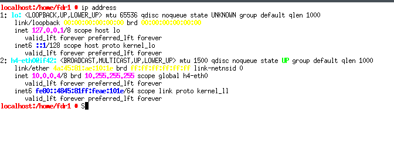
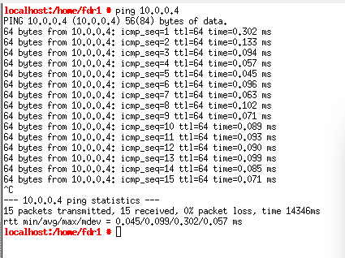

Tarea 3.1

-   Vamos a comprobar la correcta instalación de Mininet mediante una prueba básica. Para ello ejecutamos Mininet mediante el comando **`mn`**.

``` bash
sudo -E mn
```

``` bash
*** No default OpenFlow controller found for default switch!
*** Falling back to OVS Bridge
*** Creating network
*** Adding controller
*** Adding hosts:
h1 h2 
*** Adding switches:
ovs-vsctl: unix:/run/openvswitch/db.sock: database connection failed (No such file or directory)
ovs-vsctl exited with code 1
*** Error connecting to ovs-db with ovs-vsctl
Make sure that Open vSwitch is installed, that ovsdb-server is running, and that
"ovs-vsctl show" works correctly.
You may wish to try "service openvswitch-switch start".
```

Es posible que sea necesario arrancar el servicio **`openvswitch`**:

``` bash
sudo systemctl enable openvswitch.service
sudo systemctl start openvswitch.service
```

``` bash
Created symlink /etc/systemd/system/multi-user.target.wants/openvswitch.service → /usr/lib/systemd/system/openvswitch.service.
fdr1@localhost:~> sudo -E mn
[sudo] contraseña para root:
*** No default OpenFlow controller found for default switch!
*** Falling back to OVS Bridge
*** Creating network
*** Adding controller
*** Adding hosts:
h1 h2
*** Adding switches:
s1
*** Adding links:
(h1, s1) (h2, s1)
*** Configuring hosts
h1 h2
*** Starting controller

*** Starting 1 switches
s1 ...
*** Starting CLI:
mininet> quit
*** Stopping 0 controllers

*** Stopping 2 links
..
*** Stopping 1 switches
s1
*** Stopping 2 hosts
h1 h2
*** Done
completed in 111.656 seconds
fdr1@localhost:~>
```

¿Qué ha ocurrido? ¿Cuál es la topología de red que se ha creado?

Mininet ha creado una red básica con la siguiente topología:

-   **Dos hosts (`h1` y `h2`).**
-   **Un switch (`s1`).**
-   **Enlaces entre los hosts y el switch:**
    -   **`h1`** está conectado a **`s1`**.
    -   **`h2`** está conectado a **`s1`**.

Esta es una topología de red básica en estrella, donde ambos hosts (**`h1`** y **`h2`**) están conectados a un único switch (**`s1`**).

Tarea 3.2.1

Ejecutamos la línea de comando para lanzar Mininet con la topología en árbol.

``` bash
sudo -E mn --switch ovsbr --topo tree,depth=2,fanout=2
```

``` bash
*** Creating network
*** Adding controller
*** Adding hosts:
h1 h2 h3 h4 
*** Adding switches:
s1 s2 s3 
*** Adding links:
(s1, s2) (s1, s3) (s2, h1) (s2, h2) (s3, h3) (s3, h4) 
*** Configuring hosts
h1 h2 h3 h4 
*** Starting controller

*** Starting 3 switches
s1 s2 s3 ...
*** Starting CLI:
mininet> 
```

-   Indica para qué sirven cada uno de los siguientes comandos: **`exit`**, **`dump`**, **`link`**, **`links`**, **`net`**, **`pingallbd`**, **`pingpair`**, **`ports`**, **`quit`** y **`switch`**.

``` bash
mininet> help exit
Exit
mininet> help dump
Dump node info.
mininet> help link
Bring link(s) between two nodes up or down.
           Usage: link node1 node2 [up/down]
mininet> help links
Report on links
mininet> help net
List network connections.
mininet> help nodes
List all nodes.
mininet> help pingall
Ping between all hosts.
mininet> help pingpair
Ping between first two hosts, useful for testing.
mininet> help ports
display ports and interfaces for each switch
mininet> help quit
Exit
mininet> help switch
Starts or stops a switch
```

-   Indica el resultado de los comandos **`net`**, **`dump`** y **`pingall`**.

``` bash
mininet> net
h1 h1-eth0:s2-eth1
h2 h2-eth0:s2-eth2
h3 h3-eth0:s3-eth1
h4 h4-eth0:s3-eth2
s1 lo:  s1-eth1:s2-eth3 s1-eth2:s3-eth3
s2 lo:  s2-eth1:h1-eth0 s2-eth2:h2-eth0 s2-eth3:s1-eth1
s3 lo:  s3-eth1:h3-eth0 s3-eth2:h4-eth0 s3-eth3:s1-eth2
mininet> dump
<Host h1: h1-eth0:10.0.0.1 pid=13165> 
<Host h2: h2-eth0:10.0.0.2 pid=13167> 
<Host h3: h3-eth0:10.0.0.3 pid=13169> 
<Host h4: h4-eth0:10.0.0.4 pid=13171> 
<OVSBridge s1: lo:127.0.0.1,s1-eth1:None,s1-eth2:None pid=13176> 
<OVSBridge s2: lo:127.0.0.1,s2-eth1:None,s2-eth2:None,s2-eth3:None pid=13179> 
<OVSBridge s3: lo:127.0.0.1,s3-eth1:None,s3-eth2:None,s3-eth3:None pid=13182> 
mininet> pingall
*** Ping: testing ping reachability
h1 -> h2 h3 h4 
h2 -> h1 h3 h4 
h3 -> h1 h2 h4 
h4 -> h1 h2 h3 
*** Results: 0% dropped (12/12 received)
mininet> 
```

-   Otro comando interesante es **`xterm`**, cuyo modo de uso es **`xterm node1 node2`**. Este comando permite abrir un terminal en los hosts indicados y así poder ejecutar comandos.

    Emplea el comando para abrir un terminal en los hosts h2 y h4. En el terminal de h4 emplea el comando de Linux **`ip address`** para obtener la dirección IP del terminar en la red creada. Desde el terminal de h2 realiza un ping al terminal h4. Anota todo lo realizado

``` bash
mininet> xterm h2 h4
```





-   Mininet ofrece además otra manera de ejecutar comandos en los dispositivos de la red sin necesidad de abrir un terminal xterm. Es decir, permite ejecutar comandos en un determinado dispositivo desde la misma línea **`mininet>`**

    Para ello, tendríamos que introducir el nombre del dispositivo en cuestión seguido del comando que deseamos ejecutar en dicho dispositivo.

    Por ejemplo, si queremos ejecutar el comando **`ip address`** en el dispositivo h4 (como hemos hecho antes), la forma sería tecleando:

    ``` bash
    mininet> h4 ip address
    ```

    Compruébalo. ¿Cómo harías un ping desde h2 a h4 sin utilizar **`xterm`**?

    ``` bash
    mininet> h4 ip address
    1: lo: <LOOPBACK,UP,LOWER_UP> mtu 65536 qdisc noqueue state UNKNOWN group default qlen 1000
        link/loopback 00:00:00:00:00:00 brd 00:00:00:00:00:00
        inet 127.0.0.1/8 scope host lo
           valid_lft forever preferred_lft forever
        inet6 ::1/128 scope host proto kernel_lo 
           valid_lft forever preferred_lft forever
    2: h4-eth0@if42: <BROADCAST,MULTICAST,UP,LOWER_UP> mtu 1500 qdisc noqueue state UP group default qlen 1000
        link/ether 4a:45:81:ae:10:1e brd ff:ff:ff:ff:ff:ff link-netnsid 0
        inet 10.0.0.4/8 brd 10.255.255.255 scope global h4-eth0
           valid_lft forever preferred_lft forever
        inet6 fe80::4845:81ff:feae:101e/64 scope link proto kernel_ll 
           valid_lft forever preferred_lft forever
    mininet> h2 ping h4
    PING 10.0.0.4 (10.0.0.4) 56(84) bytes of data.
    64 bytes from 10.0.0.4: icmp_seq=1 ttl=64 time=11.7 ms
    64 bytes from 10.0.0.4: icmp_seq=2 ttl=64 time=0.066 ms
    64 bytes from 10.0.0.4: icmp_seq=3 ttl=64 time=0.075 ms
    64 bytes from 10.0.0.4: icmp_seq=4 ttl=64 time=0.072 ms
    64 bytes from 10.0.0.4: icmp_seq=5 ttl=64 time=0.099 ms
    64 bytes from 10.0.0.4: icmp_seq=6 ttl=64 time=0.098 ms
    64 bytes from 10.0.0.4: icmp_seq=7 ttl=64 time=0.048 ms
    64 bytes from 10.0.0.4: icmp_seq=8 ttl=64 time=0.096 ms
    ^C
    --- 10.0.0.4 ping statistics ---
    8 packets transmitted, 8 received, 0% packet loss, time 7154ms
    rtt min/avg/max/mdev = 0.048/1.536/11.735/3.854 ms
    mininet> 
    ```

-   **IMPORTANTE:** Para salir de Mininet tecleamos **`exit`**. A continuación, ejecutamos **`#sudo mn -c`**. El opción **`-c`** o **`--clean`** sirve para "limpiar" el entorno de ejecución de Mininet y así evitar conflictos con una próxima ejecución. Es recomendable ejecutarlo siempre tras salir de Mininet o antes de ejecutarlo.

    ``` bash
    mininet> exit
    *** Stopping 0 controllers

    *** Stopping 2 terms
    *** Stopping 6 links
    ......
    *** Stopping 3 switches
    s1 s2 s3 
    *** Stopping 4 hosts
    h1 h2 h3 h4 
    *** Done
    completed in 2089.877 seconds
    fdr1@localhost:~> sudo mn -c
    [sudo] contraseña para root: 
    *** Removing excess controllers/ofprotocols/ofdatapaths/pings/noxes
    killall controller ofprotocol ofdatapath ping nox_corelt-nox_core ovs-openflowd ovs-controllerovs-testcontroller udpbwtest mnexec ivs ryu-manager 2> /dev/null
    killall -9 controller ofprotocol ofdatapath ping nox_corelt-nox_core ovs-openflowd ovs-controllerovs-testcontroller udpbwtest mnexec ivs ryu-manager 2> /dev/null
    pkill -9 -f "sudo mnexec"
    *** Removing junk from /tmp
    rm -f /tmp/vconn* /tmp/vlogs* /tmp/*.out /tmp/*.log
    *** Removing old X11 tunnels
    *** Removing excess kernel datapaths
    ps ax | egrep -o 'dp[0-9]+' | sed 's/dp/nl:/'
    ***  Removing OVS datapaths
    ovs-vsctl --timeout=1 list-br
    ovs-vsctl --timeout=1 list-br
    *** Removing all links of the pattern foo-ethX
    ip link show | egrep -o '([-_.[:alnum:]]+-eth[[:digit:]]+)'
    ip link show
    *** Killing stale mininet node processes
    pkill -9 -f mininet:
    *** Shutting down stale tunnels
    pkill -9 -f Tunnel=Ethernet
    pkill -9 -f .ssh/mn
    rm -f ~/.ssh/mn/*
    *** Cleanup complete.
    ```

Tarea 3.2.2

-   Crea un directorio en tu **`HOME`** llamados **`pruebas_redes_sdn`**, y en él crea el fichero **`topo_1s_4h_nosdn.py`**. Dentro de este directorio, ejecuta Mininet desde línea de comando.

    ``` bash
    fdr1@localhost:~> mkdir ~/pruebas_redes_sdn
    ```

    ``` python


    from mininet.topo import Topo

    class mitopo (Topo):

        def build(self):

            s1=self.addSwitch('s1',switch='ovsbr')

            h1=self.addHost('h1')
            h2=self.addHost('h2')
            h3=self.addHost('h3')
            h4=self.addHost('h4')

            self.addLink('h1','s1')
            self.addLink('h2','s1')
            self.addLink('h3','s1')
            self.addLink('h4','s1')

    topos={'mitopo':(lambda: mitopo())}
    ```

<!-- -->

-   Dentro de Mininet, verifica la conectividad.

    ``` bash
    fdr1@localhost:~/pruebas_redes_sdn> sudo -E mn --switch ovsbr --custom topo_1s-4h_nosdn.py --mac --topo mitopo
    [sudo] contraseña para root: 
    *** Creating network
    *** Adding controller
    *** Adding hosts:
    h1 h2 h3 h4 
    *** Adding switches:
    s1 
    *** Adding links:
    (h1, s1) (h2, s1) (h3, s1) (h4, s1) 
    *** Configuring hosts
    h1 h2 h3 h4 
    *** Starting controller

    *** Starting 1 switches
    s1 ...
    *** Starting CLI:
    mininet> pingall
    *** Ping: testing ping reachability
    h1 -> h2 h3 h4 
    h2 -> h1 h3 h4 
    h3 -> h1 h2 h4 
    h4 -> h1 h2 h3 
    *** Results: 0% dropped (12/12 received)
    mininet>
    ```

Tarea 3.3

Considera la siguiente topología de red, definida en el fichero **`topo_routing.py`**:

``` python
# topo_routing.py
from mininet.topo import Topo
from mininet.node import OVSBridge,Node


class LinuxRouter(Node):
    def config(self,**params):
        super(LinuxRouter,self).config(**params)
        self.cmd('sysctl net.ipv4.ip_forward=1')
    def terminate(self):
        self.cmd('sysctl net.ipv4.ip_forward=0')
        super(LinuxRouter,self).config(**params)


class mitopo(Topo):
    
    def build(self):
        h1 = self.addHost('h1')
        h2 = self.addHost('h2')
        h3 = self.addHost('h3')
        h4 = self.addHost('h4')

        s1 = self.addSwitch('s1',switch='ovsbr')
        s2 = self.addSwitch('s2',switch='ovsbr')
        s3 = self.addSwitch('s3',switch='ovsbr')
        s4 = self.addSwitch('s4',switch='ovsbr')
        s5 = self.addSwitch('s5',switch='ovsbr')

        r1 = self.addNode('r1',cls=LinuxRouter,ip=None)
        r2 = self.addNode('r2',cls=LinuxRouter,ip=None)
        r3 = self.addNode('r3',cls=LinuxRouter,ip=None)

        self.addLink(h1, s1)
        self.addLink(h2, s2)
        self.addLink(h3, s3)
        self.addLink(h4, s4)

        self.addLink(r1, s1)
        self.addLink(r1, s2)
        self.addLink(r1, s5) 
        self.addLink(r2, s3)
        self.addLink(r2, s5)
        self.addLink(r3, s5)
        self.addLink(r3, s4)

topos={'mitopo':(lambda: mitopo())}
```

-   Realiza el diseño del plan de direccionamiento IP para esta red. Para ello contesta las siguientes preguntas:

    -   Identifica las subredes que componen la red y empleando subredes de igual tamaño define un plan de direccionamiento adecuado (en papel).

    

    Observando la topología (*imagen adjunta*), podemos identificar las subredes necesarias para cada enlace entre los routers y los hosts:

    1.  **Subredes entre los hosts y sus switches:**
        -   **`h1`** y **`s1`**: Subred **`192.168.1.0/24`**.
        -   **`h2`** y **`s2`**: Subred **`192.168.2.0/24`**.
        -   **`h3`** y **`s3`**: Subred **`192.168.3.0/24`**.
        -   **`h4`** y **`s4`**: Subred **`192.168.4.0/24`**.
    2.  **Subredes entre routers y switches:**
        -   **`r1`** y **`s1`**, **`s2`**, **`s5`**: Subred **`192.168.5.0/24`**.
        -   **`r2`** y **`s3`**, **`s5`**: Subred **`192.168.6.0/24`**.
        -   **`r3`** y **`s4`**, **`s5`**: Subred **`192.168.7.0/24`**.

    Este diseño asigna una subred única a cada conexión entre un router y un switch o entre un host y un switch, facilitando el encaminamiento.

    -   Traslada el plan de direccionamiento a Mininet, configurando las interfaces de los dispositivos.

    ``` bash
    ```

-   Realiza el diseño de las tablas de encaminamiento de los dispositivos de esta red. Para ello constesta las siguientes preguntas:

    -   Determina el valor de la entrada default de los hosts (en papel).

    -   Traslada el valor de la entrada default de los hosts a Mininet.

    -   Comprueba el valor de las tablas de encamiento de los hosts en Mininet

    -   Determina el valor de las entradas de las tablas de encaminamiento de cada router para poder alcanzar las redes no directamente conectadas (en papel).

    -   Comprueba el valor de las tablas de encamiento de los routers en Mininet.

-   Un vez configurada la red, verifica la conectividad haciendo un ping desde cada host hacia el resto de los hosts de la red (no emplees el comando **`pingall`**).
