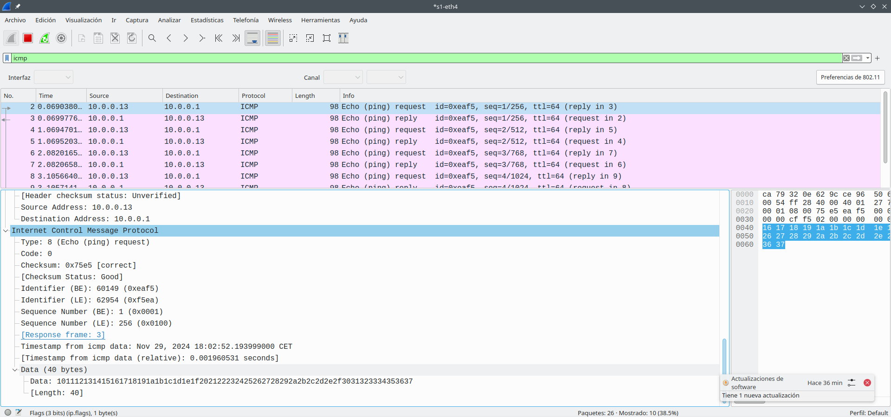

# 2. EXAMINAR LOS CAMPOS DE CABECERA DE UNA TRAMA ETHERNET II

En este apartado se examinarán los campos de cabecera y el contenido de una trama Ethernet II dada. Se utilizará una captura de Wireshark para examinar el contenido de esos campos.

En la siguiente captura de Wireshark, se muestran los paquetes generados por un ping que se hace de un equipo host a su gateway predeterminado. Se le aplicó un filtro a Wireshark para ver solamente el protocolo de resolución de direcciones (ARP) y el protocolo de mensajes de control de Internet (ICMP). La sesión comienza con una consulta ARP para obtener la dirección MAC del router del gateway seguida de cuatro solicitudes y respuestas de ping.


## Tarea 2.1

-   ¿Qué característica significativa tiene el contenido del campo de dirección de destino?

    La dirección de destino en la primera trama es de **difusión** (**`ff:ff:ff:ff:ff:ff`**), lo que significa que el mensaje se envía a todos los dispositivos en la red local.

-   ¿Por qué envía el PC un ARP de difusión antes de enviar la primera solicitud de ping?

    El PC no conoce la dirección MAC del gateway predeterminado, por lo que utiliza un ARP de difusión para obtenerla.

-   ¿Cuál es la dirección MAC origen en la primera trama?

    La dirección MAC de origen es **`f4:8c:50:62:6d`**.

-   ¿Cuál es el identificador de proveedor (OUI) de la NIC del origen?

    El OUI de la NIC de origen es **`f4:8c:50`**.

-   ¿Qué porción de la dirección MAC corresponde al OUI?

    Los primeros 3 bytes (**`f4:8c:50`**) de la dirección MAC corresponden al OUI.

-   ¿Cuál es el número de serie de la NIC del origen?

    El número de serie es **`62:62:6d`**.

# 3. UTILIZAR WIRESHARK PARA CAPTURAR Y ANALIZAR TRAMAS ETHERNET

En este apartado se examinarán los campos de cabecera y el contenido de una trama Ethernet II dada. Se utilizará una captura de Wireshark para examinar el contenido de esos campos.

Abra una consola para iniciar Mininet e introduzca los siguientes comandos:

`fdr1@vbox:~> sudo pip3 install mininet`

`fdr1@vbox:~> sudo python3 topo_link.py`

## Tarea 3.1

En el equipo H3, ejecute **ifconfig** para verificar la dirección IPv4 y la dirección MAC.

``` bash
sudo pip3 install mininet
sudo python3 topo_link.py
```

```         
Topology:

          ------       ------
          | R1 |-------| H4 |
          ------       ------
            |
            |
          ------
  |-------| S1 |-------|
  |       ------       |
  |         |          |
  |         |          |
------    ------     ------
| H1 |    | H2 |     | H3 |
------    ------     ------

*** Add links
*** Creating network
*** Adding hosts:
H1 H2 H3 H4 R1 
*** Adding switches:
s1 
*** Adding links:
(H1, s1) (H2, s1) (H3, s1) (H4, R1) (s1, R1) 
*** Configuring hosts
H1 H2 H3 H4 R1 
*** Starting controller

*** Starting 1 switches
s1 ...
*** Routing Table on Router:
Kernel IP routing table
Destination     Gateway         Genmask         Flags Metric Ref    Use Iface
10.0.0.0        0.0.0.0         255.255.255.0   U     0      0        0 R1-eth1
172.16.0.0      0.0.0.0         255.240.0.0     U     0      0        0 R1-eth2

*** Starting CLI:
mininet> H3 ifconfig
H3-eth0: flags=4163<UP,BROADCAST,RUNNING,MULTICAST>  mtu 1500
        inet 10.0.0.13  netmask 255.255.255.0  broadcast 10.0.0.255
        inet6 fe80::3464:b1ff:fe52:fb98  prefixlen 64  scopeid 0x20<link>
        ether 36:64:b1:52:fb:98  txqueuelen 1000  (Ethernet)
        RX packets 34  bytes 3526 (3.4 KiB)
        RX errors 0  dropped 0  overruns 0  frame 0
        TX packets 8  bytes 656 (656.0 B)
        TX errors 0  dropped 0 overruns 0  carrier 0  collisions 0

lo: flags=73<UP,LOOPBACK,RUNNING>  mtu 65536
        inet 127.0.0.1  netmask 255.0.0.0
        inet6 ::1  prefixlen 128  scopeid 0x10<host>
        loop  txqueuelen 1000  (Local Loopback)
        RX packets 0  bytes 0 (0.0 B)
        RX errors 0  dropped 0  overruns 0  frame 0
        TX packets 0  bytes 0 (0.0 B)
        TX errors 0  dropped 0 overruns 0  carrier 0  collisions 0

mininet> 
```

## Tarea 3.2

En el equipo H3, ejecute **netstat -r**. ¿Cuál es la dirección IP del gateway predeterminado correspondiente al host H3?

```         
mininet> H3 netstat -r
Kernel IP routing table
Destination     Gateway         Genmask         Flags   MSS Window  irtt Iface
default         10.0.0.1        0.0.0.0         UG        0 0          0 H3-eth0
10.0.0.0        0.0.0.0         255.255.255.0   U         0 0          0 H3-eth0
```

La dirección IP del gateway predeterminado es **`10.0.0.1`**.

## Tarea 3.3

a.  En el panel Packet List (Lista de paquetes) de la parte superior, haga clic en la primera trama de la lista. Debería ver el texto **Echo (ping) request** (Solicitud de eco [ping]) debajo del encabezado **Info.** Con esta acción, se debe resaltar la línea con color azul.

b.  Examine la primera línea del panel Packet Details (Detalles del paquete) de la parte central. En esta línea, se muestra la longitud de la trama (en el ejemplo, 98 bytes).

c.  En la segunda línea del panel Packet Details (Detalles del paquete), se muestra que es una trama de Ethernet II. También se muestran las direcciones MAC de origen y de destino.

    ¿Cuál es la dirección MAC de la NIC de la PC?

    **`79:32:0e:62:9c`**

    ¿Cuál es la dirección MAC del gateway predeterminado?

    **`96:50:6a:91:53`**

d.  Puede hacer clic en la flecha que se encuentra al principio de la segunda línea para obtener más información sobre la trama de Ethernet II.

    ¿Qué tipo de trama se muestra?

    Se muestra como una trama IPv4: **`0x0800`**

e.  En las últimas dos líneas de la parte central, se proporciona información sobre el campo de datos de la trama. Observe que los datos contienen información sobre las direcciones IPv4 de origen y de destino.

    ¿Cuál es la dirección IP de origen?

    **`10.0.0.13`**

    ¿Cuál es la dirección IP de destino?

    **`10.0.0.1`**

f.  Puede hacer clic en cualquier línea de la parte central para resaltar esa parte de la trama (hexadecimal y ASCII) en el panel Packet Bytes de la parte inferior. Haga clic en la línea Internet Control Message Protocol (Protocolo de mensajes de control de Internet) de la parte central y examine lo que se resalta en el panel Packet Bytes.

    

g.  Haga clic en la siguiente trama de la parte superior y examine una trama de respuesta de eco. Observe que las direcciones MAC de origen y de destino se invirtieron porque esta trama se envió desde el router del gateway predeterminado como respuesta al primer ping. ¿Qué dispositivo y qué dirección MAC se muestran como dirección de destino?

    -   **Disposición de destino:** La dirección de destino corresponde al router predeterminado que responde al ping

    -   **Dirección MAC del destino:** Según la imagen proporcionada en el enunciado de la práctica, la dirección MAC de destino es **`92:66:62:f0:14:21`**, que corresponde al equipo desde donde se originó el ping.

## Tarea 3.4

-   En la primera trama de solicitud de eco (ping), ¿cúales son las direcciones MAC de origen y de destino?

    -   **Dirección MAC de origen: `79:32:0e:62:9c`**

    -   **Dirección MAC de destino: `50:64:2b:af:85:33`**

-   ¿Cuáles son las direcciones IP de origen y de destino que contiene el campo de datos de la trama?

    -   **Dirección IP de origen:** **`10.0.0.13`**

    -   **Dirección IP de destino:** **`172.16.0.40`**

-   Comparen estas direcciones con las direcciones que recibió de en la Tarea 3.3. La única dirección que cambió es la dirección IP de destino. ¿Por qué cambió la dirección IP de destino mientras que la dirección MAC permaneció igual?

    La dirección IP de destino ha cambiado porque la solicitud de eco (ping) está destinada a una dirección IP específica, que puede ser un dispositivo en otra red. Sin embargo, la dirección MAC de destino no cambió porque el paquete debe pasar primero por el gateway predeterminado (router) para llegar a su destino final.

## Tarea 3.5

-   En Wireshark, no se muestra el campo de preámbulo de un encabezado de trama. ¿Qué contiene el preámbulo?

El **preámbulo** de una trama Ethernet contiene una secuencia de **7 bytes** con el patrón 10101010 (en hexadecimal, AA) para sincronizar los dispositivos de red. Le sigue un byte especial llamado **SFD** (Start Frame Delimiter) con el valor 10101011 (en hexadecimal, AB), que marca el inicio de la trama.