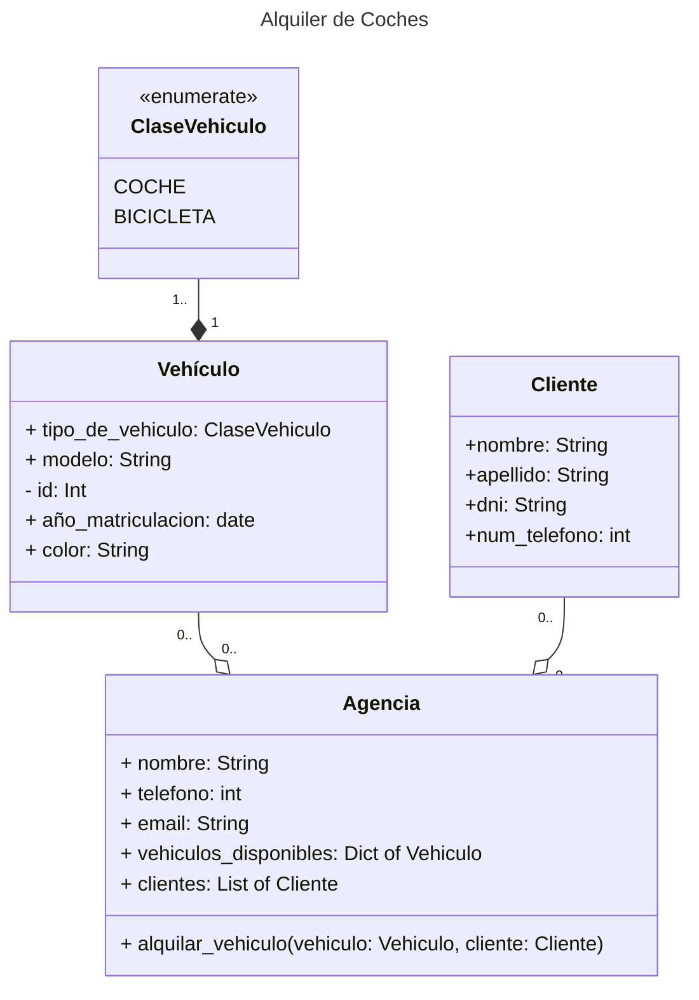

# Sistema de Alquiler de Vehículos

## Descripción del problema
Diseñar un Sistema de Alquiler de Vehículos que permita a los usuarios alquilar diferentes tipos de vehículos, como automóviles y bicicletas, en una agencia de alquiler. El sistema debe admitir funcionalidades como verificar la disponibilidad de vehículos, alquilar vehículos y calcular los costos de alquiler. Introduzca la herencia  para representar una clase base común para todos los vehículos.

## Modelado UML
1) Identificar entidades: Vehículo, Coche, Bicicleta, Cliente y Agencia de Alquiler.
2. Establecer relaciones entre entidades:
    - Los Coches y las Bicicletas son tipos de Vehículos (herencia).
    - Los Clientes pueden alquilar varios Vehículos y varios Clientes pueden alquilar un Vehículo (relación de muchos a muchos).
    - Una Agencia de Alquiler gestiona múltiples Vehículos y Clientes.

3. Definir atributos y métodos para cada entidad. 

4. Dibuje un diagrama de clases que represente las relaciones e interacciones entre las 
entidades. Además, cree un diagrama de secuencia UML para representar el flujo de 
interacciones durante el proceso de alquiler. 

5. Realice la implementación en Python de las clases definidas. 

Este ejercicio cubre la creación de diagramas de clases UML con herencia y programación Python, enfatizando el modelado de relaciones, métodos e interacciones básicas en un sistema de alquiler de vehículos.



```python
from enum import Enum
from datetime import date
from typing import List, Dict

class ClaseVehiculo(Enum):
    COCHE = 1
    BICICLETA = 2

class Vehiculo:
    def __init__(self, tipo_vehiculo: ClaseVehiculo, modelo: str, id: int, año_matriculacion: date, color:str):
        self.tipo_vehiculo = tipo_vehiculo
        self.modelo = modelo
        self.__id = id
        self.año_matriculacion = año_matriculacion
        self.color = color

class Cliente:
    def __init__(self, nombre: str, apellido: str, dni: str, telefono: int):
        self.nombre = nombre
        self.apellido = apellido
        self._dni = dni
        self._telefono = telefono

class Agencia:
    def __init__(self, nombre: str, telefono: int, email: str, vehiculos_disponibles: Dict[int, Vehiculo], clientes: List[Cliente]):
        self.nombre = nombre
        self.telefono = telefono
        self.email = email
        self._vehiculos_disponibles = vehiculos_disponibles
        self._clientes = clientes
        self._vehiculos_alquilados = []

    def alquilar_vehiculo(self, id: int, cliente: Cliente):
        if cliente not in self._clientes:
            raise ValueError("El cliente no está registrado en la Agencia")
        if id not in self._vehiculos_disponibles:
            raise ValueError("El vehículo no está diponible")
        vehiculo = self._vehiculos_disponibles.pop(id)
        self._vehiculos_alquilados.append(vehiculo)

    """ 
    Este código primero verifica si el cliente está en la lista de clientes de la 
    agencia. Si no es así, se lanza un error. Luego verifica si el ID del vehículo 
    está en la lista de vehículos disponibles. Si no es así, se lanza un error. 
    Finalmente, si ambas verificaciones son exitosas, el vehículo se elimina de los   
    vehículos disponibles y se agrega a los vehículos alquilados.
    """
```
El código define tres clases: `ClaseVehiculo`, `Vehiculo`, `Cliente` y `Agencia`.

1. `ClaseVehiculo` es una enumeración que define dos tipos de vehículos: COCHE y BICICLETA.

2. `Vehiculo` es una clase que representa un vehículo con atributos como tipo de vehículo, modelo, id, año de matriculación y color.

3. `Cliente` es una clase que representa a un cliente con atributos como nombre, apellido, DNI y teléfono.

4. `Agencia` es una clase que representa una agencia de alquiler de vehículos. Tiene atributos como nombre, teléfono, email, una lista de vehículos disponibles, una lista de clientes y una lista de vehículos alquilados.
