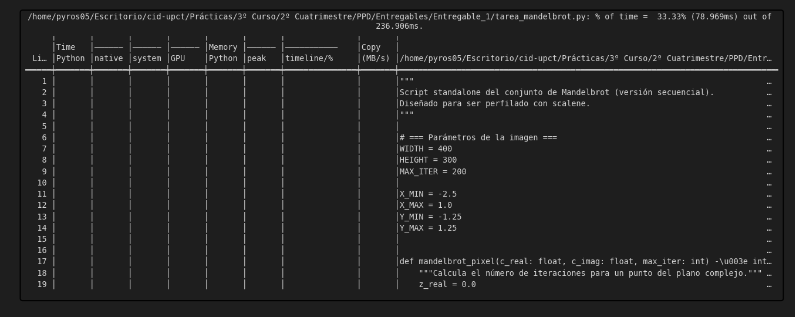
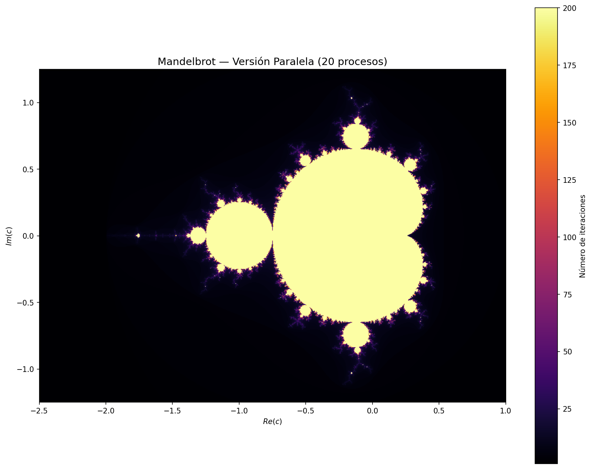
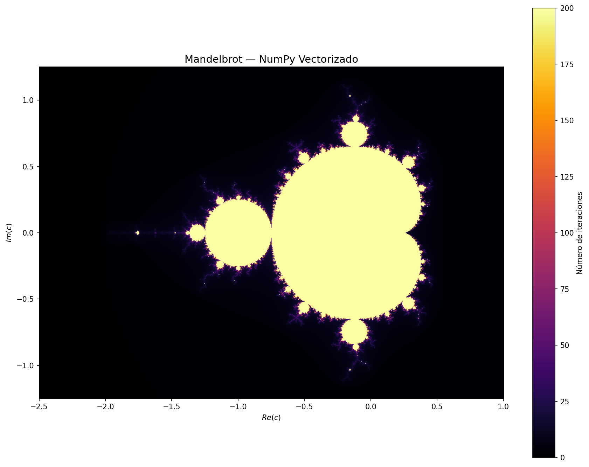

```{python}
#| echo: false
import time, numpy as np, matplotlib.pyplot as plt, multiprocessing, os
```

---

# PASO 1: Localización de las funciones que más tiempo de ejecución consumen mediante profiling

Utilizaremos las herramientas `timeit` y `scalene` para realizar un profiling efectivo e informativo del programa.

## Medición con `timeit`

Con `timeit` obtenemos el tiempo de ejecución de *wall clock*. Podemos observar que la función que consume más tiempo es `mandelbrot_sequential`, ya que la inicialización de la malla de puntos complejos es prácticamente instantánea. Concluimos que será la parte del código que deberemos modificar para paralelizar los procesos y reducir el tiempo de ejecución.
```{python}
#| eval: false
# Cálculo del conjunto: costoso
%timeit mandelbrot_sequential(WIDTH, HEIGHT, X_MIN, X_MAX, Y_MIN, Y_MAX, MAX_ITER)
# → 9.55 s ± 25.2 ms per loop (mean ± std. dev. of 7 runs, 1 loop each)
```

## Profiling detallado con `scalene`

`scalene` mide uso de CPU (código nativo vs. Python puro), memoria y GPU, y nos ayuda a detectar cuellos de botella para determinar si vale la pena paralelizar y qué zona del código es la candidata.
```{python}
#| eval: false
!scalene --cli tarea_mandelbrot.py
```



Se observa un uso ascendente de memoria a medida que avanza la ejecución, culminando en la función más costosa computacionalmente: `mandelbrot_pixel`. La métrica clave es el **73% de tiempo de código Python puro** en esta función, lo que indica una alta capacidad de paralelización.

Las funciones que conforman `mandelbrot_sequential` acumulan casi la mitad del tiempo total de ejecución del programa.

Por tanto, decidimos paralelizar `mandelbrot_sequential` dividiendo el espacio complejo en franjas horizontales independientes, aplicando el cálculo de iteraciones de manera simultánea y reensamblando la imagen resultante.

---

# PASO 2: Paralelización mediante la librería `multiprocessing`

Definimos una nueva función de generación del conjunto de Mandelbrot para poder tratar cada franja del espacio complejo de forma paralela. Esta librería necesita trabajar con una lista de resultados donde los procesos van adjuntando su tarea completada una vez finalizada, teniendo en cuenta su índice.
```{python}
#| eval: false
def mandelbrot_worker(args):
    """Worker que calcula una franja horizontal del conjunto."""
    row_start, row_end, width, height, x_min, x_max, y_min, y_max, max_iter = args
    chunk = []
    for row in range(row_start, row_end):
        c_imag = y_max - row * (y_max - y_min) / (height - 1)
        row_data = [mandelbrot_pixel(x_min + col*(x_max-x_min)/(width-1),
                                     c_imag, max_iter)
                    for col in range(width)]
        chunk.append(row_data)
    return (row_start, chunk)

# Ejecución con Pool
mandelbrot_parallel(WIDTH, HEIGHT, X_MIN, X_MAX, Y_MIN, Y_MAX, MAX_ITER)
%timeit mandelbrot_parallel(WIDTH, HEIGHT, X_MIN, X_MAX, Y_MIN, Y_MAX, MAX_ITER)
# → 5.47 s ± 330 ms per loop (mean ± std. dev. of 7 runs, 1 loop each)
```



A diferencia de la detección de bordes mediante convolución 2D, el cálculo del conjunto de Mandelbrot **no presenta el problema de solapamiento entre particiones**, ya que cada punto del plano complejo es completamente independiente de sus vecinos.

Sin embargo, sí aparecen otros inconvenientes típicos de `multiprocessing`:

- **Overhead de creación de procesos**: el coste de inicializar cada proceso puede superar el beneficio si las particiones son demasiado pequeñas.
- **Coste de serialización (pickle)**: el paso de datos entre procesos mediante IPC introduce latencia.
- **Gestión manual de procesos**: es necesario crear, iniciar (`.start()`), esperar (`.join()`) y recoger resultados explícitamente.

Con la paralelización se consigue reducir considerablemente el tiempo de ejecución respecto a la versión secuencial:
```{python}
#| eval: false
# Versión secuencial como referencia
%timeit mandelbrot_sequential(WIDTH, HEIGHT, X_MIN, X_MAX, Y_MIN, Y_MAX, MAX_ITER)
# → 9.44 s ± 40.7 ms per loop (mean ± std. dev. of 7 runs, 1 loop each)
```

---

# PASO 3: Optimización mediante NumPy vectorizado

En lugar de usar una librería especializada externa, optimizamos el cálculo reescribiendo los bucles de Python puro como operaciones vectorizadas de NumPy.
```{python}
#| eval: false
def mandelbrot_numpy(width, height, x_min, x_max, y_min, y_max, max_iter):
    c = (np.linspace(x_min, x_max, width)[np.newaxis, :] +
         1j * np.linspace(y_max, y_min, height)[:, np.newaxis])
    z          = np.zeros_like(c)
    iterations = np.full(c.shape, max_iter, dtype=np.int32)
    active     = np.ones(c.shape, dtype=bool)
    for n in range(max_iter):
        z[active]           = z[active] ** 2 + c[active]
        escaped             = active & (np.abs(z) > 2.0)
        iterations[escaped] = n
        active[escaped]     = False
        if not np.any(active): break
    return iterations

%timeit mandelbrot_numpy(WIDTH, HEIGHT, X_MIN, X_MAX, Y_MIN, Y_MAX, MAX_ITER)
# → 14.1 ms ± 578 µs per loop (mean ± std. dev. of 7 runs, 100 loops each)
```



NumPy consigue una ejecución **ultrarrápida** porque usa código compilado en C/Fortran, aplica **procesamiento vectorizado** (instrucciones SIMD: SSE/AVX) y **paralelización automática** a nivel de instrucción, logrando un rendimiento muy superior a Python puro sin necesidad de gestionar procesos manualmente.

---

# PASO 4: Uso de la librería `joblib` para paralelizar las funciones más pesadas
```{python}
#| eval: false
from joblib import Parallel, delayed

def mandelbrot_rows_joblib(row_start, row_end, width, height, x_min, x_max, y_min, y_max, max_iter):
    """Calcula un bloque de filas del conjunto de Mandelbrot."""
    chunk = []
    for row in range(row_start, row_end):
        c_imag = y_max - row * (y_max - y_min) / (height - 1)
        row_data = []
        for col in range(width):
            c_real = x_min + col * (x_max - x_min) / (width - 1)
            row_data.append(mandelbrot_pixel(c_real, c_imag, max_iter))
        chunk.append(row_data)
    return (row_start, chunk)

# Ejecutar en paralelo usando todos los núcleos disponibles
results = Parallel(n_jobs=-1, backend='loky')(
    delayed(mandelbrot_rows_joblib)(
        rs, re, WIDTH, HEIGHT, X_MIN, X_MAX, Y_MIN, Y_MAX, MAX_ITER
    )
    for rs, re in tasks_params
)

# Reconstruir la imagen
results.sort(key=lambda x: x[0])
image_joblib = []
for _, chunk in results:
    image_joblib.extend(chunk)

plt.imshow(image_joblib, cmap='inferno')
plt.axis(False)
plt.show()
```

La librería `joblib` introduce varias mejoras respecto a `multiprocessing`, principalmente en simplicidad y eficiencia:

**No se necesita un `Manager` ni una lista compartida.** En `multiprocessing` es obligatorio usar `Manager().list()` para compartir datos entre procesos, lo que introduce sobrecarga adicional. Con `joblib`, los resultados se devuelven automáticamente en una lista normal de Python.

**Código más limpio y directo.** En `multiprocessing` hay que crear procesos manualmente, iniciarlos (`.start()`), esperar su finalización (`.join()`) y almacenar los resultados. `joblib.Parallel()` simplifica todo esto, gestionando automáticamente la creación, ejecución y sincronización de los procesos.

**Mejor escalabilidad y gestión de recursos.** `joblib` optimiza el uso de la CPU ajustando dinámicamente el número de procesos: definiendo `n_jobs=-1` se usan todos los núcleos disponibles sin gestión manual.

**Menos sobrecarga en la comunicación entre procesos.** En `multiprocessing`, cada proceso tiene su propia memoria y requiere IPC (*Inter-Process Communication*) para compartir datos. `joblib` minimiza este problema manejando automáticamente la transferencia de datos entre procesos.
