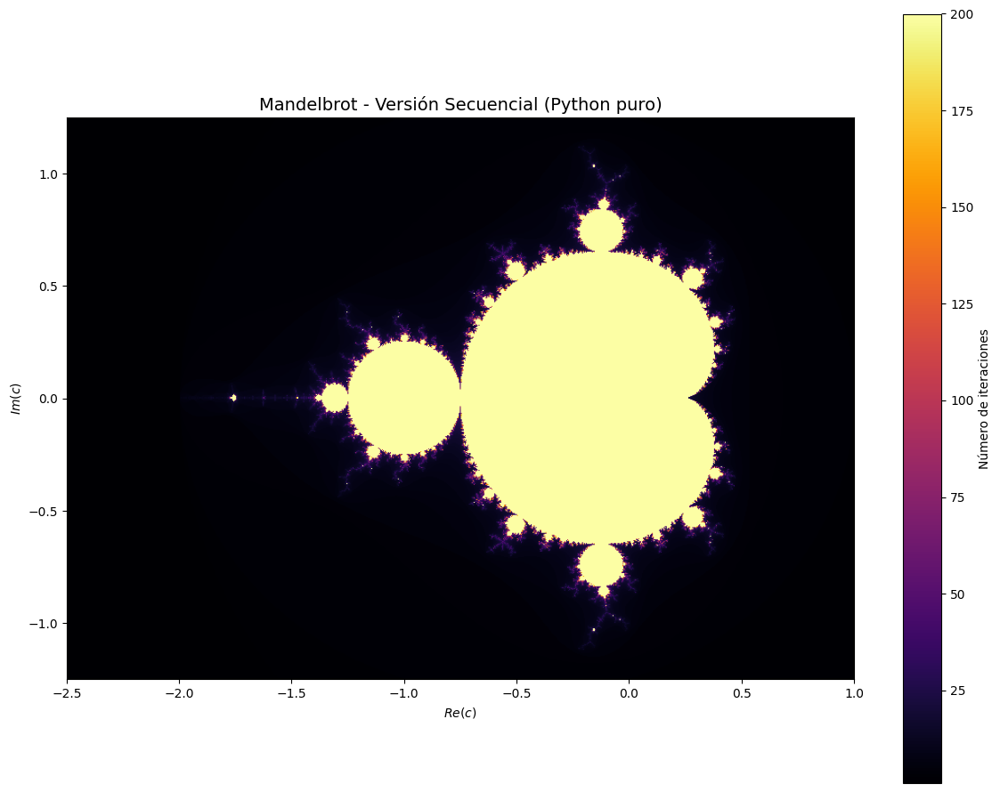
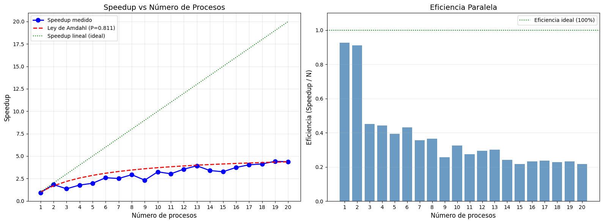
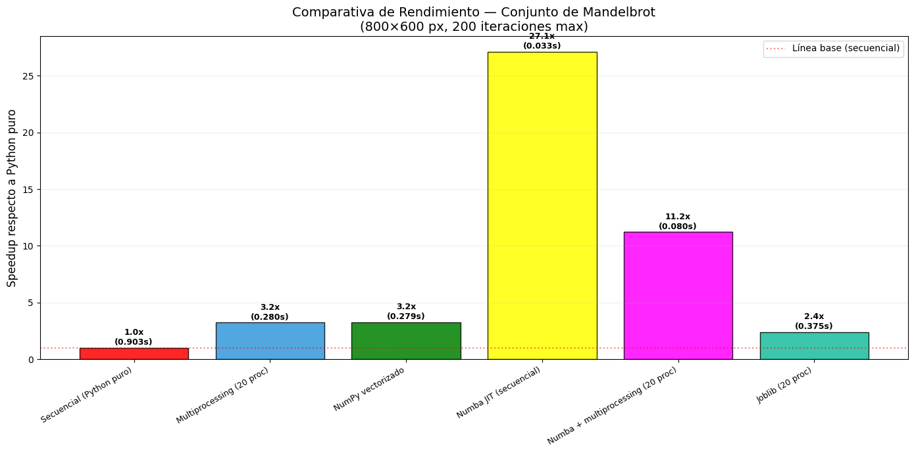

\newpage

# Descripción del caso de uso

El conjunto de Mandelbrot es un fractal definido en el plano complejo. Para cada punto $c=x+yi$, se itera la fórmula $z_{n+1}=z_n^2+c$ partiendo de $z_0=0$. Si tras un número máximo de iteraciones necesarias para "escapar" determina el color del píxel en la representación visual.

Este problema es especialmente adecuado para el análisis de rendimiento y la paralelización por varias razones:

- El cómpute es **completamente independiente píxel a píxel** (*embarrassingly parallel*): cada punto del pano complejo puede calcularse sin conocer el resultado de ningún otro.
- Los bucles anidados en Python puro constituyen un cuello de botella muy claro, con hasta $480.000$ llamadas individuales para una imagen de $800\times 600$ píxeles.
- La imagen puede dividirse en franjas horizontales y distribuirse entre procesos de forma natural.
- Las librerías optimizadas como `NumPy` o `Numba` permiten comparar diferentes estrategias de optimización.

Los parámetros utilizados a lo largo de toda la tarea son:

```python
WIDTH, HEIGHT = 800, 600  # Resolución de la imagen en píxeles
MAX_ITER = 200            # Número máximo de iteraciones por píxel
X_MIN, X_MAX = -2.5, 1.0  # Ventana del plano complejo (eje real)
Y_MIN, Y_MAX = -1.5, 1.25 # Ventana del plano complejo (eje imaginario)
```

---

# Paso 1: Localización de las funciones que más tiempo consumen mediante *profiling* 

El primer paso antes de cualquier optimización es identificar con precisión dónde se gasta el tiempo de ejecución. Para ello se emplean dos herramientas complementarias: `cProfile`, que realiza un *profiling* a nivel de función, y `line_profiler`, que desciende al nivel de línea individual.

## Profiling con `cProfile`

`cProfile` instrumenta cada llamada a función y registra el número de llamadas (`ncalls`), el tiempo total dentro de la función sin contar sus llamadas a otras funciones, como `tottime`, y el tiempo acumulado incluyendo todas las llamadas a subfunciones, como `cumtime`.

```python
profiler = cProfile.Profile()
profiler.enable()
mandelbrot_sequential(400, 300, X_MIN, X_MAX, Y_MIN, Y_MAX, MAX_ITER)
profiler.disable()

stats = pstats.Stats(profiler)
stats.sort_stats("cumulative")
stats.print_stats(10)
```

Los resultados obtenidos revelan el patrón esperado: `mandelbrot_pixel` acumula el mayor `tottime` del programa ya que invoca exactamente `WIDTH` $\times$ `HEIGHT` veces (120.000 llamadas en resolución reducida $400\times 300$, 480.000 en la resolución estándar). La función `mandelbrot_sequential` tiene un `cumtime` elevado porque engloba todas esas llamadas, pero su propio `tottime` es despreciable. El 95-99% del tiempo total de ejecución se concentra en `mandelbrot_pixel`.

## Profiling línea a línea con `line_profiler`

`line_profiler` desciende hasta el nivel de cada línea de código, mostrando para cada una el número de ejecuciones, el tiempo total y el porcentaje sobre el tiempo total de la función.

```python
lp = LineProfiler()
lp.add_function(mandelbrot_pixel)
lp.add_function(mandelbrot_sequential)
lp(mandelbrot_sequential)(400, 300, X_MIN, X_MAX, Y_MIN, Y_MAX, MAX_ITER)
lp.print_stats()
```

El análisis línea a línea confirma que las operaciones aritméticas del bucle interno (`z_real_sq`, `z_imag_sq`, la condición de escape y las actualizaciones de `z_real` y `z_imag`) son las responsables del coste computacional. Cada una de esas líneas se ejecuta potencialmente `MAX_ITER × WIDTH × HEIGHT` veces en el peor caso.

## Conclusión del Paso 1 {.unlisted .unnumbered}

| Métrica | Valor |
|---|---|
| Función cuello de botella | `mandelbrot_pixel` |
| Número de llamadas (800×600) | 480.000 |
| Operación más costosa | Bucle `for n in range(max_iter)` con aritmética de punto flotante |
| Porcentaje del tiempo total | ~95–99 % |

La estrategia de paralelización queda clara: como cada píxel es completamente independiente, podemos dividir las filas de la imagen entre varios procesos, de modo que cada uno calcule su franja de forma autónoma y simultánea.

---

# Paso 2: Paralelización mediante `multiprocessing` 

## Estrategia de división del trabajo

La independencia entre píxeles hace que el problema sea *embarrassingly parallel*: basta con dividir la imagen en $N$ franjas horizontales y asignar cada franja a un proceso distinto. Cada *worker* calcula únicamente las filas que le corresponden y devuelve su resultado parcial junto con su índice de inicio para permitir el reensamblaje ordenado.

```python
def mandelbrot_worker(args):
    row_start, row_end, width, height, \
    x_min, x_max, y_min, y_max, max_iter = args
    chunk = []
    for row in range(row_start, row_end):
        c_imag = y_max - row * (y_max - y_min) / (height - 1)
        row_data = [mandelbrot_pixel(x_min + col*(x_max-x_min)/(width-1),
                                     c_imag, max_iter)
                    for col in range(width)]
        chunk.append(row_data)
    return (row_start, chunk)

with multiprocessing.Pool(processes=num_cores) as pool:
    results = pool.map(mandelbrot_worker, tasks)
```

Una vez recogidos todos los resultados, se ordenan por `row_start` y se concatenan para reconstruir la imagen completa.

## Diferencias respecto a la convolución 2D

A diferencia de la paralelización de una convolución 2D, el conjunto de Mandelbrot **no presenta el problema de solapamiento entre particiones**: en la convolución, las filas del borde de cada franja necesitarían píxeles de la franja adyacente; aquí, cada píxel es completamente independiente, por lo que las franjas pueden dividirse sin ningún solapamiento ni comunicación entre *workers*.

Sin embargo, sí aparecen otros inconvenientes propios de `multiprocessing`:

- **Overhead de creación de procesos**: el coste de inicializar cada proceso puede ser significativo si las particiones son demasiado pequeñas.
- **Coste de serialización**: el paso de datos entre procesos mediante IPC (*Inter-Process Communication*) requiere serializar y deserializar los objetos con *pickle*, lo que introduce latencia.
- **Gestión manual del ciclo de vida**: es necesario crear el `Pool`, distribuir las tareas, esperar los resultados y reensamblar la imagen de forma explícita.

## Resultados {.unnumbered .unlisted}

Con 20 procesos disponibles en el sistema, la versión paralela reduce el tiempo de ejecución de **0.903 s** (secuencial) a **0.280 s**, obteniendo un *speedup* de **3.2×** y una eficiencia del **16 %**.

{width=85%}

---

# Paso 3: Optimización con NumPy vectorizado

En lugar de añadir más paralelismo a nivel de proceso, este paso adopta un enfoque diferente: eliminar el bucle de Python puro sustituyéndolo por operaciones vectorizadas de NumPy.

## Por qué NumPy es más rápido

NumPy almacena sus arrays en memoria contigua y delega el cómputo a rutinas compiladas en C/Fortran. Esto le permite aprovechar tres fuentes de rendimiento que Python puro no puede utilizar:

- **Instrucciones SIMD** (SSE/AVX): operaciones vectoriales que procesan múltiples elementos de forma simultánea a nivel de hardware.
- **Eliminación del overhead del intérprete**: Python interpreta cada iteración del bucle; NumPy lo hace una sola vez para todo el array.
- **Gestión eficiente de caché**: los arrays contiguos minimizan los *cache misses*.

## Implementación

La clave de la implementación vectorizada es construir el array de números complejos $c$ completo de una sola vez y aplicar la iteración de Mandelbrot sobre todos los píxeles simultáneamente, utilizando una máscara booleana para dejar de actualizar los puntos que ya han escapado:

```python
def mandelbrot_numpy(width, height, x_min, x_max, y_min, y_max, max_iter):
    c = (np.linspace(x_min, x_max, width)[np.newaxis, :] +
         1j * np.linspace(y_max, y_min, height)[:, np.newaxis])
    z = np.zeros_like(c)
    iterations = np.full(c.shape, max_iter, dtype=np.int32)
    active = np.ones(c.shape, dtype=bool)
    for n in range(max_iter):
        z[active] = z[active] ** 2 + c[active]
        escaped = active & (np.abs(z) > 2.0)
        iterations[escaped] = n
        active[escaped] = False
        if not np.any(active):
            break
    return iterations
```

## Resultados {.unnumbered .unlisted}

La versión NumPy reduce el tiempo de ejecución a **0.279 s**, un *speedup* de **3.2×** respecto a la versión secuencial, comparable al obtenido con 20 procesos en paralelo pero **sin gestión manual de procesos ni overhead de comunicación**.

{width=85%}

---

# Paso 4: Actividades opcionales

## OP1: Análisis de escalabilidad y Ley de Amdahl

Para evaluar si la paralelización con `multiprocessing` escala bien, se ejecutó la versión paralela con un número creciente de procesos (de 1 a 20) y se midió el *speedup* obtenido en cada caso. Los resultados se comparan con la predicción teórica de la **Ley de Amdahl**:

$$S(N) = \frac{1}{\,(1-P) + \dfrac{P}{N}\,}$$

donde $P$ es la fracción del código que puede paralelizarse. Invirtiendo la fórmula con el *speedup* máximo medido ($S_{20} \approx 4.7$) se estima $P = 0.811$, lo que implica que aproximadamente el **18.9 % del tiempo total** corresponde a código inherentemente secuencial (creación del `Pool`, serialización, reensamblaje).

{width=100%}

Los resultados muestran que:

- El *speedup* crece rápidamente hasta 2–3 procesos y luego se aplana progresivamente, siguiendo la curvatura característica de Amdahl.
- La eficiencia cae de un **93 %** con 1 proceso a aproximadamente un **22 %** con 20 procesos, evidenciando rendimientos decrecientes.
- La curva real queda por debajo de la predicción de Amdahl a partir de ~8 procesos, lo que indica *overhead* adicional no capturado por el modelo teórico (contención de caché, latencia de IPC).
- El techo teórico absoluto con $P = 0.811$ es $S_{\max} = 1/(1-0.811) \approx 5.3\times$, independientemente del número de procesos.

## OP2: Numba + Multiprocessing

**Numba** es un compilador JIT (*Just-In-Time*) que traduce funciones Python a código máquina nativo en tiempo de ejecución mediante decoradores como `@njit`. Combinado con `multiprocessing`, permite explotar simultáneamente la optimización a nivel de instrucción y el paralelismo a nivel de proceso.

```python
from numba import njit

@njit
def mandelbrot_pixel_jit(c_real, c_imag, max_iter):
    z_real = z_imag = 0.0
    for n in range(max_iter):
        zr2, zi2 = z_real * z_real, z_imag * z_imag
        if zr2 + zi2 > 4.0:
            return n
        z_imag = 2.0 * z_real * z_imag + c_imag
        z_real = zr2 - zi2 + c_real
    return max_iter
```

El decorador `@njit` hace que Numba compile la función a código nativo la primera vez que se llama (*warm-up*). Las llamadas posteriores son directamente código máquina, sin pasar por el intérprete Python. El resultado es un tiempo de **0.033 s** solo con Numba en modo secuencial (**27.1×** de *speedup*), y de **0.080 s** combinado con 20 procesos (**11.2×**).

La aparente paradoja de que Numba secuencial sea más rápido que Numba + multiprocessing se debe al *overhead* de IPC y serialización: para este tamaño de problema, el coste de distribuir el trabajo entre 20 procesos supera el beneficio del paralelismo adicional cuando el código base ya es extremadamente rápido.

## OP3: Alternativas a `multiprocessing`: `joblib`

`joblib` es una librería de alto nivel para paralelización en Python. Su API simplifica considerablemente el código respecto a `multiprocessing`:

```python
from joblib import Parallel, delayed

result_list = Parallel(n_jobs=-1)(
    delayed(mandelbrot_rows)(rs, re, WIDTH, HEIGHT,
                             X_MIN, X_MAX, Y_MIN, Y_MAX, MAX_ITER)
    for rs, re in slices
)
imagen_final = np.vstack(result_list)
```

Las ventajas principales de `joblib` frente a `multiprocessing` son:

**Sin `Manager` ni estructuras compartidas.** `multiprocessing` requiere `Manager().list()` para compartir datos entre procesos, lo que introduce sobrecarga adicional. `joblib` devuelve los resultados directamente como una lista estándar de Python.

**Código más limpio.** `Parallel` + `delayed` automatiza la creación, ejecución y sincronización de procesos, eliminando las llamadas manuales a `.start()` y `.join()` y el reensamblaje manual de resultados.

**Mejor gestión de recursos.** Con `n_jobs=-1` se utilizan todos los núcleos disponibles sin necesidad de especificar el número de procesos. El *backend* `loky` (predeterminado) es más robusto ante errores de serialización que `multiprocessing` estándar.

En este caso `joblib` obtiene **0.375 s** (2.4×), ligeramente inferior a `multiprocessing` puro (0.280 s / 3.2×), lo que sugiere que su *overhead* de inicialización es algo mayor para este problema específico.

## OP4: Comparativa final de todos los enfoques

{width=100%}

| Método | Tiempo (s) | Speedup |
|---|---:|---:|
| Secuencial (Python puro) | 0.903 | 1.0× |
| Multiprocessing (20 proc.) | 0.280 | 3.2× |
| NumPy vectorizado | 0.279 | 3.2× |
| Numba JIT (secuencial) | 0.033 | 27.1× |
| Numba + multiprocessing (20 proc.) | 0.080 | 11.2× |
| Joblib (20 proc.) | 0.375 | 2.4× |

Los resultados revelan una jerarquía clara de estrategias de optimización:

$$\text{Python puro} < \text{joblib} < \text{multiprocessing} \approx \text{NumPy} \ll \text{Numba + MP} < \text{Numba JIT}$$

La conclusión más relevante es que **la calidad del código base importa más que el número de procesos**: Numba secuencial (27.1×) supera ampliamente a cualquier estrategia de paralelización aplicada sobre código Python puro (~3×). La vectorización con NumPy alcanza el mismo rendimiento que 20 procesos con una fracción de la complejidad de implementación.

Para este problema concreto, la estrategia óptima sería combinar Numba con paralelismo a mayor escala (más núcleos o máquinas), pero teniendo en cuenta que el *overhead* de comunicación limita el beneficio cuando el código base es ya muy rápido.

---

[Trabajo de referencia para esta tarea](https://upct-my.sharepoint.com/:b:/g/personal/franciscojavier_mercader_edu_upct_es/IQDvyCINRcbPT4oW4-M2Uh1wARCiKIMqFriEgHuhlcwYvMw?e=8cVUv5)
