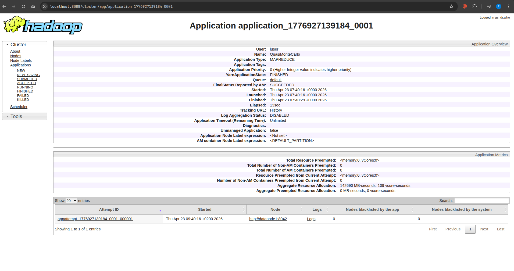

\newpage

# Hadoop (HDFS + YARN)

En este apartado completaremos los pasos correspondientes a la sesión 1 sobre el manejo de un cluster Hadoop.

## Apartado 1

Instalamos el sistema de ficheros HDFS con

```bash
sudo ./mount-hdfs.sh mount
```

## Apartado 2

Se inicia el cluster con

```bash
./start.sh
```

Comprobamos que los contenedores se están ejecutando correctamente con:

```bash
pyros05@Pyros-Nitro-ANV15-52:~/$ docker container ps

CONTAINER ID   IMAGE              COMMAND                  CREATED              STATUS                        PORTS                                                                                                                                                                                NAMES
3e7876d1f5d5   hadoop-lab:3.3.6   "/usr/bin/tini -- /o…"   About a minute ago   Up About a minute                                                                                                                                                                                                  datanode1
b368fc04f793   hadoop-lab:3.3.6   "/usr/bin/tini -- /o…"   About a minute ago   Up About a minute             0.0.0.0:19888->19888/tcp, [::]:19888->19888/tcp                                                                                                                                      historyserver
23b02909b5e6   hadoop-lab:3.3.6   "/usr/bin/tini -- /o…"   About a minute ago   Up About a minute                                                                                                                                                                                                  datanode3
1346ee2ef5e7   hadoop-lab:3.3.6   "/usr/bin/tini -- /o…"   About a minute ago   Up About a minute                                                                                                                                                                                                  datanode2
0eddfc35cb2b   hadoop-lab:3.3.6   "/usr/bin/tini -- /o…"   About a minute ago   Up About a minute                                                                                                                                                                                                  workbench
d9d23cd13ed4   hadoop-lab:3.3.6   "/usr/bin/tini -- /o…"   About a minute ago   Up About a minute             0.0.0.0:2049->2049/tcp, 0.0.0.0:2049->2049/udp, [::]:2049->2049/tcp, [::]:2049->2049/udp, 0.0.0.0:4242->4242/tcp, 0.0.0.0:4242->4242/udp, [::]:4242->4242/tcp, [::]:4242->4242/udp   nfsgateway
74502e9f8623   hadoop-lab:3.3.6   "/usr/bin/tini -- /o…"   About a minute ago   Up About a minute (healthy)   0.0.0.0:8088->8088/tcp, [::]:8088->8088/tcp, 0.0.0.0:9000->9000/tcp, [::]:9000->9000/tcp, 0.0.0.0:9870->9870/tcp, [::]:9870->9870/tcp                                                namenode

```

Nos conectamos al NameNode/Resource Manager

```bash
docker container exec -ti namenode /bin/bash
```

y cambiamos al usuario `hdadmin`

```bash
su - hdadmin
```

Revisamos la configuración de los _daemons_ de Hadoop ubicados en `core-site.xml`, `hdfs-site.xml`, `yarn-site.xml`, `mapred-site.xml`.

```bash
cat <nombre-fichero.xml>
```

Comprobamos que el cluster está interactuando con los servicios HDFS y YARN:

```bash
hdadmin@namenode:~$ hdfs dfsadmin -report

Configured Capacity: 3017603960832 (2.74 TB)
Present Capacity: 313837965312 (292.28 GB)
DFS Remaining: 313837891584 (292.28 GB)
DFS Used: 73728 (72 KB)
DFS Used%: 0.00%
Replicated Blocks:
 Under replicated blocks: 0
 Blocks with corrupt replicas: 0
 Missing blocks: 0
 Missing blocks (with replication factor 1): 0
 Low redundancy blocks with highest priority to recover: 0
 Pending deletion blocks: 0
Erasure Coded Block Groups:
 Low redundancy block groups: 0
 Block groups with corrupt internal blocks: 0
 Missing block groups: 0
 Low redundancy blocks with highest priority to recover: 0
 Pending deletion blocks: 0

-------------------------------------------------
Live datanodes (3):

Name: 172.21.0.6:9866 (datanode2.hadoop-lab_default)
Hostname: datanode2
Decommission Status : Normal
Configured Capacity: 1005867986944 (936.79 GB)
DFS Used: 24576 (24 KB)
Non DFS Used: 850084560896 (791.70 GB)
DFS Remaining: 104612630528 (97.43 GB)
DFS Used%: 0.00%
DFS Remaining%: 10.40%
Configured Cache Capacity: 0 (0 B)
Cache Used: 0 (0 B)
Cache Remaining: 0 (0 B)
Cache Used%: 100.00%
Cache Remaining%: 0.00%
Xceivers: 0
Last contact: Thu Apr 23 06:42:33 UTC 2026
Last Block Report: Thu Apr 23 06:38:36 UTC 2026
Num of Blocks: 0


Name: 172.21.0.7:9866 (datanode1.hadoop-lab_default)
Hostname: datanode1
Decommission Status : Normal
Configured Capacity: 1005867986944 (936.79 GB)
DFS Used: 24576 (24 KB)
Non DFS Used: 850084560896 (791.70 GB)
DFS Remaining: 104612630528 (97.43 GB)
DFS Used%: 0.00%
DFS Remaining%: 10.40%
Configured Cache Capacity: 0 (0 B)
Cache Used: 0 (0 B)
Cache Remaining: 0 (0 B)
Cache Used%: 100.00%
Cache Remaining%: 0.00%
Xceivers: 0
Last contact: Thu Apr 23 06:42:33 UTC 2026
Last Block Report: Thu Apr 23 06:38:36 UTC 2026
Num of Blocks: 0


Name: 172.21.0.8:9866 (datanode3.hadoop-lab_default)
Hostname: datanode3
Decommission Status : Normal
Configured Capacity: 1005867986944 (936.79 GB)
DFS Used: 24576 (24 KB)
Non DFS Used: 850084560896 (791.70 GB)
DFS Remaining: 104612630528 (97.43 GB)
DFS Used%: 0.00%
DFS Remaining%: 10.40%
Configured Cache Capacity: 0 (0 B)
Cache Used: 0 (0 B)
Cache Remaining: 0 (0 B)
Cache Used%: 100.00%
Cache Remaining%: 0.00%
Xceivers: 0
Last contact: Thu Apr 23 06:42:33 UTC 2026
Last Block Report: Thu Apr 23 06:38:36 UTC 2026
Num of Blocks: 0
```

```bash
hdadmin@namenode:~$ yarn node -list
2026-04-23 06:43:20,358 INFO client.DefaultNoHARMFailoverProxyProvider: Connecting to ResourceManager at resourcemanager/172.21.0.2:8032
Total Nodes:3
         Node-Id      Node-State Node-Http-Address Number-of-Running-Containers
 datanode3:42907         RUNNING    datanode3:8042                            0
 datanode2:36231         RUNNING    datanode2:8042                            0
 datanode1:45251         RUNNING    datanode1:8042                            0
```

Podemos ver que se están ejecutando 3 datanodes pero no tienen ningún contenedor funcionando ya que no hemos realizado todavía ninguna petición. También podemos conectarnos mediante:

```bash
curl -v http://localhost:9870   # HDFS NameNode
curl -v http://localhost:8088   # YARN
curl -v http://localhost:19888  # JobHistory
```

## Apartado 3

Metiéndonos en el workbench comprobamos las carpetas dentro de cada usuario

```bash
pyros05@Pyros-Nitro-ANV15-52:~/$ docker compose exec workbench bash
root@workbench:/# hdfs dfs -ls /user
Found 2 items
drwxr-xr-x   - hdadmin supergroup          0 2026-04-23 06:38 /user/hdadmin
drwxr-xr-x+  - luser   supergroup          0 2026-04-23 06:38 /user/luser
```

Creamos un directorio y un fichero de prueba

```bash
root@workbench:/# hdfs dfs -mkdir -p dir_prueba
root@workbench:/# hdfs dfs -touch file_prueba file
root@workbench:/# hdfs dfs -ls
Found 3 items
drwxr-xr-x+  - luser supergroup          0 2026-04-23 06:48 dir_prueba
-rw-r--r--   3 luser supergroup          0 2026-04-23 06:48 file
-rw-r--r--   3 luser supergroup          0 2026-04-23 06:48 file_prueba
```

También nos podemos mover a la carpeta `hdfs` y, crear otro directorio y otro fichero:

```bash
pyros05@Pyros-Nitro-ANV15-52:~$ cd ~/hdfs/
pyros05@Pyros-Nitro-ANV15-52:~/hdfs$ touch file_prueba_2
pyros05@Pyros-Nitro-ANV15-52:~/hdfs$ mkdir dir_prueba_2
pyros05@Pyros-Nitro-ANV15-52:~/hdfs$ ls -al
total 6
drwxr-xr-x  7 pyros05 2584148964  224 abr 23 08:54 .
drwxr-x--- 69 pyros05 pyros05    4096 abr 22 20:06 ..
drwxr-xr-x  2 pyros05 pyros05      64 abr 23 08:54 dir_prueba_2
-rw-r--r--  1 pyros05 2584148964    0 abr 23 08:48 file
-rw-r--r--  1 pyros05 2584148964    0 abr 23 08:48 file_prueba
-rw-r--r--  1 pyros05 pyros05       0 abr 23 08:54 file_prueba_2
-rw-r--r--  1 pyros05 pyros05      37 abr 23 08:52 hello-20260423085200-40341.txt
```

Al observar el mapeo configurado entre los IDs de usuarios y el ID que tiene `hdfs` por defecto se puede ver que el código númerico que muestra `docker compose` se debe a que NFS no puede mapear el nombre del grupo por lo que le asigna un número.

```bash
pyros05@Pyros-Nitro-ANV15-52:~/$ docker compose exec nfsgateway id -u luser
1000
pyros05@Pyros-Nitro-ANV15-52:~/$ docker compose exec nfsgateway id -g luser
1000
pyros05@Pyros-Nitro-ANV15-52:~/$ tail /etc/passwd | grep $USER
pyros05:x:1000:1000:Francisco Javier:/home/pyros05:/bin/bash
```

A la hora de tratar con archivos, `hdfs` nos permite copiar archivos como si fuera parte del sistema de ficheros local. Descagamos el fichero de libros `libros.tar.gz` y lo descomprimimos:

```bash
wget https://github.com/dsevilla/bd2-data/releases/download/libros-tar-gz/libros.tar.gz
tar xzf libros.tar.gz
```

Copiamos el fichero de `libros` a `hdfs`.

```bash
pyros05@Pyros-Nitro-ANV15-52:~/$ cp -r libros/ ~/hdfs/
```

Y desde el contenedor _workbench_ comprobamos que todo se haya copiado correctamente

```bash
root@workbench:/# hdfs dfs -ls libros
Found 16 items
-rw-------   3 luser hostgrp     441804 2026-04-23 07:04 libros/pg14329.txt.gz
-rw-------   3 luser hostgrp     264123 2026-04-23 07:04 libros/pg1619.txt.gz
-rw-------   3 luser hostgrp     455129 2026-04-23 07:04 libros/pg16625.txt.gz
-rw-------   3 luser hostgrp     939502 2026-04-23 07:04 libros/pg17013.txt.gz
-rw-------   3 luser hostgrp     737367 2026-04-23 07:04 libros/pg17073.txt.gz
-rw-------   3 luser hostgrp     219304 2026-04-23 07:04 libros/pg18005.txt.gz
-rw-------   3 luser hostgrp     813698 2026-04-23 07:04 libros/pg2000.txt.gz
-rw-------   3 luser hostgrp     328494 2026-04-23 07:04 libros/pg24536.txt.gz
-rw-------   3 luser hostgrp     504188 2026-04-23 07:04 libros/pg25640.txt.gz
-rw-------   3 luser hostgrp      38194 2026-04-23 07:04 libros/pg25807.txt.gz
-rw-------   3 luser hostgrp     103986 2026-04-23 07:04 libros/pg32315.txt.gz
-rw-------   3 luser hostgrp     125693 2026-04-23 07:04 libros/pg5201.txt.gz
-rw-------   3 luser hostgrp      82099 2026-04-23 07:04 libros/pg7109.txt.gz
-rw-------   3 luser hostgrp      99685 2026-04-23 07:04 libros/pg8870.txt.gz
-rw-------   3 luser hostgrp      85187 2026-04-23 07:04 libros/pg9980.txt.gz
-rw-r--r--   3 luser hostgrp  330326458 2026-04-23 07:04 libros/random_words.txt.bz2
```

## Apartado 4

Copiamos el fichero `filesystem_cat.py` al workbench con un fichero de prueba.

```bash
docker cp filesystem_cat.py workbench:/home/luser
echo "HDFS es el sistema de archivos que permite a Hadoop confiar en hardware poco fiable" > $HOME/hdfs/fichero1.txt
```

Ejecutamos el fichero como usuario `luser` con

```bash
root@workbench:/# su - luser
luser@workbench:~$ export CLASSPATH=$(hdfs classpath --glob)
luser@workbench:~$ python3 filesystem_cat.py hdfs://namenode:9000/user/luser/fichero1.txt
HDFS es el sistema de archivos que permite a Hadoop confiar en hardware poco fiable
```

Creamos el archivo `copy_half_file.py` para que lea los fichero a partir de la mitad:

```python
#! /usr/bin/env python3
import shutil
import sys

from pyarrow.fs import FileInfo, FileSystem


def copy_half_file(uri1: str, uri2: str) -> None:
    fs1, path1 = FileSystem.from_uri(uri1)
    fs2, path2 = FileSystem.from_uri(uri2)

    # Obtener información del archivo en fs1
    f_info: FileInfo = fs1.get_file_info(path1)

    with (
        fs1.open_input_file(path1) as instream,
        fs2.open_output_stream(path2) as outstream,
    ):
        # Mover el puntero de instream a la mitad del archivo
        size = f_info.size
        instream.seek(size // 2)
        # Copiar el resto del archivo en outstream
        shutil.copyfileobj(instream, outstream)


if __name__ == "__main__":
    # Si no se proporcionan dos argumentos, se muestra un mensaje de error
    if len(sys.argv) != 3:
        print("Uso: {} <uri1> <uri2>".format(sys.argv[0]))
        sys.exit(1)

    copy_half_file(sys.argv[1], sys.argv[2])
```

Después subimos el código de la misma forma que `filesystem_cat.py` y lo ejecutamos para que escriba la salida en el archivo `fichero2.txt`:

```bash
luser@workbench:~$ python3 copy_half_file.py hdfs://namenode:9000/user/luser/fichero1.txt \
> hdfs://namenode:9000/user/luser/fichero2.txt
```

```bash
luser@workbench:~$ hdfs dfs -ls
Found 8 items
drwxr-xr-x+  - luser hostgrp             0 2026-04-23 06:54 dir_prueba_2
-rw-r--r--   3 luser hostgrp            84 2026-04-23 07:20 fichero1.txt
-rw-r--r--   3 luser supergroup         42 2026-04-23 07:33 fichero2.txt
```

Podemos observar que `fichero2.txt` ocupa exactamente la mitad que `fichero1.txt`. Para estar seguros ejecutamos de nuevo `filesystem_cat.py` utilizando el fichero 2:

```bash
luser@workbench:~$ python3 filesystem_cat.py hdfs://namenode:9000/user/luser/fichero2.txt
 a Hadoop confiar en hardware poco fiable
```

## Apartado 5

**Cálculo de $\pi$ mediante Monte Carlo:** Accedemos a los ejemplos de Map Reduce existentes dentro de la instalación Hadoop lo ejecutamos con `yarn`:

```bash
export MAPRED_EXAMPLES=$HADOOP_HOME/share/hadoop/mapreduce
yarn jar $MAPRED_EXAMPLES/hadoop-mapreduce-examples-*.jar pi 16 1000
```

Desde la interfaz de YARN podremos ver lo siguiente:



Desde el terminal, obtenemos un resumen con las métricas de el sistema de ficheros, la tarea, Map-Reduce, I/O y los errores, además de el tiempo de ejecución y el resultado.

```
2026-04-23 07:40:30,519 INFO mapreduce.Job: Counters: 54
 File System Counters
  FILE: Number of bytes read=358
  FILE: Number of bytes written=4705031
  FILE: Number of read operations=0
  FILE: Number of large read operations=0
  FILE: Number of write operations=0
  HDFS: Number of bytes read=4230
  HDFS: Number of bytes written=215
  HDFS: Number of read operations=69
  HDFS: Number of large read operations=0
  HDFS: Number of write operations=3
  HDFS: Number of bytes read erasure-coded=0
 Job Counters
  Launched map tasks=16
  Launched reduce tasks=1
  Data-local map tasks=16
  Total time spent by all maps in occupied slots (ms)=83759
  Total time spent by all reduces in occupied slots (ms)=1061
  Total time spent by all map tasks (ms)=83759
  Total time spent by all reduce tasks (ms)=1061
  Total vcore-milliseconds taken by all map tasks=83759
  Total vcore-milliseconds taken by all reduce tasks=1061
  Total megabyte-milliseconds taken by all map tasks=85769216
  Total megabyte-milliseconds taken by all reduce tasks=1086464
 Map-Reduce Framework
  Map input records=16
  Map output records=32
  Map output bytes=288
  Map output materialized bytes=448
  Input split bytes=2342
  Combine input records=0
  Combine output records=0
  Reduce input groups=2
  Reduce shuffle bytes=448
  Reduce input records=32
  Reduce output records=0
  Spilled Records=64
  Shuffled Maps =16
  Failed Shuffles=0
  Merged Map outputs=16
  GC time elapsed (ms)=1762
  CPU time spent (ms)=5740
  Physical memory (bytes) snapshot=5413490688
  Virtual memory (bytes) snapshot=47525949440
  Total committed heap usage (bytes)=8912896000
  Peak Map Physical memory (bytes)=336945152
  Peak Map Virtual memory (bytes)=2803544064
  Peak Reduce Physical memory (bytes)=234389504
  Peak Reduce Virtual memory (bytes)=2806915072
 Shuffle Errors
  BAD_ID=0
  CONNECTION=0
  IO_ERROR=0
  WRONG_LENGTH=0
  WRONG_MAP=0
  WRONG_REDUCE=0
 File Input Format Counters
  Bytes Read=1888
 File Output Format Counters
  Bytes Written=97
Job Finished in 15.0 seconds
Estimated value of Pi is 3.14250000000000000000
```

**Número de palabras:** Copiamos el fichero `wordcount.tgz` al _workbench_ de `hdfs`:

```bash
docker cp wordcount.tgz namenode:/home/luser
```

Descomprimimos el archivo y compilamos el código utilizando Maven:

```bash
tar xvzf wordcount.tgz
cd wordcount
mvn package
```

Después lo ejecutamos con YARN

```bash
yarn jar target/wordcount*.jar libros/p* wordcount-out
```

Desde la interfaz de YARN podemos ver que se ha ejecutado correctamente:


Movemos los ficheros de salida de HDFS al disco local de _workbench_:

```bash
luser@workbench:~/wordcount$ hdfs dfs -get wordcount-out

get: `wordcount-out/_SUCCESS': File exists
get: `wordcount-out/part-r-00000': File exists
get: `wordcount-out/part-r-00001': File exists
get: `wordcount-out/part-r-00002': File exists
```

Al analizar la salida de la ejecución, podemos ver que hay 3 ficheros:

```bash
luser@workbench:~/wordcount-out$ ls
_SUCCESS  part-r-00000  part-r-00001  part-r-00002
```

Investigamos la razón en el Driver:

```java
package cursohadoop.wordcount;

import org.apache.hadoop.conf.Configuration;
import org.apache.hadoop.conf.Configured;
import org.apache.hadoop.fs.Path;
import org.apache.hadoop.io.IntWritable;
import org.apache.hadoop.io.Text;
import org.apache.hadoop.mapreduce.Job;
import org.apache.hadoop.mapreduce.lib.input.FileInputFormat;
import org.apache.hadoop.mapreduce.lib.output.FileOutputFormat;
import org.apache.hadoop.util.Tool;
import org.apache.hadoop.util.ToolRunner;

public class WordCountDriver extends Configured implements Tool
{
    @Override
    public int run(String[] arg0) throws Exception
    {
        if (arg0.length != 2)
        {
            System.err.printf("Usar : %s [ops] <entrada> <salida >\n",
                    getClass().getSimpleName());
            ToolRunner.printGenericCommandUsage(System.err);
            return -1;
        }

        Configuration conf = getConf();
        Job job = Job.getInstance(conf);
        job.setJobName("Word Count");
        job.setJarByClass(getClass());
        FileInputFormat.addInputPath(job, new Path(arg0[0]));
        FileOutputFormat.setOutputPath(job, new Path(arg0[1]));
        job.setOutputKeyClass(Text.class);
        job.setOutputValueClass(IntWritable.class);
        job.setNumReduceTasks(3);
        job.setMapperClass(WordCountMapper.class);
        job.setCombinerClass(WordCountReducer.class);
        job.setReducerClass(WordCountReducer.class);
        return (job.waitForCompletion(true) ? 0 : -1);
    }

    public static void main(String[] args) throws Exception
    {
        int exitCode = ToolRunner.run(new WordCountDriver(), args);
        System.exit(exitCode);
    }
}
```

Donde ver que se especifica que deben de haber 3 tareas enfocadas a reducir (`job.setNumReduceTasks(3)`)

# MapReduce usando MRJoob

**En este apartado se nos pide desarrollar una solución a los ejercicios planteados.** Para ejecutar los código sobre el archivo de 600K líneas utilizaremos el comando:

```bash
python3 <nombre-codigo> 2019-Oct_600k.txt -o <nombre_carpeta_destino>
```

## Ejercicio 1: Event Count

Se debe contar el número de cada tipo de evento `[cart, purchase, view]`.

- Mapper: De cada línea del dataset, extrae la columna `event_type` y la usa como clave, siendo 1 su valor
- Reducer: Por cada clave, agrega sus valores en una suma

```python
import csv

from mrjob.job import MRJob


class MRCountEvents(MRJob):

    def mapper(self, _, line):
        """
        Mapper:
        - Lee cada línea del txt
        - Ignora líneas corruptas o cabecera
        - Extrae event_type
        - Yield (event_type, 1)
        """
        try:
            line = line.strip()
            parts = line.split(',')
            # línea corrupta o cabecera
            if len(parts) < 2 or parts[0] == 'event_time' or len(parts) < 8:
                return

            event_type = parts[1]
            yield event_type, 1
        except Exception:
            # ignora líneas corruptas o cabecera
            pass

    def reducer(self, key, values):
        """
        Reducer:
        - Suma todos los valores asociados a cada event_type
        """
        yield key, sum(values)


if __name__ == '__main__':
    MRCountEvents.run()
```

```
"view" 578376
"cart" 9963
"purchase" 11660
```

## Ejercicio 2: User Count

Se debe contar el número de interacciones de cada usuario.

- Mapper: De cada línea del dataset, extrae la columna `user_id` y la usa como clave, siendo 1 su valor.
- Reducer: Por cada clave, agrega sus valores en una suma.

```python
from mrjob.job import MRJob

class MRUserEventCount(MRJob):

    def mapper(self, _, line):
        """
        Mapper:
        - Lee cada línea del txt
        - Ignora líneas corruptas o cabecera
        - Extrae user_id
        - Yield (user_id, 1)
        """
        fields = line.strip().split(",")

        # Ignorar cabecera y líneas corruptas (mínimo 5 campos)
        if len(fields) < 8 or fields[0] == "event_type":
            return

        user_id = fields[7].strip() # user_id está en la columna 4

        if user_id:
            yield user_id, 1

    def reducer(self, key, values):
        """
        Reducer:
        - Suma todos los valores asociados a cada user_id
        """
        yield key, sum(values)

if __name__ == '__main__':
    MRUserEventCount.run()
```

```
"244951053" 2
"306441847" 4
"315805600" 6
"318145786" 2
"321655812" 2
"330585300" 6
"332550649" 7
"348609428" 1
"351866718" 1
"353623668" 1
"359660585" 6
"360719779" 3
"362699320" 7
"362972137" 3
"370076704" 5
"372118107" 3
"372804920" 2
"372944259" 2
```

## Ejercicio 3: User-Event Count

Se debe contar el número de interacciones de cada usuario con cada tipo de evento.

- Mapper: De cada linea del dataset, extrae las columnas `event_type` y `user_id` y las usa como clave, siendo 1 su valor
- Reducer: Por cada clave combinada, agrega sus valores en una suma

```python
from mrjob.job import MRJob


class MRUserEventCount(MRJob):
    def mapper(self, _, line):
        """
        Mapper:
        - Lee cada línea del txt
        - Ignora líneas corruptas o cabecera
        - Extrae user_id
        - Yield (user_id, envent_type, 1)
        """
        fields = line.strip().split(",")

        # Ignorar cabecera y líneas corruptas (mínimo 8 campos)
        if len(fields) < 8 or fields[0] == "event_time":
            return

        event_type = fields[1].strip()  # event_type está en la columna 1
        user_id = fields[7].strip()  # user_id está en la columna 7

        if user_id and event_type:
            yield (user_id, event_type), 1

    def reducer(self, key, values):
        """
        Reducer:
        - Suma todos los valores asociados a cada user_id, event_type
        """
        yield key, sum(values)


if __name__ == "__main__":
    MRUserEventCount.run()
```

```
["244951053", "view"] 2
["306441847", "view"] 4
["315805600", "view"] 6
["318145786", "view"] 2
["321655812", "view"] 2
["330585300", "view"] 6
["332550649", "view"] 7
["348609428", "view"] 1
["351866718", "view"] 1
["353623668", "view"] 1
```

## Ejercicio 4: Top Users

Se debe obtener el Top 10 de usuarios que más interacciones han tenido

- Mapper: De cada linea del dataset, extrae la columna `user_id` y la usa como clave, siendo 1 su valor
- Reducer_count: Por cada clave, agrega sus valores en una suma se devuelve una clave nula y la tupla clave-valor como valor.
- Reducer_topn: Una vez agregados los valores, se ordenan por su valor y se escogen solo los primeros N.

```python
from mrjob.job import MRJob
from mrjob.step import MRStep

TOP_N = 10


class MRTopUsersSimple(MRJob):

    def mapper_count(self, _, line):
        """
        Mapper:
        - Lee cada línea del txt
        - Ignora líneas corruptas o cabecera
        - Extrae user_id
        - Yield (user_id, 1)
        """
        fields = line.strip().split(",")

        # Ignorar cabecera y líneas corruptas (mínimo 8 campos)
        if len(fields) < 8 or fields[0] == "event_time":
            return

        user_id = fields[7].strip()

        if user_id:
            yield user_id, 1

    def reducer_count(self, user_id, values):
        """
        Reducer:
        - Suma todos los valores asociados a cada user_id y hace yield
        (None, (count, user_id))
        para preparar la siguiente fase de ordenamiento
        """
        total = sum(values)
        # Clave None ⟶ todo va al mismo reducer_topn
        yield None, (total, user_id)


    def reducer_topn(self, _, user_count_pairs):
        """
        Reducer:
        - Recibe (None, (count, user_id)) para todos los usuarios
        - Ordena por count y emite los TOP_N usuarios con más eventos
        """
        # Ordenar de mayor a menor por count y tomar los TOP_N
        top = sorted(user_count_pairs, key=lambda x: x[0], reverse=True)[:TOP_N]

        for count, user_id in top:
            yield user_id, count


    def steps(self):
        return [
            MRStep(mapper=self.mapper_count,
                   reducer=self.reducer_count),
            MRStep(reducer=self.reducer_topn)
        ]


if __name__ == '__main__':
    MRTopUsersSimple.run()
```

```
"521074984" 285
"522799138" 279
"546270188" 257
"516415886" 249
"513611029" 242
"543679273" 230
"541615979" 220
"543346576" 202
"548554037" 195
"549317039" 190
```

## Ejercicio 5: Descripción de productos top

Se debe encontrar el Top 10 de productos más vistos y devolverlos junto con la marca y la categoría.

- Mapper: De cada línea del dataset, extrae las columnas `product_id`, `category_code` de las filas cuya columna `event_type` sea **`view`** y la usa como clave, siendo 1 su valor.
- Reducer_count: Por cada clave, agrega sus valores en una suma
- Reducer_top_N: Ordena por valor y emite los 10 más vistos

```python
from mrjob.job import MRJob
from mrjob.step import MRStep

TOP_N = 10


class MRTopViewedProducts(MRJob):
    def mapper(self, _, line):
        """
        Mapper:
        - Lee cada línea del txt
        - Ignora líneas corruptas o cabecera
        - Extrae event_type, product_id, category_code, brand
        - Si event_type == "view", emite (product_id, (1, category_code, brand))
        """
        fields = line.strip().split(",")

        # Ignorar cabecera y líneas corruptas (mínimo 8 campos)
        if len(fields) < 8 or fields[0] == "event_time":
            return

        event_type = fields[1].strip()
        product_id = fields[2].strip()
        category_code = fields[4].strip()
        brand = fields[5].strip()

        # Solo nos interesan los eventos de tipo "view"
        if event_type == "view" and product_id:
            yield product_id, (1, category_code, brand)

    def reducer_count(self, product_id, values):
        """
        Reducer:
        - Suma el total de views para cada product_id y obtiene category_code y brand
        - Necesita iterar sobre todos los valores del tipo (count, category_code, brand) para sumar counts y obtener la info del producto
        - Emite (None, (total_views, product_id, category_code, brand))
        """
        total = 0
        category_code = ""
        brand = ""

        for count, cat, br in values:
            total += count
            # Guarda la primera categoría/marca no vacía encontrada
            if not category_code and cat:
                category_code = cat
            if not brand and br:
                brand = br

        # Clave None ⟶ todo va al mismo reducer_top_n
        yield None, (total, product_id, category_code, brand)

    def reducer_top_n(self, _, values):
        """
        Reducer:
        - Recibe (None, (total_views, product_id, category_code, brand)) para todos los productos
        - Ordena por total_views y emite los TOP_N productos más vistos
        """
        top = sorted(values, key=lambda x: x[0], reverse=True)[:TOP_N]

        for total_views, product_id, category_code, brand in top:
            yield product_id, [total_views, category_code, brand]

    # -------------------------
    def steps(self):
        return [
            MRStep(mapper=self.mapper, reducer=self.reducer_count),
            MRStep(reducer=self.reducer_top_n),
        ]


if __name__ == "__main__":
    MRTopViewedProducts.run()
```

```
"1004856" [6462, "electronics.smartphone", "samsung"]
"1005115" [6070, "electronics.smartphone", "apple"]
"1004767" [4652, "electronics.smartphone", "samsung"]
"1005105" [3338, "electronics.smartphone", "apple"]
"1004870" [3211, "electronics.smartphone", "samsung"]
"1004249" [2988, "electronics.smartphone", "apple"]
"5100816" [2589, "", "xiaomi"]
"1004833" [2544, "electronics.smartphone", "samsung"]
"1002544" [2488, "electronics.smartphone", "apple"]
"4804056" [2418, "electronics.audio.headphone", "apple"]
```

# Ejercicios opcionales

**En este apartado se resolverán los ejercicios opcionales presentados en la práctica**

## MRJob en Hadoop

Para ejecutar los códigos anterior debemos meter los scripts de Python y el dataset de 600K líneas en el entorno usando:

```bash
docker cp <ruta_al_archivo> workbench:/home/luser
```

y después ejecutarlo desde el usuario `luser`:

```bash
docker compose exec workbench bash
su - luser
python3 <archivo_python> -r hadoop 2019-Oct_600k.txt -o <carpeta_output>
```

Para ver los resultados obtenidos deberemos ejectuar el comando

```bash
hdfs dfs -cat <carpeta_output>/part-XXXX
```

Ejemplo:

```bash
luser@workbench:~$ hdfs dfs -cat output_ej1/part-0000

"view" 578376
"cart" 9963
"purchase" 11660
```

## Map Reduce en un Dataset propio ([eCommerce behavior data from multi category store](https://www.kaggle.com/mkechinov/ecommerce-behavior-data-from-multi-category-store))

Este dataset contiene ~44.5 M de líneas y 9 columnas. Para ejecutar los siguientes ejercicios seguiremos los pasos realizados en el ejercicio anterior.

- `event_time`: Fecha y hora exactas en que se produjo el evento, con format `YYYY-MM-DD HH:MM:SS UCT`. Permite ordenar cronológicamente, agrupar por dia/hora y analizar series temporales (p. ej. picos de tráfico).
- `envet_type`: Tipo de interacción del usuario con un producto. Toma exactamente uno de tres valores: `view` (el usuario abre la ficha del producto), `cart` (lo añade al carrito) y `purchase` (efectúa la compra). Es la columna clave para analizar el embudo de conversión
- `product_id`: Identificador único del producto sobre el que ocurre el evento. Sirve para agregar interacciones por artículo (productos más vistos, más comprados, etc.).
- `category_id`: Identificador numérico interno de la categoría a la que pertenece el producto. Es un código opaco (no legible por humanos), pero sí estable y siempre presente. Útil para joins y agregaciones por categoría.
- `category_code`: Nombre legible de la categoría, expresado como una jerarquía con puntos: `dominio.subdominio.detalle` (p. ej. `electronics.smartphone`, `appliances.environment.water_heater`). Puede estar vacío para muchos productos (no todas las categorías están etiquetadas).
- `brand`: Marca del producto en minúsculas (`samsung`, `apple`, `xiaomi`, `aqua`, `lenovo`...). Puede estar vacío si el producto no tiene marca asociada.
- `price`: Precio unitario del producto en el momento del evento, en la divisa interna del dataset (sin símbolo). Suele tener dos decimales (p. ej. `33.20`, `543.10`).
- `user_id`: Identificador permanente del usuario (anonimizado). Persiste entre sesiones, lo que permite estudiar el comportamiento de un mismo usuario a lo largo del tiempo.
- `user_sesion`: Identificador temporal de la sesión del usuario (formato UUID v4, p. ej. `9333dfbd-b87a-4708-9857-6336556b0fcc`). Cambia cuando el usuario abre una nueva sesión, tras cerrar el navegador, expirar las cookies, o tras un periodo prolongado de inactividad. Sirve para agrupar eventos contiguos de un mismo "viaje" de compra.

### Ejercicio 1: Contador de eventos

Cuenta cuántos eventos hay de cada tipo `(view, cart, purchase)` emitiendo `(event_type, 1)` en el mapper y sumando en el reducer.

Mapper:

- Parsea cada línea como CSV (admite comas dentro de campos entrecomillados).
- Ignora cabecera y líneas corruptas.
- Emite `(event_type, 1)`.

Reducer: Suma todos los valores asociados a cada `event_type`.

```python
import csv
import io

from mrjob.job import MRJob


class MRCountEvents(MRJob):

    def mapper(self, _, line):
        try:
            fields = next(csv.reader(io.StringIO(line)))
        except Exception:
            return

        # Cabecera o línea malformada
        if len(fields) < 9 or fields[0] == "event_time":
            return

        event_type = fields[1].strip()
        if event_type:
            yield event_type, 1

    def reducer(self, key, values):
        yield key, sum(values)


if __name__ == "__main__":
    MRCountEvents.run()
```

```bash
luser@workbench:~$ hdfs dfs -cat ej1_ouput/part-00000
"cart" 926516
"purchase" 742849

luser@workbench:~$ hdfs dfs -cat ej1_ouput/part-00001
"view" 40779399
```

### Ejercicio 2: Contador de interacciones por usuario

Para cada `user_id`, calcula el número total de interacciones con la plataforma (independientemente del tipo de evento).

Mapper:

- Parsea cada línea como CSV.
- Ignora cabecera y líneas corruptas.
- Emite `(user_id, 1)`.

Reducer: Suma todas las interacciones de cada `user_id`.

```python
import csv
import io

from mrjob.job import MRJob


class MRUserCount(MRJob):

    def mapper(self, _, line):
        try:
            fields = next(csv.reader(io.StringIO(line)))
        except Exception:
            return

        if len(fields) < 9 or fields[0] == "event_time":
            return

        user_id = fields[7].strip()
        if user_id:
            yield user_id, 1

    def reducer(self, key, values):
        yield key, sum(values)


if __name__ == "__main__":
    MRUserCount.run()
```

```bash
luser@workbench:~$ hdfs dfs -cat ej2_ouput/part-00000 | head -n 15
"183503497" 1
"184265397" 6
"195082191" 1
"200673532" 4
"205053188" 2
"208669541" 2
"209714031" 22
"210507313" 2
"216064734" 5
"216769127" 1
"219406386" 5
"221480173" 1
"222907508" 2
"224520397" 1
"226242984" 3
```

### Ejercicio 3: Contador de interacciones por usuario y tipo de evento

Para cada par `(user_id, event_type)` calcula cuántas veces ese usuario ha realizado ese tipo de evento.

Mapper:

- Parsea cada línea como CSV.
- Ignora cabecera y líneas corruptas.
- Emite `((user_id, event_type), 1)`.

Reducer: Suma las ocurrencias de cada `(user_id, event_type)`.

```python
import csv
import io

from mrjob.job import MRJob


class MRUserEventCount(MRJob):

    def mapper(self, _, line):
        try:
            fields = next(csv.reader(io.StringIO(line)))
        except Exception:
            return

        if len(fields) < 9 or fields[0] == "event_time":
            return

        event_type = fields[1].strip()
        user_id = fields[7].strip()

        if user_id and event_type:
            yield (user_id, event_type), 1

    def reducer(self, key, values):
        yield key, sum(values)


if __name__ == "__main__":
    MRUserEventCount.run()
```

```bash
luser@workbench:~$ hdfs dfs -cat ej3_ouput/part-00000 | head -n 15
["183503497", "view"] 1
["184265397", "view"] 6
["195082191", "view"] 1
["200673532", "view"] 4
["205053188", "view"] 2
["208669541", "view"] 2
["209714031", "view"] 22
["210507313", "view"] 2
["216064734", "view"] 5
["216769127", "view"] 1
["219406386", "view"] 5
["221480173", "view"] 1
["222907508", "view"] 2
["224520397", "view"] 1
["226242984", "view"] 3
```

### Ejercicio 4: Top 10 usuarios con más interacciones

Calcula los TOP_N usuarios con mayor número de interacciones totales (de cualquier tipo) usando dos pasos MapReduce:

1. Conteo por `user_id`.
2. Reducer único que ordena y selecciona los **TOP_N**.

Mapper:

- Parsea cada línea como CSV.
- Ignora cabecera y líneas corruptas.
- Emite `(user_id, 1)`.

Reducer parcial:

- Suma las interacciones de cada `user_id`.
- Emite `(None, (total, user_id))` para forzar que todos los registros vayan al mismo reducer en el siguiente paso.

Reducer final:

- Recibe todos los `(total, user_id)` bajo la clave None.
- Ordena por total descendente y emite los **TOP_N**.

```python
import csv
import io

from mrjob.job import MRJob
from mrjob.step import MRStep

TOP_N = 10


class MRTopUsers(MRJob):

    def mapper_count(self, _, line):
        try:
            fields = next(csv.reader(io.StringIO(line)))
        except Exception:
            return

        if len(fields) < 9 or fields[0] == "event_time":
            return

        user_id = fields[7].strip()
        if user_id:
            yield user_id, 1

    def reducer_count(self, user_id, values):
        yield None, (sum(values), user_id)

    def reducer_topn(self, _, user_count_pairs):
        top = sorted(user_count_pairs, key=lambda x: x[0], reverse=True)[:TOP_N]
        for total, user_id in top:
            yield user_id, total

    def steps(self):
        return [
            MRStep(mapper=self.mapper_count, reducer=self.reducer_count),
            MRStep(reducer=self.reducer_topn),
        ]


if __name__ == "__main__":
    MRTopUsers.run()
```

```bash
luser@workbench:~$ hdfs dfs -cat ej4_ouput/part-00000
"512475445" 7436
"512365995" 4013
"526731152" 2912
"512505687" 2894
"513021392" 2862
"546159478" 2433
"546270188" 2426
"514649263" 2390
"516308435" 2316
"512401084" 2232
```

### Ejercicio 5: Top 10 productos más vistos junto con su categoría y marca

Filtra eventos de tipo 'view' y calcula los `top_n` productos con mayor número de visualizaciones, devolviendo además `category_code` y `brand`.

Mapper:

- Parsea cada línea como CSV.
- Ignora cabecera y líneas corruptas.
- Sólo procesa eventos 'view'.
- Emite `(product_id, (1, category_code, brand))`.

Reducer parcial:

- Suma el total de views por `product_id`.
- Conserva la primera `category_code` y `brand` no vacías.
- Emite `(None, (total_views, product_id, category_code, brand))`.

Reducer final:

- Ordena los productos por total_views descendente.
- Emite los **TOP_N** como `(product_id, [total_views, category_code, brand])`.

```python
import csv
import io

from mrjob.job import MRJob
from mrjob.step import MRStep

TOP_N = 10


class MRTopViewedProducts(MRJob):

    def mapper(self, _, line):
        try:
            fields = next(csv.reader(io.StringIO(line)))
        except Exception:
            return

        if len(fields) < 9 or fields[0] == "event_time":
            return

        event_type = fields[1].strip()
        product_id = fields[2].strip()
        category_code = fields[4].strip()
        brand = fields[5].strip()

        if event_type == "view" and product_id:
            yield product_id, (1, category_code, brand)

    def reducer_count(self, product_id, values):
        total = 0
        category_code = ""
        brand = ""

        for count, cat, br in values:
            total += count
            if not category_code and cat:
                category_code = cat
            if not brand and br:
                brand = br

        yield None, (total, product_id, category_code, brand)

    def reducer_top_n(self, _, values):
        top = sorted(values, key=lambda x: x[0], reverse=True)[:TOP_N]
        for total_views, product_id, category_code, brand in top:
            yield product_id, [total_views, category_code, brand]

    def steps(self):
        return [
            MRStep(mapper=self.mapper, reducer=self.reducer_count),
            MRStep(reducer=self.reducer_top_n),
        ]


if __name__ == "__main__":
    MRTopViewedProducts.run()
```

```bash
luser@workbench:~$ hdfs dfs -cat ej5_ouput/part-00000
"1004856" [419287, "electronics.smartphone", "samsung"]
"1004767" [378777, "electronics.smartphone", "samsung"]
"1005115" [327715, "electronics.smartphone", "apple"]
"1004249" [207422, "electronics.smartphone", "apple"]
"1004833" [203018, "electronics.smartphone", "samsung"]
"1005105" [197930, "electronics.smartphone", "apple"]
"1004870" [190435, "electronics.smartphone", "samsung"]
"1002544" [179249, "electronics.smartphone", "apple"]
"4804056" [179092, "electronics.audio.headphone", "apple"]
"5100816" [164608, "", "xiaomi"]
```
