\newpage

# Dask

Instalamos e importamos las librerías necesarias para el desarrollo del
proyecto:

```bash
uv pip install dask distributed --quiet  # Para trabajar con Dask
uv pip install pyngrok --quiet  # Para exponer el dashboard de Dask
uv pip install kagglehub # Para extraer el dataset directamente desde Kaggle
```

```python
# Importar librerías
from dask.distributed import Client, LocalCluster
from pyngrok import ngrok
import multiprocessing
import matplotlib.pyplot as plt
from IPython.display import display
import warnings

warnings.filterwarnings("ignore")
```

## Exponer el Dashboard de Dask con _ngrok_ y configuración del clúster en modo CPU

```python
# Función para exponer el dashboard de Dask con ngrok
def expose_dashboard(cluster):
    ngrok.set_auth_token("3DGUSrNgMvLKPTUmNUW5yTWO6gG_K8JaZSLeymSDNRoijoV1")
    public_url = ngrok.connect("8787")  # Puerto por defecto del dashboard de Dask
    print(f"El dashboard de Dask está disponible en: {public_url}")
    return public_url

def setup_cluster(mode="cpu"):
    if mode == "cpu":
        # Configuración para uso de CPU
        num_cpus = int(
            multiprocessing.cpu_count() // 2
        )  # Menos núcleos de la CPU para evitar saturación
        cluster = LocalCluster(n_workers=num_cpus, threads_per_worker=2)
    else:
        raise ValueError("Modo no válido")

    # Conectar al cluster
    client = Client(cluster)
    print(client)  # Mostrar información del cliente
    expose_dashboard(cluster)  # Exponer el dashboard
    return client

# Modo CPU
client_cpu = setup_cluster(mode="cpu")
```

```
<Client: 'tcp://127.0.0.1:37001' processes=10 threads=20, memory=31.04 GiB>
El dashboard de Dask está disponible en: NgrokTunnel: "https://13b3-88-98-121-210.ngrok-free.app"
    -> "http://localhost:8787"
```

## Cargar y limpiar datos

```python
import dask.dataframe as dd
import os
import kagglehub

# Descargamos el dataset

dataset_name = "new-york-city/nyc-parking-tickets"
path = kagglehub.dataset_download(dataset_name)
os.makedirs(path, exist_ok=True)

# Cargamos cada archivo en un DataFrame de Dask distinto
tickets14 = dd.read_csv(
    os.path.join(
        path, "Parking_Violations_Issued_-_Fiscal_Year_2014__August_2013___June_2014_.csv"
    ),
    assume_missing=True,
    sample=10000,
)
print(f"Columnas y Tipos de datos 2014:\n{tickets14.dtypes}")
print(f"Número de columnas: {len(set(tickets14.columns))}")
print("-" * 60)
print()

tickets15 = dd.read_csv(
    os.path.join(path, "Parking_Violations_Issued_-_Fiscal_Year_2015.csv"),
    assume_missing=True,
    sample=10000,
)
print(f"Columnas y Tipos de datos 2015:\n{tickets15.dtypes}")
print(f"Número de columnas: {len(set(tickets15.columns))}")
print("-" * 60)
print()

tickets16 = dd.read_csv(
    os.path.join(path, "Parking_Violations_Issued_-_Fiscal_Year_2016.csv"),
    assume_missing=True,
    sample=10000,
)
print(f"Columnas y Tipos de datos 2016:\n{tickets16.dtypes}")
print(f"Número de columnas: {len(set(tickets16.columns))}")
print("-" * 60)
print()

tickets17 = dd.read_csv(
    os.path.join(path, "Parking_Violations_Issued_-_Fiscal_Year_2017.csv"),
    assume_missing=True,
    sample=10000,
)
print(f"Columnas y Tipos de datos 2017:\n{tickets17.dtypes}")
print(f"Número de columnas: {len(set(tickets17.columns))}")
print("-" * 60)
```

:::: {layout-ncol="2"}

::: {#first-layout}

```
Columnas y Tipos de datos 2014:
Summons Number                       float64
Plate ID                              string
Registration State                    string
Plate Type                            string
Issue Date                            string
Violation Code                       float64
Vehicle Body Type                     string
Vehicle Make                          string
Issuing Agency                        string
Street Code1                         float64
...
dtype: object
Número de columnas: 51
---------------------------------------------
```

:::

::: {#second-column}

```
Columnas y Tipos de datos 2015:
Summons Number                       float64
Plate ID                              string
Registration State                    string
Plate Type                            string
Issue Date                            string
Violation Code                       float64
Vehicle Body Type                     string
Vehicle Make                          string
Issuing Agency                        string
Street Code1                         float64
...
dtype: object
Número de columnas: 51
---------------------------------------------
```

:::

::: {#third-layout}

```
Columnas y Tipos de datos 2016:
Summons Number                       float64
Plate ID                              string
Registration State                    string
Plate Type                            string
Issue Date                            string
Violation Code                       float64
Vehicle Body Type                     string
Vehicle Make                          string
Issuing Agency                        string
Street Code1                         float64
...
dtype: object
Número de columnas: 51
--------------------------------------------
```

:::

::: {#fourth-column}

```
Columnas y Tipos de datos 2017:
Summons Number                       float64
Plate ID                              string
Registration State                    string
Plate Type                            string
Issue Date                            string
Violation Code                       float64
Vehicle Body Type                     string
Vehicle Make                          string
Issuing Agency                        string
Street Code1                         float64
...
dtype: object
Número de columnas: 43
--------------------------------------------
```

:::

::::

```python
tickets = {
    "tickets14": tickets14,
    "tickets15": tickets15,
    "tickets16": tickets16,
    "tickets17": tickets17,
}

# Comparar columnas entre todos los pares de DataFrames
for name1, df1 in tickets.items():
    for name2, df2 in tickets.items():
        if name1 >= name2:
            continue
        if set(df1.columns) != set(df2.columns):
            print(f"Diferencia de columnas entre {name1} y {name2}")
```

```
Diferencia de columnas entre tickets14 y tickets17
Diferencia de columnas entre tickets15 y tickets17
Diferencia de columnas entre tickets16 y tickets17
```

En las celdas anteriores hemos podido evidenciar ambos problemas:

- En primer lugar, tenemos que el CSV con la información del dataset para 2017
  tiene menos columnas que los demás por lo que nos tendremos que adecuar a este
  para que no hayan muchos valores nulos en aquellas columnas que este fichero
  no tiene, para ello combinaremos los datasets quedándonos solo con las
  columnas comunes entre ellos.
- En segundo lugar, podemos ver en el error anterior, que `Dask` no ha
  conseguido inferir correctamente el tipo de dato de algunas columnas como
  **House Number, Time First Observed** y **Violation Legal Code**, para
  solucionar esto especificaremos al framework el tipo de dato a utilizar a la
  hora de cargar los datos de las diferentes columnas.

### Extracción de columnas comunes

```python
# Obtenemos las columnas comunes entre los DataFrames
common_cols = list(
    set(tickets14.columns).intersection(
        tickets15.columns,
        tickets16.columns,
        tickets17.columns
    )
)
```

### Conversión a columnas strings

```python
# Convertimos todas las columnas comunes a string y cargamos solamente estas
data_types = {col: "str" for col in common_cols}

tickets14 = dd.read_csv(
    os.path.join(
        path, "Parking_Violations_Issued_-_Fiscal_Year_2014__August_2013___June_2014_.csv"
    ),
    assume_missing=True,
    usecols=common_cols,
    dtype=data_types,
)
tickets15 = dd.read_csv(
    os.path.join(path, "Parking_Violations_Issued_-_Fiscal_Year_2015.csv"),
    assume_missing=True,
    usecols=common_cols,
    dtype=data_types,
)
tickets16 = dd.read_csv(
    os.path.join(path, "Parking_Violations_Issued_-_Fiscal_Year_2016.csv"),
    assume_missing=True,
    usecols=common_cols,
    dtype=data_types,
)
tickets17 = dd.read_csv(
    os.path.join(path, "Parking_Violations_Issued_-_Fiscal_Year_2017.csv"),
    assume_missing=True,
    usecols=common_cols,
    dtype=data_types,
)
```

### Creación de un DataFrame único con persistencia

```python
# Cargamos los DataFrames en uno único
df = dd.concat([tickets14, tickets15, tickets16, tickets17], axis=0)

# Para hacer el dataframe persistente en memoria debemos hacer:
df = df.persist()

# Para el dataset en RAM hacemos:
print(df.info())

print(f"Nº de particiones: {df.npartitions}")
n_filas = df.shape[0].compute()  # N_FILAS
n_columnas = df.shape[1]  # N_COLUMNAS

print(f"\nNº de Filas: {n_filas}\nNº de columnas: {n_columnas}")
print(f"Tamaño aproximado en RAM (GBytes): {df.memory_usage(deep=True).sum().compute() / 1024**3}")
```

```
<class 'dask.dataframe.dask_expr.DataFrame'>
Columns: 43 entries, Summons Number to Double Parking Violation
dtypes: string(43)None
Nº de particiones: 138

Nº de Filas: 42339438
Nº de columnas: 43
Tamaño aproximado en RAM (GBytes): 20.111379859037697
```

Comprobación de que el cambio de tipo de dato se ha realizado correctamente.

```python
# Esquema de datos correctamente definidos
print(df.dtypes)
```

::::: {layout-ncol="2"}

<div>

```
Summons Number                       string
Plate ID                             string
Registration State                   string
Plate Type                           string
Issue Date                           string
Violation Code                       string
Vehicle Body Type                    string
Vehicle Make                         string
Issuing Agency                       string
Street Code1                         string
Street Code2                         string
Street Code3                         string
Vehicle Expiration Date              string
Violation Location                   string
Violation Precinct                   string
Issuer Precinct                      string
Issuer Code                          string
Issuer Command                       string
Issuer Squad                         string
Violation Time                       string
Time First Observed                  string
Violation County                     string
```

</div>

<div>

```
Violation In Front Of Or Opposite    string
House Number                         string
Street Name                          string
Intersecting Street                  string
Date First Observed                  string
Law Section                          string
Sub Division                         string
Violation Legal Code                 string
Days Parking In Effect               string
From Hours In Effect                 string
To Hours In Effect                   string
Vehicle Color                        string
Unregistered Vehicle?                string
Vehicle Year                         string
Meter Number                         string
Feet From Curb                       string
Violation Post Code                  string
Violation Description                string
No Standing or Stopping Violation    string
Hydrant Violation                    string
Double Parking Violation             string
dtype: object
```

</div>
:::::

\newpage

Podemos observar la correcta definición del tipo de datos mediante el esquema
definido, para esta primera carga hemos utilizado `string` como tipo de dato
para todas las columnas.

Por otro lado:

1. Tenemos que, en la lectura, Dask ha definido 138 particiones para el
   almacenamiento distribuido(ficticio) de los datos del dataset.

2. Hay 42.339.438 filas, 43 columnas(atributos) y el tamaño en RAM del DataFrame
   es de 20.11 GBytes.

### Dask Daskboard durante el proceso de carga

**Diferentes tareas de procesamiento del dataset para su carga en los diferentes
nodos del clúster:**

{fig-align="center"}

**Métricas de trabajo de los distintos workers del clúster:**

{fig-align="center"}

Observar el:

- Gran uso de CPU para procesar todos los datos.
- El incremento secuencial del uso de la memoria RAM donde se esta almacenando
  el dataset.
- El comienzo del Spilling to Disk que se puede apreciar en la columna 11.
- Número de bytes almacenados por cada worker que se puede apreciar en la
  columna 5.

**Spilling to Disk y muestral del Dashboard Final**

- Aquí se puede ver claramente como nuestros workers han tenido que echar mano
  del mecanismo de spilling, esto ocurre porque estos intentan cargar o procesar
  más datos de los que caben en su memoria RAM, y como resultado tienen que usar
  el disco como almacenamiento temporal de estos datos que no caben.

- Observar que se han llevado **14.86 GBytes** de datos al disco mediante este
  mecanismo.

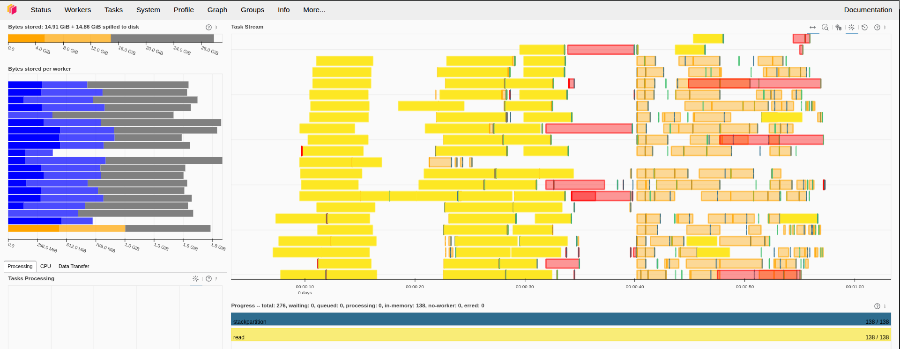{fig-align="center"}

**Tiempo necesitado para la carga de todo el dataset mediante el clúster de
"cpus"**

El dataset con sus 138 particiones ha sido cargado completamente en RAM y,
temporalmente, en disco en **aproximadamente un minuto**, veremos próximamente
si con otros métodos conseguimos aumentar la eficiencia.

## Calcular algunos filtros

1. Calcula el condado de NYC que recibió más multas durante el periodo de
   estudio.

   ```python
   # Calcular el condado con más multas usando value_counts
   county_with_most_violations = df["Violation County"].value_counts().nlargest(1).compute()

   county = county_with_most_violations.index[0]
   n_vio = county_with_most_violations.values[0]

   print(
     "El condado con más multas durante el periodo "
     f"de estudio fue: {county} con {n_vio} multas."
   )
   ```

   ```
   El condado con más multas durante el periodo de estudio fue: NY con 14630069 multas.
   ```

   Para encontrar el condado con más multas, seguimos estos pasos:
   1. **Contamos** el número de multas por condado mediante `value_counts()`.
   2. **Identificamos** el condado con el mayor número de múltas mediante
      `.nlargest(1)`.
   3. **Mostramos** el condado con más multas y el número de multas registradas.

   Siguiendo estos pasos encontramos que el condado de NYC con más multas es:
   **NY**.

2. Calcula los 10 coches que recibieron más multas durante el periodo de
   estudio. Utiliza la columna `'Plate ID'` para identificar cada coche.

   ```python
   # Seleccionamos 'Plate ID' que contiene el número de matrícula y contamos el número de
   # multas en cada matrícula y nos quedamos con los 11 valores más altos porrque el
   # primero se asocia a matrícula en blanco.
   top_10_plates = (
       df["Plate ID"].value_counts(split_every=4).nlargest(11).compute()
   )

   # Imprimimos las 10 matrículas con el mayor número de multas
   for i, count_vio in enumerate(top_10_plates):
       print(
           f"El {i}º coche con más multas: {top_10_plates.index[i]} -> {count_vio}"
       )
   ```

   ```
   El 0º coche con más multas: BLANKPLATE -> 56717
   El 1º coche con más multas: 47603MD -> 4003
   El 2º coche con más multas: 49781MA -> 3534
   El 3º coche con más multas: 2028685 -> 3497
   El 4º coche con más multas: AN917T -> 3312
   El 5º coche con más multas: 96087MA -> 3261
   El 6º coche con más multas: 75225JW -> 3217
   El 7º coche con más multas: 49839JG -> 3204
   El 8º coche con más multas: AP300F -> 3190
   El 9º coche con más multas: 62546JM -> 3169
   El 10º coche con más multas: 16213TC -> 3152
   ```

   ```python
   # Graficamos las 10 matrículas con el mayor número de multas mediante una
   # gráfica de barras
   top_10_plates[1:].plot(
       kind="bar",
       title="Top 10 coches con más multas en NYC",
       xlabel="Coches",
       ylabel="Número de multas",
   )
   plt.show()
   ```

   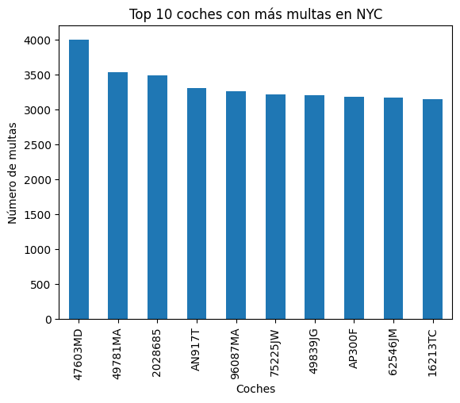{fig-align="center" width="80%"}

   Para encontrar los 10 coches con más multas, seguimos estos pasos:
   1. **Contamos** el número de multas por matrícula (`'Plate ID'`) y
      **Ordenamos** esas matrículas a partir de su conteo de manera descendente.
   2. **Identificamos** las 10 matrículas con el mayor número de multas.
   3. **Mostramos** las 10 matrículas con más multas y el número de multas
      registradas para cada una.
   4. **Graficamos** los resultados en un gráfico de barras.

   Siguiendo estos pasos observamos que:
   - Las personas suelen tener bastantes multas cuando no tienen aún matriculado
     el coche.
   - El coche con más infracciones cometidas durante el periodo de estudio es el
     coche con matrícula **47603MD**.

3. Distribución de multas por mes (agregación temporal): Determinar el número
   total de multas emitidas en cada mes a lo largo del periodo y descubrir qué
   mes presenta la mayor cantidad de infracciones (para identificar posibles
   tendencias estacionales). (Pista: La columna de fecha de emisión Issue Date
   incluye fecha/hora de la multa): df\['Issue Date'\].dt.month para obtener el
   mes).

   ```python
   # Convertimos 'Issue Date' a datetime
   df["Issue Date"] = dd.to_datetime(df["Issue Date"], errors="coerce")

   # Extraemos el mes de la columna 'Issue Date' y generamos una nueva columna
   # en el datframe con el
   df["Issue Month"] = df["Issue Date"].dt.month

   # Mediante 'Issue Month' realizamos el conteo y ordenamos de forma descendente
   monthly_counts = (
       df["Issue Month"].value_counts().compute().sort_values(ascending=False)
   )

   # Mostramos la distribución de multas y el mes con más infracciones cometidas
   print("Distribución de multas por mes:")
   print(monthly_counts)

   print(
       f"\nEl mes con más infracciones es: {monthly_counts.index[0]} "
       f"con {monthly_counts.values[0]} multas"
   )
   ```

   ```
   Distribución de multas por mes:
   Issue Month
   10    3987212
   3     3852356
   5     3840294
   1     3809913
   9     3758123
   6     3710541
   4     3602097
   11    3483306
   8     3455617
   12    3055935
   2     3054514
   7     2729530
   Name: count, dtype: int64

   El mes con más infracciones es: 10 con 3987212 multas
   ```

   Para obtener la distribución de multas por mes y el mes con más multas
   seguimos estos pasos:
   1. **Convertimos** la columna 'Issue Date' a formato datetime.
   2. **Extraemos** el mes de la columna 'Issue Date' y creamos una nueva
      columna llamada 'Issue Month'.
   3. **Contamos** el número de multas por cada mes.
   4. **Identificamos** el mes con el mayor número de multas escogiendo el 1º de
      ellos dado que hemos ordenado de manera descendente.
   5. **Mostramos** la distribución de multas por mes y el mes con el mayor
      número de infracciones.

   Podemos observar que, durante el periodo de estudio, **Octubre** fue el mes
   con más infracciones registradas.

   ```python
   import calendar

   # Ordenamos por índice
   monthly_counts = monthly_counts.sort_index()

   # Mapeamos los índices a nombres de meses en inglés
   month_names = [calendar.month_name[i] for i in monthly_counts.index]


   plt.figure(figsize=(12, 6))
   plt.plot(month_names, monthly_counts.values, marker="o")
   plt.xlabel("Mes")
   plt.ylabel("Número de Multas (Millones)")
   plt.title("Distribución de Multas por Mes")
   plt.xticks(rotation=45, ha="right")
   plt.tight_layout()
   plt.show()
   ```

   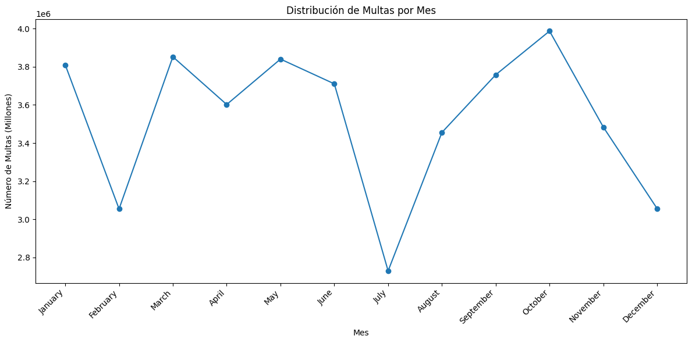{fig-align="center" width="80%"}

   Visualizando la gráfica de la distribución de multas podemos observar
   claramente como se reducen considerablemente en los meses vacacionales como
   Julio y Diciembre, por otro lado, se observa una constante durante los meses
   que se dan entre Navidad y Verano, por último, comentar que después de las
   vacaciones de verano se da un aumento progresivo de las infracciones llegando
   a su pico de **Octubre**, esto podríamos llegar a achacarlo a esa ansiedad
   que se produce en las personas a la vuelta de las vacaciones lo que les puede
   llevar a cometer más infracciones de lo normal.

4. Horas del día con más multas (patrón diario): Analizar en qué horas del día
   se emiten más multas, identificando las horas pico de sanciones. (Pista:
   basándote en "Violation Time" extrae la hora del día de cada registro. Crea
   tu propia funcion "extract_hour" para obtener la hora - el formato es
   HORAMINUTOA/P, por ejemplo 0710P serían las 19:10. 0810A serían las 8:10-.
   Utiliza el método "map" para aplicar tu función a la entrada).

   ```python
   def extract_hour(time_str):
       if not isinstance(time_str, str):
           return None  # Manejar valores no válidos

       time_str = time_str.strip()
       if not time_str:
           return None

       period = time_str[-1].upper()
       time_str = time_str[:-1]

       try:
           hour = int(time_str[:2])
       except ValueError:
           return None

       if period == "P" and hour != 12:
           hour += 12
       elif period == "A" and hour == 12:
           hour = 0  # Medianoche

       return hour
   ```

   ```python
   # Aplicamos la función extract_hour definida a la columna 'Violation Time' para extraer
   # la hora de cada tiempo
   df["Violation Extract Hour"] = df["Violation Time"].map(
       extract_hour, meta=("Violation Time", "int64")
   )

   # Realizamos el conteo para cada hora y ordenamos de manera descendente
   hourly_counts = (
       df["Violation Extract Hour"]
       .value_counts()
       .compute()
       .sort_values(ascending=False)
   )

   print("Las 10 horas pico con más infracciones son:\n")
   for i in range(11):
       print(f"Las {hourly_counts.index[i]}h con {hourly_counts.iloc[i]} multas")
   ```

   ```
   Las 10 horas pico con más infracciones son:

   Las 9.0h con 4499583 multas
   Las 11.0h con 4402639 multas
   Las 13.0h con 4132527 multas
   Las 8.0h con 3886120 multas
   Las 12.0h con 3699299 multas
   Las 10.0h con 3678650 multas
   Las 14.0h con 3540660 multas
   Las 15.0h con 2526664 multas
   Las 16.0h con 2362957 multas
   Las 7.0h con 2111441 multas
   Las 17.0h con 1705422 multas
   ```

   Con la función definida `extract_hour(time_str)` extraemos la hora de un
   string de tiempo, extrae la hora en formato de 24 horas, manejando los casos
   AM/PM.

   A continuación, realizamos el siguiente procesamiento en el DataFrame:
   1. **Extraemos la hora:** Aplicamos la función `extract_hour` a la columna
      'Violation Time' para crear una nueva columna, 'Violation Extract Hour'.
      Esto nos da la hora en que se emitió cada multa.
   2. **Contamos** el número de multas para cada hora.
   3. **Ordenamos** las horas por el número de multas de forma descendente.
   4. **Mostramos** las 10 horas pico con más multas y el número de multas
      registradas para cada una.
   5. **Creamos** un gráfico de barras para mostrar la distribución del número
      de multas por hora, previamente ordenamos por índice(horas).

   ```python
   hourly_counts = hourly_counts.sort_index()

   # Creamos el gráfico de barras
   plt.figure(figsize=(12, 6))
   hourly_counts.iloc[:24].plot(kind="bar")
   plt.title("Distribución de multas por hora")
   plt.xlabel("Hora")
   plt.ylabel("Número de multas")
   plt.xticks(rotation=45)
   plt.tight_layout()
   plt.show()
   ```

   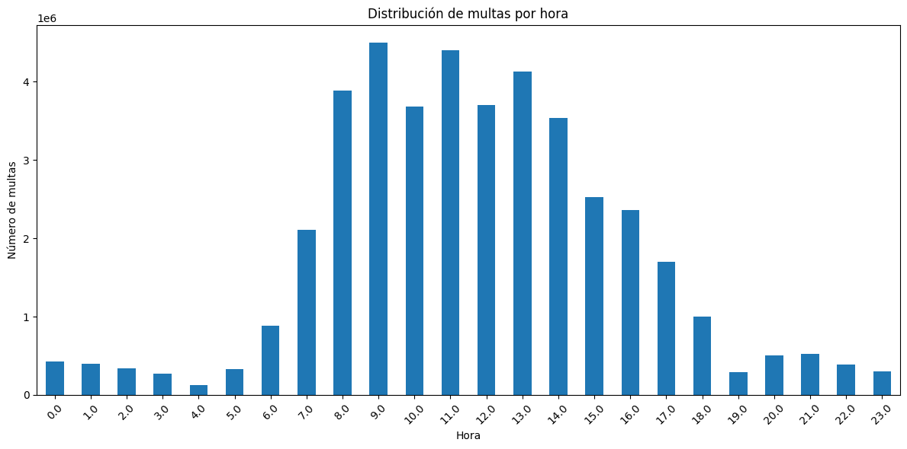{fig-align="center" width="80%"}

   Visualizando la gráfica de la distribución de multas por hora podemos
   observar claramente que las horas más controversiales son las del inicio de
   la mañana donde las personas están de camino al trabajo o están realizando
   trámites como papeleo, visitas al médico o la dejada de los niños en la
   escuela. La hora pico de multas sucede a las **9 de la mañana**.

5. Tipos de infracción más comunes: Encontrar cuáles son las infracciones de
   estacionamiento más frecuentes en NYC.

   ```python

   # Realizamos el conteo de multas por cada tipo de'Violation Description',
   # ordenamos y nos quedamos con las 10 más frecuentes
   violation_counts = (
       df["Violation Description"].value_counts(sort=True).nlargest(10).compute()
   )

   # Mostramos los resultados
   print("Las 10 infracciones de estacionamiento más frecuentes son:")
   print(violation_counts.head(10))
   ```

   ```
   Las 10 infracciones de estacionamiento más frecuentes son:
   Violation Description
   21-No Parking (street clean)      4954662
   38-Failure to Display Muni Rec    4833587
   PHTO SCHOOL ZN SPEED VIOLATION    3583078
   14-No Standing                    3244603
   37-Expired Muni Meter             2800752
   FAILURE TO STOP AT RED LIGHT      2161754
   20A-No Parking (Non-COM)          1881504
   71A-Insp Sticker Expired (NYS)    1765219
   40-Fire Hydrant                   1573012
   69-Failure to Disp Muni Recpt      957268
   Name: count, dtype: int64[pyarrow]
   ```

   Para encontrar las infracciones de estacionamiento más frecuentes seguimos
   estos pasos:
   1. **Contamos** el número de multas para cada tipo de 'Violation
      Description'.
   2. **Ordenamos** los tipos de infracción por el número de multas de forma
      descendente.
   3. **Seleccionamos** los 10 tipos de infracción más frecuentes.
   4. **Mostramos** los resultados.

   Podemos observar que, durante el periodo de estudio, el tipo de multa más
   común es: **21-No Parking (street clean)** con 4,954,662 multas.

   Resumen de las 10 infracciones más frecuentes:
   1. **21-No Parking (street clean):** 4,954,662 multas. La infracción más
      común, relacionada con el apacamiento en zona prohibida.
   2. **38-Failure to Display Muni Rec:** 4,833,587 multas. No mostrar el recibo
      municipal.
   3. **PHTO SCHOOL ZN SPEED VIOLATION:** 3,583,078 multas. Infracción por
      exceso de velocidad en zona escolar.
   4. **14-No Standing:** 3,244,603 multas. Prohibido detenerse.
   5. **37-Expired Muni Meter:** 2,800,752 multas. Expiración del parquímetro
      municipal.
   6. **FAILURE TO STOP AT RED LIGHT:** 2,161,754 multas. No detenerse como
      semáforo en rojo.
   7. **20A-No Parking (Non-COM):** 1,881,504 multas. Prohibido estacionar (no
      comercial).
   8. **71A-Insp Sticker Expired (NYS):** 1,765,219 multas. Calcomanía de
      inspección expirada (NYS).
   9. **40-Fire Hydrant:** 1,573,012 multas. Estacionar cerca de una boca de
      incendios.
   10. **69-Failure to Disp Muni Recpt:** 957,268 multas. No mostrar el recibo
       municipal.

6. Zonas con mayor número de multas: Identificar las ubicaciones de la ciudad
   con más infracciones registradas (e.g., Calle).

   ```python
   # Realizamos el conteo de multas por cada calle de NYC, ordenamos y nos quedamos
   # con las 10 que son más propensas a que hayan multas
   street_counts = df["Street Name"].value_counts(sort=True).nlargest(10).compute()

   # Mostramos los resultados
   print("Las 10 calles con más multas son:")
   print(street_counts.head(10))
   ```

   ```
   Las 10 calles con más multas son:
   Street Name
   Broadway         859474
   3rd Ave          650506
   5th Ave          414020
   Madison Ave      394063
   Lexington Ave    335943
   2nd Ave          313403
   1st Ave          294659
   7th Ave          264017
   Queens Blvd      243205
   8th Ave          235267
   Name: count, dtype: int64[pyarrow]
   ```

   Para identificar las ubicaciones con mayor número de multas he seleccionado,
   específicamente, el atributo 'Street Name' que indica el nombre de la calle
   donde se cometió la infracción, durante el procesamiento seguimos estos
   pasos:
   1. **Contamos** el número de multas para cada calle en la columna 'Street
      Name'.
   2. **Ordenamos** las calles por el número de multas de forma descendente.
   3. **Seleccionamos** las 10 calles con el mayor número de multas.
   4. **Mostramos** los resultados.

   Podemos observar que, durante el periodo de estudio, la calle con más
   infracciones registradas es: **Broadway** con 859.474 multas.

# Dask Category

## Cargar y limpiar datos

```python
import dask.dataframe as dd
import os
import kagglehub

# Descargamos el dataset

dataset_name = "new-york-city/nyc-parking-tickets"
path = kagglehub.dataset_download(dataset_name)
os.makedirs(path, exist_ok=True)

# Cargamos cada archivo en un DataFrame de Dask distinto
tickets14 = dd.read_csv(
    os.path.join(
        path, "Parking_Violations_Issued_-_Fiscal_Year_2014__August_2013___June_2014_.csv"
    ),
    assume_missing=True,
    sample=10000,
)
print(f"Columnas y Tipos de datos 2014:\n{tickets14.dtypes}")
print(f"Número de columnas: {len(set(tickets14.columns))}")
print("-" * 60)
print()

tickets15 = dd.read_csv(
    os.path.join(path, "Parking_Violations_Issued_-_Fiscal_Year_2015.csv"),
    assume_missing=True,
    sample=10000,
)
print(f"Columnas y Tipos de datos 2015:\n{tickets15.dtypes}")
print(f"Número de columnas: {len(set(tickets15.columns))}")
print("-" * 60)
print()

tickets16 = dd.read_csv(
    os.path.join(path, "Parking_Violations_Issued_-_Fiscal_Year_2016.csv"),
    assume_missing=True,
    sample=10000,
)
print(f"Columnas y Tipos de datos 2016:\n{tickets16.dtypes}")
print(f"Número de columnas: {len(set(tickets16.columns))}")
print("-" * 60)
print()

tickets17 = dd.read_csv(
    os.path.join(path, "Parking_Violations_Issued_-_Fiscal_Year_2017.csv"),
    assume_missing=True,
    sample=10000,
)
print(f"Columnas y Tipos de datos 2017:\n{tickets17.dtypes}")
print(f"Número de columnas: {len(set(tickets17.columns))}")
print("-" * 60)
```

:::: {layout-ncol="2"}

::: {#first-layout}

```
Columnas y Tipos de datos 2014:
Summons Number                       float64
Plate ID                              string
Registration State                    string
Plate Type                            string
Issue Date                            string
Violation Code                       float64
Vehicle Body Type                     string
Vehicle Make                          string
Issuing Agency                        string
Street Code1                         float64
...
dtype: object
Número de columnas: 51
---------------------------------------------
```

:::

::: {#second-column}

```
Columnas y Tipos de datos 2015:
Summons Number                       float64
Plate ID                              string
Registration State                    string
Plate Type                            string
Issue Date                            string
Violation Code                       float64
Vehicle Body Type                     string
Vehicle Make                          string
Issuing Agency                        string
Street Code1                         float64
...
dtype: object
Número de columnas: 51
---------------------------------------------
```

:::

::: {#third-layout}

```
Columnas y Tipos de datos 2016:
Summons Number                       float64
Plate ID                              string
Registration State                    string
Plate Type                            string
Issue Date                            string
Violation Code                       float64
Vehicle Body Type                     string
Vehicle Make                          string
Issuing Agency                        string
Street Code1                         float64
...
dtype: object
Número de columnas: 51
--------------------------------------------
```

:::

::: {#fourth-column}

```
Columnas y Tipos de datos 2017:
Summons Number                       float64
Plate ID                              string
Registration State                    string
Plate Type                            string
Issue Date                            string
Violation Code                       float64
Vehicle Body Type                     string
Vehicle Make                          string
Issuing Agency                        string
Street Code1                         float64
...
dtype: object
Número de columnas: 43
--------------------------------------------
```

:::

::::

\newpage

```python
tickets = {
    "tickets14": tickets14,
    "tickets15": tickets15,
    "tickets16": tickets16,
    "tickets17": tickets17,
}

# Comparar columnas entre todos los pares de DataFrames
for name1, df1 in tickets.items():
    for name2, df2 in tickets.items():
        if name1 >= name2:
            continue
        if set(df1.columns) != set(df2.columns):
            print(f"Diferencia de columnas entre {name1} y {name2}")
```

```
Diferencia de columnas entre tickets14 y tickets17
Diferencia de columnas entre tickets15 y tickets17
Diferencia de columnas entre tickets16 y tickets17
```

En las celdas anteriores hemos podido evidenciar ambos problemas:

- En primer lugar, tenemos que el CSV con la información del dataset para 2017
  tiene menos columnas que los demás por lo que nos tendremos que adecuar a este
  para que no hayan muchos valores nulos en aquellas columnas que este fichero
  no tiene, para ello combinaremos los datasets quedándonos solo con las
  columnas comunes entre ellos.
- En segundo lugar, podemos ver en el error anterior, que `Dask` no ha
  conseguido inferir correctamente el tipo de dato de algunas columnas como
  **House Number, Time First Observed** y **Violation Legal Code**, para
  solucionar esto especificaremos al framework el tipo de dato a utilizar a la
  hora de cargar los datos de las diferentes columnas.

\pagebreak

### Extracción de columnas comunes

```python
# Obtenemos las columnas comunes entre los DataFrames
common_cols = list(
    set(tickets14.columns).intersection(
        tickets15.columns,
        tickets16.columns,
        tickets17.columns
    )
)
```

### Conversión de columnas a _category_

Ahora sí, vamos a especificar el esquema del tipo de datos y no habrá así ningún
problema con la incorrecta inferencia de tipos por parte del framework. Por otro
lado en la lectura también analizamos la cardinalidad de las columnas comunes y
las filtramos para determinar cuáles deben ser `category`, `float` o quedarse
como `string`.

```python
# Identificamos las columnas con cardinalidad baja para saber cuál convertir a category
import pandas as pd
import os

# 1. Leer una muestra rápida del primer archivo con Pandas para analizar la cardinalidad
archivo_muestra = os.path.join(
    path,
    "Parking_Violations_Issued_-_Fiscal_Year_2014__August_2013___June_2014_.csv",
)

# Leemos 50,000 filas considerando solo las columnas comunes
df_sample = pd.read_csv(
    archivo_muestra, usecols=common_cols, nrows=50000, low_memory=False
)

data_types = {}
UMBRAL_CARDINALIDAD = (
    500  # Si hay menos de 500 valores únicos, lo consideramos 'category'
)

for col in common_cols:
    valores_unicos = df_sample[col].nunique()

    # 1. PRIMER FILTRO: Si tiene pocos valores únicos, la hacemos category.
    # El tipo 'category' admite perfectamente mezclas de números y letras como 'A2'.
    if valores_unicos < UMBRAL_CARDINALIDAD:
        data_types[col] = "category"

    # 2. Las columnas de fechas de alta cardinalidad siempre a str para evitar errores
    elif "Date" in col or "Time" in col or "Year" in col:
        data_types[col] = "str"

    # 3. Datos de alta cardinalidad numéricos puros (coordendas, IDs muy grandes, etc.)
    elif pd.api.types.is_numeric_dtype(df_sample[col]):
        # Si aún así da error 'A2' en alguna columna de alta cardinalidad,
        # cambiaremos "float32" por "str" para curarnos en salud.
        data_types[col] = "float32"

    # 4. Cualquier otra cosa de alta cardinalidad (matrículas largas, etc.) a string
    else:
        data_types[col] = "str"

# Convertiremos algunas altamente conflictivas a string si sabemos que dan problemas
for col_conflictiva in ["Violation Legal Code", "Unregistered Vehicle?"]:
    if col_conflictiva in data_types:
        data_types[col_conflictiva] = "str"

# Verificamos
print("Resumen de tipos de datos inferidos automáticamente:")
tipos_generados = pd.Series(data_types)
print(tipos_generados.value_counts())
```

```
Resumen de tipos de datos inferidos automáticamente:
category    27
str         11
float32      5
Name: count, dtype: int64
```

```python
tickets14 = dd.read_csv(
    os.path.join(
        path,
        "Parking_Violations_Issued_-_Fiscal_Year_2014__August_2013___June_2014_.csv",
    ),
    assume_missing=True,
    usecols=common_cols,
    dtype=data_types,
    low_memory=False,
)
tickets15 = dd.read_csv(
    os.path.join(path, "Parking_Violations_Issued_-_Fiscal_Year_2015.csv"),
    assume_missing=True,
    usecols=common_cols,
    dtype=data_types,
    low_memory=False,
)
tickets16 = dd.read_csv(
    os.path.join(path, "Parking_Violations_Issued_-_Fiscal_Year_2016.csv"),
    assume_missing=True,
    usecols=common_cols,
    dtype=data_types,
    low_memory=False,
)
tickets17 = dd.read_csv(
    os.path.join(path, "Parking_Violations_Issued_-_Fiscal_Year_2017.csv"),
    assume_missing=True,
    usecols=common_cols,
    dtype=data_types,
    low_memory=False,
)
```

### Creación de un DataFrame único con persistencia

```python
# Cargamos los DataFrames en uno único
df = dd.concat([tickets14, tickets15, tickets16, tickets17], axis=0)

# Para hacer el dataframe persistente en memoria debemos hacer:
df = df.persist()

# Para el dataset en RAM hacemos:
print(df.info())

print(f"Nº de particiones: {df.npartitions}")
n_filas = df.shape[0].compute()  # N_FILAS
n_columnas = df.shape[1]  # N_COLUMNAS

print(f"\nNº de Filas: {n_filas}\nNº de columnas: {n_columnas}")
print(f"Tamaño aproximado en RAM (GBytes): {df.memory_usage(deep=True).sum().compute() / 1024**3}")
```

```
<class 'dask.dataframe.dask_expr.DataFrame'>
Columns: 43 entries, Summons Number to Double Parking Violation
dtypes: string(11), category(27), float32(5)None
Nº de particiones: 138

Nº de Filas: 42339438
Nº de columnas: 43
Tamaño aproximado en RAM (GBytes): 7.723142210394144
```

Podemos observar la correcta definición del tipo de datos mediante el esquema
indicado en la lectura. A diferencia de la carga anterior, en este caso el
esquema no es uniforme: se han usado category para las 27 columnas de baja
cardinalidad (< 500 valores únicos), string para las 11 columnas de alta
cardinalidad de tipo texto (matrículas, fechas, identificadores) y float32 para
las 5 columnas numéricas continuas restantes.

Vamos a ver ahora si el tipo category es una buena opción para optimizar el uso
de memoria y mejorar la eficiencia en DataFrames que contienen columnas con un
número limitado de valores distintos.

Tenemos que:

1. En la lectura, Dask ha definido 138 particiones para el almacenamiento
   distribuido (ficticio) de los datos del dataset.

2. Hay 42.339.438 filas, 43 columnas (atributos) y el tamaño en RAM del
   DataFrame en este caso es de 7.73 GBytes, lo que contrasta con la cantidad de
   datos que hemos tenido que almacenar en la carga anterior con el tipo de dato
   string, que era de 20.11 GBytes.

Podemos observar una gran optimización del uso de memoria (≈ 62 % menos respecto
a la carga anterior) gracias al uso combinado de category y float32 en lugar de
string para todas las columnas. Esto se debe a que category almacena
internamente enteros (códigos) que apuntan a un diccionario único de valores, en
lugar de repetir la cadena completa en cada fila, lo cual es especialmente
eficiente en columnas con muchos valores repetidos como Registration State,
Vehicle Make o Violation Code. Por su parte, float32 reduce a la mitad el
espacio de las columnas numéricas frente al float64 por defecto.

### Dask Dashboard durante el proceso de carga

1. Diferentes tareas de procesamiento del dataset para su carga en los
   diferentes nodos del clúster:

   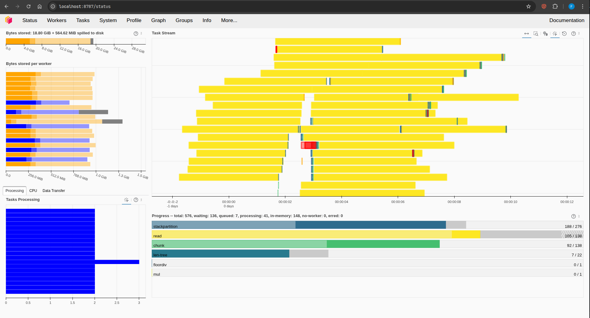

2. Métricas de trabajo de los distintos workers del clúster:

   Observar que:
   - El Spilling to Disk en este caso casi no se ha dado ya que los datos del
     `df` caben completamente en RAM, se puede apreciar en la columna 11 que
     está prácticamente vacía.

   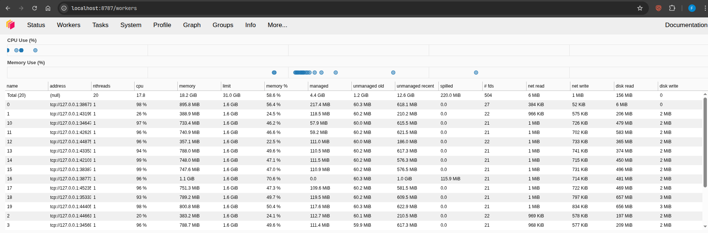

3. Spilling to Disk y muestral del Dashboard Final
   - Aquí se puede ver claramente como nuestros apenas workers han tenido que
     echar mano del mecanismo de spilling, esto ocurre porque la cantidad de
     datos que intentan cargar caben en su memoria RAM, y como resultado apenas
     tienen que usar el disco como almacenamiento temporal.

   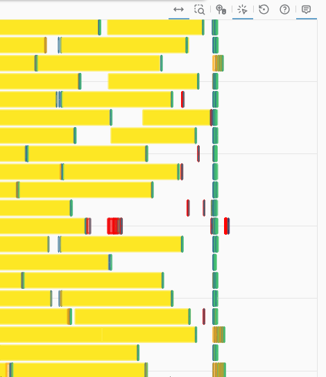{fig-align="center" width=60%}

4. Tiempo necesitado para la carga de todo el dataset mediante el clúster de
   "cpus"
   - El dataset, con tipo de datos 'string', con sus 138 particiones ha sido
     cargado completamente en RAM y, temporalmente, en disco en unos **50
     segundos**.
   - Utilizando el tipo de dato 'category' se consigue realizar un procesamiento
     más rápido del dataset, reduciendo el tiempo a **30 segundos**.

## Calcular algunos filtros

1. Calcula el condado de NYC que recibió más multas durante el periodo de
   estudio.

   ```python
   # Calcular el condado con más multas usando value_counts
   county_with_most_violations = df["Violation County"].value_counts().nlargest(1).compute()

   county = county_with_most_violations.index[0]
   n_vio = county_with_most_violations.values[0]

   print(
     "El condado con más multas durante el periodo "
     f"de estudio fue: {county} con {n_vio} multas."
   )
   ```

   ```
   El condado con más multas durante el periodo de estudio fue: NY con 14630069 multas.
   ```

   Para encontrar el condado con más multas, seguimos estos pasos:
   1. **Contamos** el número de multas por condado mediante `value_counts()`.
   2. **Identificamos** el condado con el mayor número de múltas mediante
      `.nlargest(1)`.
   3. **Mostramos** el condado con más multas y el número de multas registradas.

   Siguiendo estos pasos encontramos que el condado de NYC con más multas es:
   **NY**.

2. Calcula los 10 coches que recibieron más multas durante el periodo de
   estudio. Utiliza la columna `'Plate ID'` para identificar cada coche.

   ```python
   # Seleccionamos 'Plate ID' que contiene el número de matrícula y contamos el número de
   # multas en cada matrícula y nos quedamos con los 11 valores más altos porrque el
   # primero se asocia a matrícula en blanco.
   top_10_plates = (
       df["Plate ID"].value_counts(split_every=4).nlargest(11).compute()
   )

   # Imprimimos las 10 matrículas con el mayor número de multas
   for i, count_vio in enumerate(top_10_plates):
       print(
           f"El {i}º coche con más multas: {top_10_plates.index[i]} -> {count_vio}"
       )
   ```

   ```
   El 0º coche con más multas: BLANKPLATE -> 56717
   El 1º coche con más multas: 47603MD -> 4003
   El 2º coche con más multas: 49781MA -> 3534
   El 3º coche con más multas: 2028685 -> 3497
   El 4º coche con más multas: AN917T -> 3312
   El 5º coche con más multas: 96087MA -> 3261
   El 6º coche con más multas: 75225JW -> 3217
   El 7º coche con más multas: 49839JG -> 3204
   El 8º coche con más multas: AP300F -> 3190
   El 9º coche con más multas: 62546JM -> 3169
   El 10º coche con más multas: 16213TC -> 3152
   ```

   ```python
   # Graficamos las 10 matrículas con el mayor número de multas mediante una
   # gráfica de barras
   top_10_plates[1:].plot(
       kind="bar",
       title="Top 10 coches con más multas en NYC",
       xlabel="Coches",
       ylabel="Número de multas",
   )
   plt.show()
   ```

   {fig-align="center" width="80%"}

   Para encontrar los 10 coches con más multas, seguimos estos pasos:
   1. **Contamos** el número de multas por matrícula (`'Plate ID'`) y
      **Ordenamos** esas matrículas a partir de su conteo de manera descendente.
   2. **Identificamos** las 10 matrículas con el mayor número de multas.
   3. **Mostramos** las 10 matrículas con más multas y el número de multas
      registradas para cada una.
   4. **Graficamos** los resultados en un gráfico de barras.

   Siguiendo estos pasos observamos que:
   - Las personas suelen tener bastantes multas cuando no tienen aún matriculado
     el coche.
   - El coche con más infracciones cometidas durante el periodo de estudio es el
     coche con matrícula **47603MD**.

3. Distribución de multas por mes (agregación temporal): Determinar el número
   total de multas emitidas en cada mes a lo largo del periodo y descubrir qué
   mes presenta la mayor cantidad de infracciones (para identificar posibles
   tendencias estacionales). (Pista: La columna de fecha de emisión Issue Date
   incluye fecha/hora de la multa): df\['Issue Date'\].dt.month para obtener el
   mes).

   ```python
   # Convertimos 'Issue Date' a datetime
   df["Issue Date"] = dd.to_datetime(df["Issue Date"], errors="coerce")

   # Extraemos el mes de la columna 'Issue Date' y generamos una nueva columna
   # en el datframe con el
   df["Issue Month"] = df["Issue Date"].dt.month

   # Mediante 'Issue Month' realizamos el conteo y ordenamos de forma descendente
   monthly_counts = (
       df["Issue Month"].value_counts().compute().sort_values(ascending=False)
   )

   # Mostramos la distribución de multas y el mes con más infracciones cometidas
   print("Distribución de multas por mes:")
   print(monthly_counts)

   print(
       f"\nEl mes con más infracciones es: {monthly_counts.index[0]} "
       f"con {monthly_counts.values[0]} multas"
   )
   ```

   ```
   Distribución de multas por mes:
   Issue Month
   10    3987212
   3     3852356
   5     3840294
   1     3809913
   9     3758123
   6     3710541
   4     3602097
   11    3483306
   8     3455617
   12    3055935
   2     3054514
   7     2729530
   Name: count, dtype: int64

   El mes con más infracciones es: 10 con 3987212 multas
   ```

   Para obtener la distribución de multas por mes y el mes con más multas
   seguimos estos pasos:
   1. **Convertimos** la columna 'Issue Date' a formato datetime.
   2. **Extraemos** el mes de la columna 'Issue Date' y creamos una nueva
      columna llamada 'Issue Month'.
   3. **Contamos** el número de multas por cada mes.
   4. **Identificamos** el mes con el mayor número de multas escogiendo el 1º de
      ellos dado que hemos ordenado de manera descendente.
   5. **Mostramos** la distribución de multas por mes y el mes con el mayor
      número de infracciones.

   Podemos observar que, durante el periodo de estudio, **Octubre** fue el mes
   con más infracciones registradas.

   ```python
   import calendar

   # Ordenamos por índice
   monthly_counts = monthly_counts.sort_index()

   # Mapeamos los índices a nombres de meses en inglés
   month_names = [calendar.month_name[i] for i in monthly_counts.index]


   plt.figure(figsize=(12, 6))
   plt.plot(month_names, monthly_counts.values, marker="o")
   plt.xlabel("Mes")
   plt.ylabel("Número de Multas (Millones)")
   plt.title("Distribución de Multas por Mes")
   plt.xticks(rotation=45, ha="right")
   plt.tight_layout()
   plt.show()
   ```

   {fig-align="center" width="80%"}

   Visualizando la gráfica de la distribución de multas podemos observar
   claramente como se reducen considerablemente en los meses vacacionales como
   Julio y Diciembre, por otro lado, se observa una constante durante los meses
   que se dan entre Navidad y Verano, por último, comentar que después de las
   vacaciones de verano se da un aumento progresivo de las infracciones llegando
   a su pico de **Octubre**, esto podríamos llegar a achacarlo a esa ansiedad
   que se produce en las personas a la vuelta de las vacaciones lo que les puede
   llevar a cometer más infracciones de lo normal.

4. Horas del día con más multas (patrón diario): Analizar en qué horas del día
   se emiten más multas, identificando las horas pico de sanciones. (Pista:
   basándote en "Violation Time" extrae la hora del día de cada registro. Crea
   tu propia funcion "extract_hour" para obtener la hora - el formato es
   HORAMINUTOA/P, por ejemplo 0710P serían las 19:10. 0810A serían las 8:10-.
   Utiliza el método "map" para aplicar tu función a la entrada).

   ```python
   def extract_hour(time_str):
       if not isinstance(time_str, str):
           return None  # Manejar valores no válidos

       time_str = time_str.strip()
       if not time_str:
           return None

       period = time_str[-1].upper()
       time_str = time_str[:-1]

       try:
           hour = int(time_str[:2])
       except ValueError:
           return None

       if period == "P" and hour != 12:
           hour += 12
       elif period == "A" and hour == 12:
           hour = 0  # Medianoche

       return hour
   ```

   ```python
   # Aplicamos la función extract_hour definida a la columna 'Violation Time' para extraer
   # la hora de cada tiempo
   df["Violation Extract Hour"] = df["Violation Time"].map(
       extract_hour, meta=("Violation Time", "int64")
   )

   # Realizamos el conteo para cada hora y ordenamos de manera descendente
   hourly_counts = (
       df["Violation Extract Hour"]
       .value_counts()
       .compute()
       .sort_values(ascending=False)
   )

   print("Las 10 horas pico con más infracciones son:\n")
   for i in range(11):
       print(f"Las {hourly_counts.index[i]}h con {hourly_counts.iloc[i]} multas")
   ```

   ```
   Las 10 horas pico con más infracciones son:

   Las 9.0h con 4499583 multas
   Las 11.0h con 4402639 multas
   Las 13.0h con 4132527 multas
   Las 8.0h con 3886120 multas
   Las 12.0h con 3699299 multas
   Las 10.0h con 3678650 multas
   Las 14.0h con 3540660 multas
   Las 15.0h con 2526664 multas
   Las 16.0h con 2362957 multas
   Las 7.0h con 2111441 multas
   Las 17.0h con 1705422 multas
   ```

   Con la función definida `extract_hour(time_str)` extraemos la hora de un
   string de tiempo, extrae la hora en formato de 24 horas, manejando los casos
   AM/PM.

   A continuación, realizamos el siguiente procesamiento en el DataFrame:
   1. **Extraemos la hora:** Aplicamos la función `extract_hour` a la columna
      'Violation Time' para crear una nueva columna, 'Violation Extract Hour'.
      Esto nos da la hora en que se emitió cada multa.
   2. **Contamos** el número de multas para cada hora.
   3. **Ordenamos** las horas por el número de multas de forma descendente.
   4. **Mostramos** las 10 horas pico con más multas y el número de multas
      registradas para cada una.
   5. **Creamos** un gráfico de barras para mostrar la distribución del número
      de multas por hora, previamente ordenamos por índice(horas).

   ```python
   hourly_counts = hourly_counts.sort_index()

   # Creamos el gráfico de barras
   plt.figure(figsize=(12, 6))
   hourly_counts.iloc[:24].plot(kind="bar")
   plt.title("Distribución de multas por hora")
   plt.xlabel("Hora")
   plt.ylabel("Número de multas")
   plt.xticks(rotation=45)
   plt.tight_layout()
   plt.show()
   ```

   {fig-align="center" width="80%"}

   Visualizando la gráfica de la distribución de multas por hora podemos
   observar claramente que las horas más controversiales son las del inicio de
   la mañana donde las personas están de camino al trabajo o están realizando
   trámites como papeleo, visitas al médico o la dejada de los niños en la
   escuela. La hora pico de multas sucede a las **9 de la mañana**.

5. Tipos de infracción más comunes: Encontrar cuáles son las infracciones de
   estacionamiento más frecuentes en NYC.

   ```python

   # Realizamos el conteo de multas por cada tipo de'Violation Description',
   # ordenamos y nos quedamos con las 10 más frecuentes
   violation_counts = (
       df["Violation Description"].value_counts(sort=True).nlargest(10).compute()
   )

   # Mostramos los resultados
   print("Las 10 infracciones de estacionamiento más frecuentes son:")
   print(violation_counts.head(10))
   ```

   ```
   Las 10 infracciones de estacionamiento más frecuentes son:
   Violation Description
   21-No Parking (street clean)      4954662
   38-Failure to Display Muni Rec    4833587
   PHTO SCHOOL ZN SPEED VIOLATION    3583078
   14-No Standing                    3244603
   37-Expired Muni Meter             2800752
   FAILURE TO STOP AT RED LIGHT      2161754
   20A-No Parking (Non-COM)          1881504
   71A-Insp Sticker Expired (NYS)    1765219
   40-Fire Hydrant                   1573012
   69-Failure to Disp Muni Recpt      957268
   Name: count, dtype: int64[pyarrow]
   ```

   Para encontrar las infracciones de estacionamiento más frecuentes seguimos
   estos pasos:
   1. **Contamos** el número de multas para cada tipo de 'Violation
      Description'.
   2. **Ordenamos** los tipos de infracción por el número de multas de forma
      descendente.
   3. **Seleccionamos** los 10 tipos de infracción más frecuentes.
   4. **Mostramos** los resultados.

   Podemos observar que, durante el periodo de estudio, el tipo de multa más
   común es: **21-No Parking (street clean)** con 4,954,662 multas.

   Resumen de las 10 infracciones más frecuentes:
   1. **21-No Parking (street clean):** 4,954,662 multas. La infracción más
      común, relacionada con el apacamiento en zona prohibida.
   2. **38-Failure to Display Muni Rec:** 4,833,587 multas. No mostrar el recibo
      municipal.
   3. **PHTO SCHOOL ZN SPEED VIOLATION:** 3,583,078 multas. Infracción por
      exceso de velocidad en zona escolar.
   4. **14-No Standing:** 3,244,603 multas. Prohibido detenerse.
   5. **37-Expired Muni Meter:** 2,800,752 multas. Expiración del parquímetro
      municipal.
   6. **FAILURE TO STOP AT RED LIGHT:** 2,161,754 multas. No detenerse como
      semáforo en rojo.
   7. **20A-No Parking (Non-COM):** 1,881,504 multas. Prohibido estacionar (no
      comercial).
   8. **71A-Insp Sticker Expired (NYS):** 1,765,219 multas. Calcomanía de
      inspección expirada (NYS).
   9. **40-Fire Hydrant:** 1,573,012 multas. Estacionar cerca de una boca de
      incendios.
   10. **69-Failure to Disp Muni Recpt:** 957,268 multas. No mostrar el recibo
       municipal.

6. Zonas con mayor número de multas: Identificar las ubicaciones de la ciudad
   con más infracciones registradas (e.g., Calle).

   ```python
   # Realizamos el conteo de multas por cada calle de NYC, ordenamos y nos quedamos
   # con las 10 que son más propensas a que hayan multas
   street_counts = df["Street Name"].value_counts(sort=True).nlargest(10).compute()

   # Mostramos los resultados
   print("Las 10 calles con más multas son:")
   print(street_counts.head(10))
   ```

   ```
   Las 10 calles con más multas son:
   Street Name
   Broadway         859474
   3rd Ave          650506
   5th Ave          414020
   Madison Ave      394063
   Lexington Ave    335943
   2nd Ave          313403
   1st Ave          294659
   7th Ave          264017
   Queens Blvd      243205
   8th Ave          235267
   Name: count, dtype: int64[pyarrow]
   ```

   Para identificar las ubicaciones con mayor número de multas he seleccionado,
   específicamente, el atributo 'Street Name' que indica el nombre de la calle
   donde se cometió la infracción, durante el procesamiento seguimos estos
   pasos:
   1. **Contamos** el número de multas para cada calle en la columna 'Street
      Name'.
   2. **Ordenamos** las calles por el número de multas de forma descendente.
   3. **Seleccionamos** las 10 calles con el mayor número de multas.
   4. **Mostramos** los resultados.

   Podemos observar que, durante el periodo de estudio, la calle con más
   infracciones registradas es: **Broadway** con 859.474 multas.

# Dask RAPIDS

En este apartado, repetimos la carga, preprocesamiento y aplicación de filtros,
pero utilizando la librería **cuDF de NVIDIA** que nos permite utilizar la GPU y
su gran capacidad de procesamiento paralelo para obtener resultados de forma
mucho más eficiente.

## Cargar y limpiar datos

### Extracción de columnas comunes

```python
# Obtenemos las columnas comunes entre los DataFrames
common_cols = list(
    set(tickets14.columns).intersection(
        tickets15.columns, tickets16.columns, tickets17.columns
    )
)
```

### Conversión de columnas a _string_

No podemos utilizar `category` como en el apartado anterior ya que no es un tipo
adecuado para realizar _hashing_.

```python
# Convertimos todas las columnas comunes a string y cargamos solamente estas
data_types = {col: "str" for col in common_cols}

tickets14 = dd.read_csv(
    os.path.join(
        path,
        "Parking_Violations_Issued_-_Fiscal_Year_2014__August_2013___June_2014_.csv",
    ),
    usecols=common_cols,
    dtype=data_types,
    blocksize="16MB",
)
tickets15 = dd.read_csv(
    os.path.join(path, "Parking_Violations_Issued_-_Fiscal_Year_2015.csv"),
    usecols=common_cols,
    dtype=data_types,
    blocksize="16MB",
)
tickets16 = dd.read_csv(
    os.path.join(path, "Parking_Violations_Issued_-_Fiscal_Year_2016.csv"),
    usecols=common_cols,
    dtype=data_types,
    blocksize="16MB",
)
tickets17 = dd.read_csv(
    os.path.join(path, "Parking_Violations_Issued_-_Fiscal_Year_2017.csv"),
    usecols=common_cols,
    dtype=data_types,
    blocksize="16MB",
)
```

Por otra parte, hemos agregado el parámetro **"blocksize"** para tener un
control definido del tamaño asociado a cada partición. Este parámetro es muy
relativo al tamaño de dataset, capacidad de computación y memoria.

### Creación de un DataFrame único con persistencia

```python
# Cargamos los DataFrames en uno único
df = dd.concat([tickets14, tickets15, tickets16, tickets17], axis=0)

# No hacemos el dataframe persistente en memoria porque satura la
# memoria de la GPU
```

```python
# Para el dataset en RAM hacemos:
print(df.info())

print(f"Nº de particiones: {df.npartitions}")
n_filas = df.shape[0].compute()  # N_FILAS
n_columnas = df.shape[1]  # N_COLUMNAS

print(f"\nNº de Filas: {n_filas}\nNº de columnas: {n_columnas}")
print(
    f"Tamaño aproximado en RAM (GBytes): {df.memory_usage(deep=True).sum().compute() / 1024**3}"
)
```

```
<class 'dask_cudf._expr.collection.DataFrame'>
Columns: 43 entries, Summons Number to Double Parking Violation
dtypes: object(43)None
Nº de particiones: 563

Nº de Filas: 42339438
Nº de columnas: 43
Tamaño aproximado en RAM (GBytes): 13.325831815600395
```

```python
print(df.dtypes)
```

```
Summons Number                       object
Plate ID                             object
Registration State                   object
Plate Type                           object
Issue Date                           object
Violation Code                       object
Vehicle Body Type                    object
Vehicle Make                         object
Issuing Agency                       object
Street Code1                         object
Street Code2                         object
...
dtype: object
```

**cuDF** no implementa todavía el nuevo tipo `string[pyarrow]` de pandas; usar
**object** es su forma de manejar buffers de bytes en GPU. No obstante, su
representación interna sigue siendo un **string**.

1. En la lectura, Dask ha definido 563 particiones para el almacenamiento
   distribuido (ficticio) de los datos del dataset. El aumento es justificado
   debido a las propiedades de paralelización de la GPU debido al gran número de
   núcleos operacionales.
2. Hay 42.339.438 filas, 43 columnas(atributos) y el tamaño en RAM del DataFrame
   en este caso es de 13.32 GBytes, esto contrasta con la cantidad de datos que
   hemos tenido que almacenar en la carga anterior con el tipo de dato category,
   esta era de 9 GBytes.

Además, podemos observar una gran optimización del uso de memoria eficiente de
la GPU en el dashboard.

### Dask Dashbiard durante el procesa de carga

Diferentes tareas de procesamiento del dataset para su carga en los diferentes
nodos del clúster:

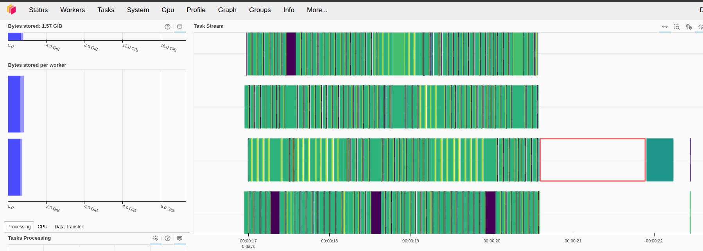

El dataset cabe perfectamente en memoria por lo que no se ha tenido que realizar
**spilling**. La carga del dataset completa ha llevado aproximadamente **6
segundos**.

### Métricas de trabajo de los distintos workers del clúster

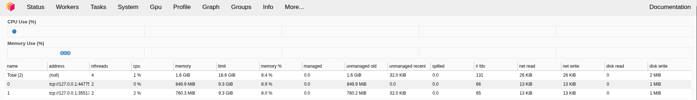

## Calcular algunos filtros

Los ejercicios realizados son prácticamente los mismo pero con ciertas
adaptaciones necesarias para las librerias **dask_cudf** y **cudf**
principalmente debido a sus formatos adaptados de la librería pandas.

1. Calcula el condado de NYC que recibió más multas durante el periodo de
   estudio.

   ```python
   # Calcular el condado con más multas usando value_counts
   county_with_most_violations = (
       df["Violation County"].value_counts().nlargest(1).compute()
   )

   county = county_with_most_violations.index[0]
   n_vio = county_with_most_violations.values[0]

   print(
       f"El condado con más multas durante el periodo de estudio fue: {county} con {n_vio} multas."
   )
   ```

   ```
   El condado con más multas durante el periodo de estudio fue: NY con 14630069 multas.
   ```

1. Calcula los 10 coches que recibieron más multas durante el periodo de
   estudio. Utiliza la columna `'Plate ID'` para identificar cada coche.

   ```python
   # Seleccionamos 'Plate ID' que contiene el número de matrícula y contamos el número de multas en
   # cada matrícula y nos quedamos con los 11 valores más altos
   # porrque el primero se asocia a matrícula en blanco.
   # Agrupamos por 'Plate ID' y realizamos el conteo

   top_10_plates = df["Plate ID"].value_counts(sort=True).nlargest(11).compute()

   # Imprimimos las 10 matrículas con el mayor número de multas
   top_pd = top_10_plates.to_pandas()

   # 3. Itera sobre el pandas.Series
   for i, (plate, n) in enumerate(top_pd.items(), start=0):
       print(f"{i}º coche con más multas: {plate} -> {n}")
   ```

   ```
   El 0º coche con más multas: BLANKPLATE -> 56717
   El 1º coche con más multas: 47603MD -> 4003
   El 2º coche con más multas: 49781MA -> 3534
   El 3º coche con más multas: 2028685 -> 3497
   El 4º coche con más multas: AN917T -> 3312
   El 5º coche con más multas: 96087MA -> 3261
   El 6º coche con más multas: 75225JW -> 3217
   El 7º coche con más multas: 49839JG -> 3204
   El 8º coche con más multas: AP300F -> 3190
   El 9º coche con más multas: 62546JM -> 3169
   El 10º coche con más multas: 16213TC -> 3152
   ```

   ```python
   # Graficamos las 10 matrículas con el mayor número de multas mediante una gráfica de barras
   top_pd[1:].plot(
       kind="bar",
       title="Top 10 coches con más multas en NYC",
       xlabel="Coches",
       ylabel="Número de multas",
   )
   plt.show()
   ```

   {fig-align="center" width="80%"}

1. Distribución de multas por mes (agregación temporal): Determinar el número
   total de multas emitidas en cada mes a lo largo del periodo y descubrir qué
   mes presenta la mayor cantidad de infracciones (para identificar posibles
   tendencias estacionales). (Pista: La columna de fecha de emisión Issue Date
   incluye fecha/hora de la multa): df['Issue Date'].dt.month para obtener el
   mes).

   ```python
   # Convertimos 'Issue Date' a datetime
   df["Issue Date"] = df["Issue Date"].astype("datetime64[ns]")

   # Extraemos el mes de la columna 'Issue Date' y generamos una nueva columna en el datframe con el
   df["Issue Month"] = df["Issue Date"].dt.month

   # Mediante 'Issue Month' realizamos el conteo y ordenamos de forma descendente
   monthly_counts = (
       df["Issue Month"].value_counts().compute().sort_values(ascending=False)
   )

   # Mostramos la distribución de multas y el mes con más infracciones cometidas
   print("Distribución de multas por mes:")
   print(monthly_counts)

   print(
       f"\nEl mes con más infracciones es: {monthly_counts.index[0]} con {monthly_counts.values[0]} multas"
   )
   ```

   ```
   Distribución de multas por mes:
   Issue Month
   10    3987212
   3     3852356
   5     3840294
   1     3809913
   9     3758123
   6     3710541
   4     3602097
   11    3483306
   8     3455617
   12    3055935
   2     3054514
   7     2729530
   Name: count, dtype: int64

   El mes con más infracciones es: 10 con 3987212 multas
   ```

   ```python
   import calendar

   monthly_counts = monthly_counts.to_pandas()
   # Ordenamos por índice
   monthly_counts = monthly_counts.sort_index()

   # Mapeamos los índices a nombres de meses en inglés
   month_names = [calendar.month_name[i] for i in monthly_counts.index]


   plt.figure(figsize=(12, 6))
   plt.plot(month_names, monthly_counts.values, marker="o")
   plt.xlabel("Mes")
   plt.ylabel("Número de Multas (Millones)")
   plt.title("Distribución de Multas por Mes")
   plt.xticks(rotation=45, ha="right")
   plt.tight_layout()
   plt.show()
   ```

   {fig-align="center" width="80%"}

1. Horas del día con más multas (patrón diario): Analizar en qué horas del día
   se emiten más multas, identificando las horas pico de sanciones. (Pista:
   basándote en "Violation Time" extrae la hora del día de cada registro. Crea
   tu propia funcion "extract_hour" para obtener la hora - el formato es
   HORAMINUTOA/P, por ejemplo 0710P serían las 19:10. 0810A serían las 8:10-.
   Utiliza el método "map" para aplicar tu función a la entrada).

   ```python
   import cudf


   def extract_hour_cudf(df: cudf.DataFrame) -> cudf.DataFrame:
       # 1) Lectura de la columna original
       tc = df["Violation Time"]

       # 2) Extraemos las dos primeras posiciones (hora) y el sufijo A/P
       hour_str = tc.str.slice(0, 2)  # p. ej. "08", "12"
       ampm = tc.str.slice(-1)  # p. ej. "A" o "P"

       # 3) Convertimos la parte numérica a valor, invalidos → NaN
       hour = cudf.to_numeric(hour_str, errors="coerce")

       # 4) Creamos máscaras para PM y medianoche (12 AM)
       pm_mask = (ampm == "P") & (hour < 12)  # sumar 12 si es PM excepto 12PM
       midnight_mask = (ampm == "A") & (hour == 12)  # convertir 12AM a 0

       # 5) Ajustamos la hora según las máscaras
       hour = hour.where(~pm_mask, hour + 12)  # si pm_mask True, hour+12
       hour = hour.where(~midnight_mask, 0)  # si midnight_mask True, set 0

       # 6) Filtramos valores inválidos:
       #    — longitud mínima del string (al menos "1A" = 2 chars)
       #    — no nulos
       #    — rango [0, 23]
       valid = (tc.str.len() >= 2) & hour.notnull() & (hour >= 0) & (hour < 24)
       # Colocamos None donde no sean válidos y cambiamos a entero con nulos
       hour = hour.where(valid, None).astype("Int32")

       # 7) Devolvemos un DataFrame con la nueva columna
       return cudf.DataFrame({"Violation Hour": hour})


   # Definimos el “meta” para Dask-cuDF: esquema de la salida
   meta = cudf.DataFrame({"Violation Hour": cudf.Series([], dtype="Int32")})

   # Aplicamos la función en cada partición del DataFrame Dask-cuDF
   tickets_hours = df.map_partitions(extract_hour_cudf, meta=meta)

   # 3) Agrupamos por hora y contamos las multas
   hourly_counts = (
       tickets_hours.groupby("Violation Hour")  # agrupación por cada hora 0–23
       .size()  # tamaño de cada grupo = número de multas
       .compute()  # ejecuta en el clúster y devuelve pandas Series
       .sort_index()  # ordena por hora ascendente
   )
   ```

   ```python
   hourly_counts = hourly_counts.to_pandas()

   # Creamos el gráfico de barras
   plt.figure(figsize=(12, 6))
   hourly_counts.iloc[:24].plot(kind="bar")
   plt.title("Distribución de multas por hora")
   plt.xlabel("Hora")
   plt.ylabel("Número de multas")
   plt.xticks(rotation=45)
   plt.tight_layout()
   plt.show()
   ```

   {fig-align="center" width="80%"}

1. Tipos de infracción más comunes: Encontrar cuáles son las infracciones de
   estacionamiento más frecuentes en NYC.

   ```python
   # Realizamos el conteo de multas por cada tipo de'Violation Description', ordenamos y nos quedamos
   # con las 10 más frecuentes
   violation_counts = (
       df["Violation Description"].value_counts(sort=True).nlargest(10).compute()
   )

   # Mostramos los resultados
   print("Las 10 infracciones de estacionamiento más frecuentes son:")
   print(violation_counts.head(10))
   ```

   ```
   Las 10 infracciones de estacionamiento más frecuentes son:
   Violation Description
   21-No Parking (street clean)      4954662
   38-Failure to Display Muni Rec    4833587
   PHTO SCHOOL ZN SPEED VIOLATION    3583078
   14-No Standing                    3244603
   37-Expired Muni Meter             2800752
   FAILURE TO STOP AT RED LIGHT      2161754
   20A-No Parking (Non-COM)          1881504
   71A-Insp Sticker Expired (NYS)    1765219
   40-Fire Hydrant                   1573012
   69-Failure to Disp Muni Recpt      957268
   Name: count, dtype: int64[pyarrow]
   ```

1. Zonas con mayor número de multas: Identificar las ubicaciones de la ciudad
   con más infracciones registradas (e.g., Calle).

   ```python
   # Realizamos el conteo de multas por cada calle de NYC, ordenamos y nos quedamos
   # con las 10 que son más propensas a que hayan multas
   street_counts = df["Street Name"].value_counts(sort=True).nlargest(10).compute()

   # Mostramos los resultados
   print("Las 10 calles con más multas son:")
   print(street_counts.head(10))
   ```

   ```
   Las 10 calles con más multas son:
   Street Name
   Broadway         859474
   3rd Ave          650506
   5th Ave          414020
   Madison Ave      394063
   Lexington Ave    335943
   2nd Ave          313403
   1st Ave          294659
   7th Ave          264017
   Queens Blvd      243205
   8th Ave          235267
   Name: count, dtype: int64[pyarrow]
   ```

# Actividades opcionales

## Filtro 1: ¿Qué marcas de vehículos reciben más multas?

Este código tiene como propósito representar gráficamente las **10 marcas de
vehículos que han recibido más multas**, permitiendo así identificar las marcas
más frecuentemente implicadas en infracciones.

Primero, se calcula la frecuencia de cada valor en la columna "Vehicle Make"
mediante value_counts, distribuyendo la operación en GPU con `split_out=16` para
mejorar la eficiencia y evitar cuellos de botella en la memoria. Posteriormente,
los resultados se traen a CPU como un objeto `pandas.Series` mediante
`.compute().to_pandas()`.

A continuación, se seleccionan las 10 marcas más multadas utilizando
.nlargest(10), lo que permite centrar la visualización en las marcas más
representativas dentro del conjunto de datos.

Finalmente, se genera un gráfico de barras verticales con matplotlib. Esta
visualización resulta útil para identificar patrones de comportamiento por
marca, analizar posibles correlaciones con la presencia de ciertos tipos de
vehículos en la ciudad, y apoyar decisiones relacionadas con regulación o
campañas de concienciación vial.

```python
vc = (
    df["Vehicle Make"]
    .value_counts(split_out=16)  # evita picos de VRAM
    .compute()  # devuelve cudf.Series
    .to_pandas()  # ahora pandas.Series
)

# Toma el top-10 marcas más multadas
top_makes = vc.nlargest(10)

# Gráfico de barras
plt.figure(figsize=(10, 6))
top_makes.plot(kind="bar", color="steelblue", edgecolor="black")
plt.title("Top 10 Marcas de Vehículo con Más Multas")
plt.xlabel("Marca de vehículo")
plt.ylabel("Número de multas")
plt.xticks(rotation=45, ha="right")
plt.tight_layout()
plt.show()
```

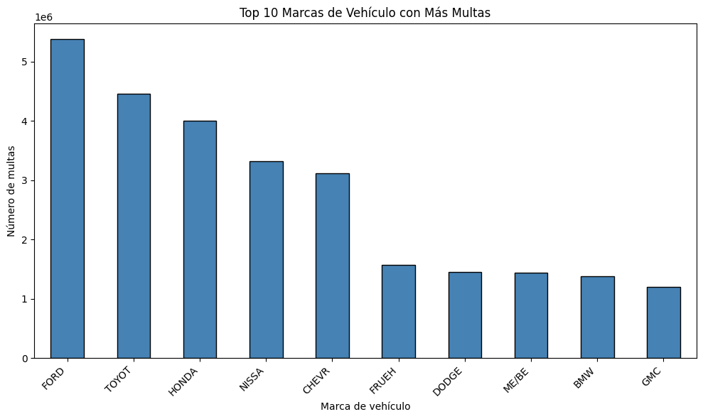{fig-align="center" width="80%"}

- **FORD** lidera ampliamente el ranking, seguido por **TOYOTA**, **HONDA**,
  etc.
- Hay una **caída clara** a partir del 5.º puesto, lo que sugiere que unas pocas
  marcas concentran una gran proporción de las sanciones.
- La presencia de marcas comerciales y populares refuerza la idea de que la
  frecuencia puede estar relacionada con volumen de circulación.

## Filtro 2: ¿Qué intersecciones son aquellas en las que se ponen más multas?

Este código tiene como finalidad identificar y visualizar las intersecciones con
mayor número de multas registradas, lo cual permite detectar zonas críticas
desde el punto de vista de la regulación del tráfico.

En primer lugar, se construye una nueva columna llamada _"Intersection"_
combinando tres atributos del dataset: el número de la casa _(House Number)_, el
nombre de la calle _(Street Name)_ y la calle que se cruza _(Intersecting
Street)_. Esta concatenación genera una representación textual precisa de la
ubicación de cada infracción.

A continuación, se realiza un conteo de las intersecciones más frecuentes
utilizando value_counts con `split_out=32`, lo cual permite distribuir la
operación en GPU para una ejecución eficiente. Se extraen las 20 intersecciones
con más sanciones mediante `nlargest(20)` y se convierte el resultado a pandas
para facilitar la visualización.

Luego, se transforma el índice y los valores en listas para graficar. Se utiliza
un gráfico de barras horizontales (`barh`) para mostrar de forma ordenada (de
menor a mayor) el número de multas por intersección. Esta elección de
visualización facilita la lectura de nombres largos y destaca visualmente las
ubicaciones más conflictivas.

Este análisis permite identificar las zonas geográficas más propensas a recibir
sanciones, lo cual es especialmente útil para estudios urbanos, planificación
vial o reforzamiento de medidas de control en puntos estratégicos de la ciudad.

```python
# Crear columna combinada “Intersection”
df = df.assign(
    Intersection=(
        df["House Number"].astype("str")
        + " "
        + df["Street Name"]
        + " & "
        + df["Intersecting Street"]
    )
)

# Contar las 20 intersecciones con más multas
top_intersections = (
    df["Intersection"].value_counts(split_out=32).nlargest(20).compute()
)

top_intersections = top_intersections.to_pandas()


intersections = top_intersections.index.to_list()
counts = top_intersections.values.tolist()

plt.figure(figsize=(10, 6))
plt.barh(
    intersections[::-1], counts[::-1]
)  # invertido para ordenar de menor a mayor
plt.xlabel("Número de multas")
plt.title("Top 20 intersecciones con más multas")
plt.tight_layout()
plt.show()
```

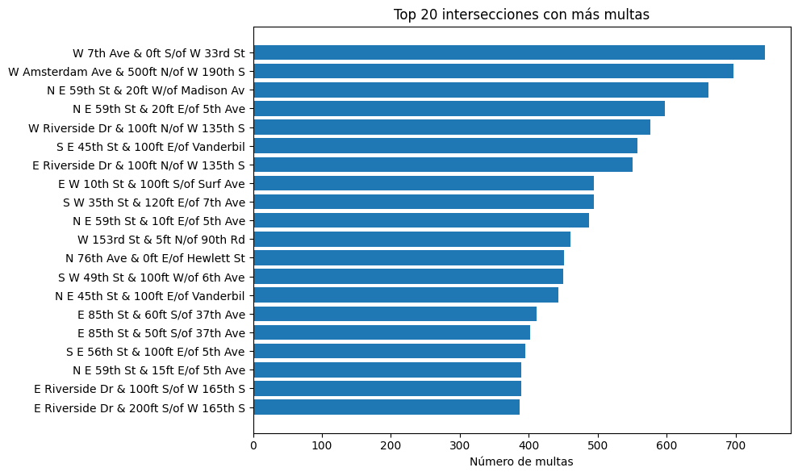{fig-align="center" width="80%"}

- **Cada barra representa una intersección concreta**, y su longitud el número
  de multas acumuladas.
- Las primeras posiciones muestran **intersecciones con más de 700 sanciones**,
  lo que indica zonas de alta conflictividad vial.
- Aparecen varias repeticiones de calles como **E Riverside Dr, E 85th St**, lo
  que sugiere que ciertas zonas son reincidentes.

## Filtro 3: ¿La edad del vehículo está relacionada con el número de multas?

Este código analiza la distribución de multas según el año de fabricación de los
vehículos, con el objetivo de detectar tendencias en relación con la antigüedad
del vehículo.

Primero, se filtran los registros para conservar únicamente los vehículos cuyo
año de fabricación se encuentra entre 1970 y 2017, lo que permite eliminar
valores anómalos o irrelevantes. A continuación, se realiza un conteo del número
de multas por año utilizando `value_counts`, distribuyendo el procesamiento en
GPU gracias a split_out para una mayor eficiencia. Posteriormente, se aplica un
umbral mínimo de 100 multas por año para descartar casos aislados que podrían
distorsionar la visualización.

Una vez calculadas las frecuencias, se convierten a un DataFrame de pandas para
facilitar su tratamiento en _matplotlib_. Se extraen los años y los conteos como
listas para graficar.

En la parte visual, se crea un gráfico de línea donde cada punto representa un
año, con una línea conectada por tramos y un área rellena en azul claro bajo la
curva para resaltar el volumen acumulado. El eje X se configura con marcas
(`ticks`) cada 5 años, y las etiquetas se rotan para mejorar su legibilidad.
Finalmente, se añaden título, etiquetas de ejes y una cuadrícula horizontal para
facilitar la interpretación visual, y se muestra el gráfico completo.

Esta visualización es útil para observar cómo ha evolucionado el número de
sanciones en función de la antigüedad del vehículo, y permite identificar picos
o caídas que podrían estar relacionados con cambios en el parque móvil,
normativas o comportamiento de los conductores.

```python
min_year, max_year = 1970, 2017

# Convertimos la columna a numérico por si es string y filtramos para quedarnos solo con años razonables
# Asumiendo que la columna se llama "Vehicle Year" basándonos en el dataset original
df["Vehicle Year"] = df["Vehicle Year"].astype(float)
df_valid = df[df["Vehicle Year"].between(min_year, max_year)]

# Hacemos un conteo
year_counts_valid = (
    df_valid["Vehicle Year"].value_counts(split_out=16).compute().sort_index()
)

# Aplicamos umbral de ≥100 multas
year_counts_valid = year_counts_valid[year_counts_valid >= 100]

print("Multas por año de vehículo (filtrado en df, 1970–2017, ≥100 multas):")
print(year_counts_valid)


# Convierte a pandas para facilitar .tolist()
yc_pd = year_counts_valid.to_pandas()


# Dibuja la figura
# Extraemos los ejes
years = yc_pd.index.tolist()
counts = yc_pd.values.tolist()

# Crea figura y ejes
fig, ax = plt.subplots(figsize=(10, 5))

# Dibuja línea con markers
ax.plot(
    years,
    counts,
    marker="o",  # marcador en cada año
    linewidth=1.5,
    alpha=0.8,
    label="Multas",
)

# Rellena el área bajo la curva
ax.fill_between(years, counts, color="skyblue", alpha=0.3)

# Define ticks cada 5 años
start, end = int(years[0]), int(years[-1])
ax.set_xticks(list(range(start, end + 1, 5)))

# Etiquetas, título y grid
ax.set_xlabel("Año del vehículo")
ax.set_ylabel("Número de multas")
ax.set_title("Multas vs. Antigüedad del vehículo (1970–2017)")
ax.grid(axis="y", linestyle="--", alpha=0.5)

# Rota las etiquetas del eje X
plt.setp(ax.get_xticklabels(), rotation=45, ha="right")

# Ajuste final y mostrar
plt.tight_layout()
plt.show()
```

```
Multas por año de vehículo (filtrado en df, 1970–2017, ≥100 multas):
Vehicle Year
1970.0        924
1971.0       1174
1972.0       1133
1973.0       1192
1974.0        929
1975.0       1077
1976.0       1113
1977.0       1568
1978.0       1773
1979.0       2258
1980.0       2435
1981.0       2253
1982.0       2775
1983.0       3973
1984.0       6352
1985.0      12573
1986.0      28050
1987.0      40096
1988.0      84614
1989.0      50447
1990.0      90596
1991.0      36017
1992.0      72183
1993.0      81271
1994.0     116066
1995.0     246082
1996.0     262945
1997.0     440082
1998.0     493320
1999.0     633633
2001.0     995748
2002.0    1158404
2003.0    1327118
2004.0    1532174
2005.0    1674529
2006.0    1813414
2007.0    2046406
2008.0    1734083
2009.0    1372862
2010.0    1555460
2011.0    1949152
2012.0    2396533
2013.0    3212610
2014.0    2793813
2015.0    2433876
2016.0    1286654
2017.0     299087
Name: count, dtype: int64
```

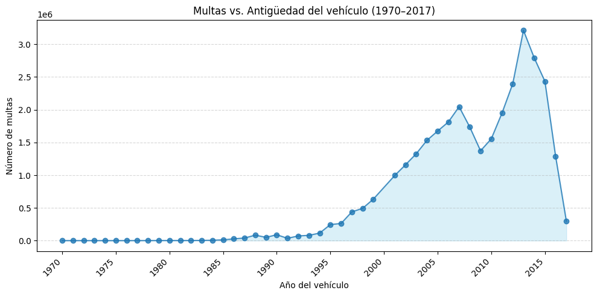{fig-align="center" width="80%"}

- **Tendencia creciente desde 1990:** los vehículos fabricados entre 1995 y 2015
  acumulan la gran mayoría de sanciones.
- **Pico pronunciado en torno a 2013**, lo que puede coincidir con años de mayor
  volumen de vehículos activos.

El número de multas no está distribuido de forma uniforme por antigüedad: se
concentra fuertemente en vehículos de una década específica (2000–2015), lo cual
puede estar correlacionado con los coches en circulación de forma activa y/o
hábitos de uso más intensivo.

# Conclusión

Durante este laboratorio he adquirido una comprensión práctica del
funcionamiento de Dask y su utilidad en el tratamiento de grandes volúmenes de
datos que no caben en memoria. Esto resulta especialmente relevante en el ámbito
de la ciencia de datos, donde es común enfrentarse a conjuntos de datos extensos
que requieren soluciones escalables.

Uno de los aspectos que más me ha llamado la atención es cómo la elección del
tipo de dato puede influir de forma considerable en el consumo de memoria,
optimizando el uso de recursos tanto cuando se trabaja con Dask distribuido como
en procesos más simples.

Además, he podido comprobar que el uso de GPUs supone una mejora notable en
cuanto al rendimiento y velocidad de procesamiento, permitiendo resolver tareas
de forma mucho más ágil. Eso sí, también he constatado que trabajar con
aceleradores GPU impone ciertas limitaciones, como una mayor sensibilidad al
manejo de memoria o restricciones específicas del entorno.

En resumen, este laboratorio me ha permitido familiarizarme con el ecosistema de
Dask, entender cómo el tipo de dato afecta al rendimiento, y comparar el
comportamiento entre ejecución en CPU y GPU, valorando sus ventajas y
limitaciones.
