\newpage

# Introducción

El rango 173.XY.0.0/20 de la red interna de la organización se ha asignado de la siguiente manera:

- XY corresponde a las dos últimas cifras del DNI 26649110E

Por lo tanto el rango de direcciones definido para la organización es: **173.10.0.0/20**.

El rango tiene una máscara **(/20)**, es decir, que hay un total de $2^{12}=4096$ direcciones en la subred disponibles, ya que **(/20)-(255.255.240.0)** significa que los primeros 20 bits están fijos para la red, dejando 12 bitss para las IPs de los hosts (e interfaces de los routers), de las subredes y los respectivos broadcasts de cada subred.

# Direccionamiento y arquitectura

La topología de red de la organización tiene un total de 12 subredes, de las cuales 8 de estas 12 son P2P entre routers y 4 son redes de área local (LAN).

El direccionamiento de las redes LAN se ha hecho de la siguiente forma:

**PC1 (500 hosts)** $\rightarrow$ Requiere de una máscara /23 (255.255.254.0) que recoge un total de 512 hosts cuyo rango es 173.10.0.0-173.10.1.255.

Se reservan dos IPs, una para la red que es la IP 173.10.0.0 y una para el broadcast que es la IP 173.10.1.255, por otro lado, en la configuración del router 1, fijamos la interfaz de red GigabitEthernet0/0 con la IP 173.10.1.254.

**Subred LAN 1.1:**

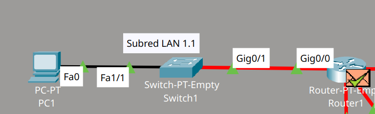{width=70% fig-align="center"}

**Server0 (180 hosts)** $\rightarrow$ Requiere de una máscara /24 (255.255.255.0) que recoge un total de 256 hosts cuyo rango es 173.10.2.0-173.10.2.255.

Se reservan dos IPs, una para la red que es la IP 173.10.2.0 y una para el broadcast que es la IP 173.10.2.255, por otro lado, en la configuración del router 2, fijamos la interfaz de red GigabitEthernet3/0 con la IP 173.10.2.254.

**Subred LAN 1.4:**

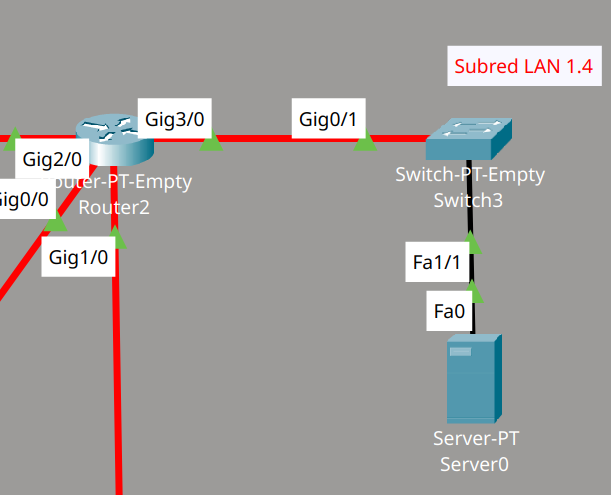{width=60% fig-align="center"}

**PC2 (130 hosts)** $\rightarrow$ Requiere de una máscara /24 (255.255.255.0) que recoge un total de 256 hosts cuyo rango es 173.10.3.0-173.10.3.255.

Se reservan dos IPs, una para la red que es la IP 173.10.3.0 y una para el broadcast que es la IP 173.10.3.255, por otro lado, en la configuración del router 5, fijamos la interfaz de red GigabitEthernet0/0 con la IP 173.10.3.254.

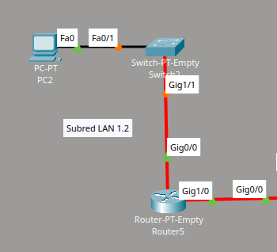{width=70% fig-align="center"}

**PC3 (58 hosts)** $\rightarrow$ Requiere de una máscara /26 (255.255.255.192) que recoge un total de 64 hosts cuyo rango es 173.10.4.0-173.10.4.63.

Se reservan dos IPs, una para la red que es la IP 173.10.4.0 y una para el broadcast que es la IP 173.10.63, por otro lado, en la configuración del router 6, fijamos la interfaz de red GigabitEthernet2/0 con la IP 173.10.4.62.

**Subred LAN 1.3:**

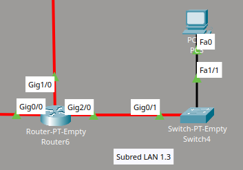{width=70% fig-align="center"}

**Subredes P2P entre routers:**

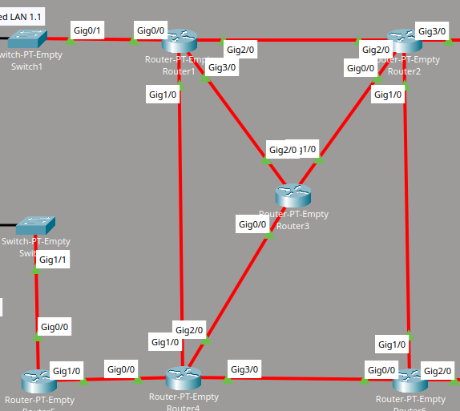{width=70% fig-align="center"}

En la topología mostrada, se han configurado 8 subredes punto a punto (P2P) para la interconexión entre routers. Cada una con una máscara /30 (255.255.255.252), lo que permite 2 hosts utilizables por enlace (uno para cada extremo del enlace).

Recordar que estas direcciones IP son asignadas a las interfaces GigabitEthernet de los routers.

**Ejemplo de asignación de una de las subredes P2P:**

- Red: 173.10.4.72/30
- Gig2/0 (Router 1): 173.10.4.73
- Gig2/0 (Router 2): 73.10.4.74
- Broadcast: 173.10.4.75

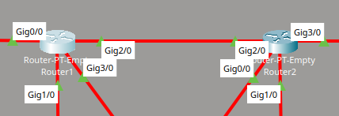{width=70% fig-align="center"}

Esta estructura permite una comunicación eficiente y segmentada entre los routers, facilitando la gestión de tráfico y optimizando el uso de direcciones IP.

---

En cuanto a las conexiones físicas que han sido empleadas en la red:

1. **Entre routers y entre router-switch se ha optado por una conexión mediante cables de fibra Gigabit Ethernet (1 Gbps).**

   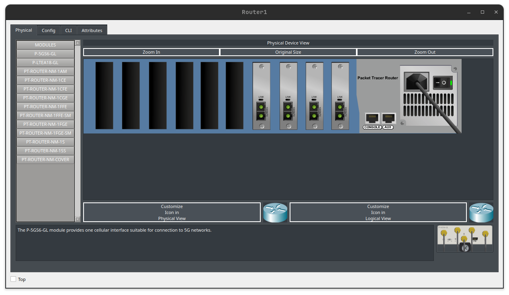{width=70% fig-align="center"}

   Para ello, de todos los puertos mostrados en la imagen se deben de introducir a los routers vaciós los módulos que corresponden al nombre **PT-ROUTER-NM-1FGE** ya que, como bien dicen las siglas, **FGE** significa **F**ibra **G**igabit **E**thernet. Se pueden instalar en cada router/switch un total de 10 módulos ya que hay 10 puertos, el número de módulos introducidos dependerá del número de conexiones que tenga dicho dispositivo.

   En este caso, el router 1 tiene 4 conexiones (en todas utiliza cableado de fibra) por lo tanto se han introducido un total de 4 módulos **FGE**.

2. **Entre PC/Server-switch se ha obtado por una conexión mediante clabes de cobre Fast Ethernet (100 Mbps).**

   Para ello, de todos estos módulos disponibles se debe introducir el módulo **PT-HOST-NM-1CFE** para los hosts (uno para cada host) y **PT-SWITCH-NM-1CFE** (uno para cada switch), observar también el módulo que debe ser conectado a los switches para su conexión mediante clableado de fibra con su respectivo router (**PT-SWITCH-NM-1FGE**).

   Una vez instalados todos los módulos requeridos en cada uno de los dispositivos de la red, podemos realizar las conexiones con el respectivo cableado.

   ::: {layout-ncol=2}
   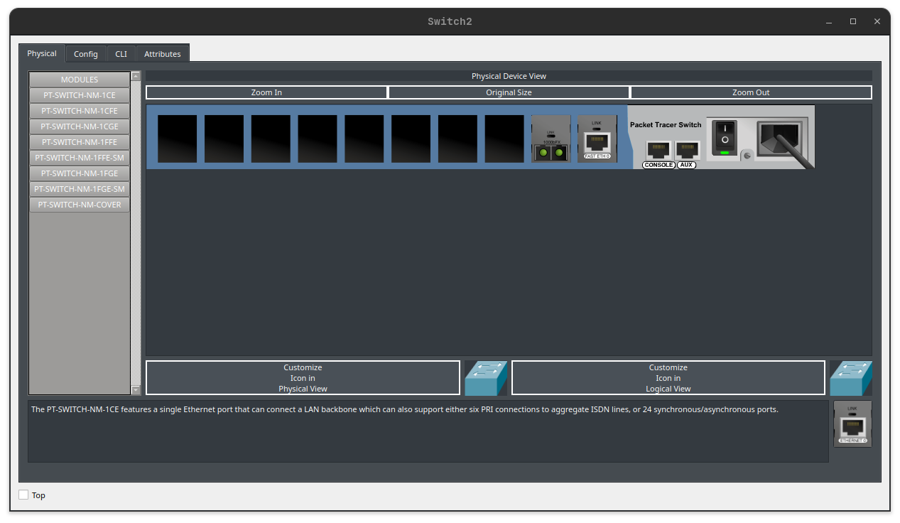

   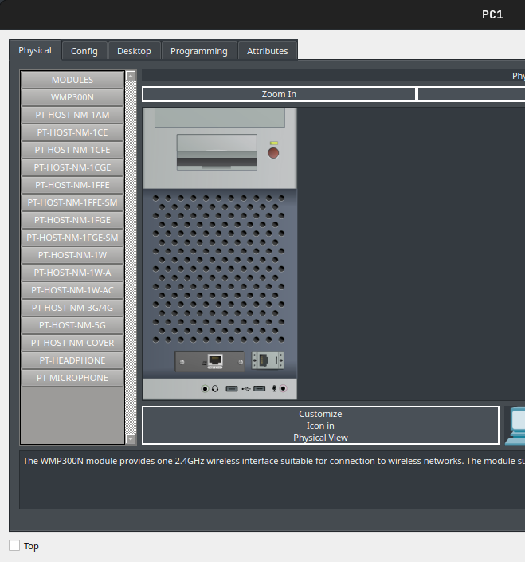
   :::

\newpage

# Encaminamiento intra-dominio IPv4

El objetivo ahora es configurar **RIP v2** en cada router de la red, se ha tenido en cuento los siguientes aspectos específicos en la configuración de cada router:

1. Fijar correctamente las redes directamente conectadas
2. Marcar las **interfaces pasivas** para evitar el tráfico RIP innecesario ya que, los mensajes RIP, se envían por defecto por todas las interfaces. Estas interfaces pasivas serán aquellas que no están conectadas directamente con la interfaz de otro router.
3. Establecer una **ruta por defecto** en los hosts a través de su router de acceso.

Una vez configurado el encaminamiento en cada uno de los routers por separado tendremos que: Tras las **convergencia**, todas las **tablas de enrutamiento de la topología estarán completas**.

A continuación se mostrará cómo se ha configurado el encaminamiento de algunos de los routers mediante el protocolo **RIP**:

Coonfiguración RIP **Router 1** (Router con conexión P2P y conexión LAN) mediante CLI:

```
Router>enable
Router#configure terminal
Enter configuration commands, one per line.  End with CNTL/Z.
Router(config)#router rip
Router(config-router)#version 2
Router(config-router)#network 173.10.1.0
Router(config-router)#network 173.10.4.68
Router(config-router)#network 173.10.4.64
Router(config-router)#network 173.10.4.72
Router(config-router)#passive-interface Gig
Router(config-router)#passive-interface GigabitEthernet 0/0
Router(config-router)#default-information originate
Router(config-router)#exit
Router(config)#exit
Router#copy running-config startup-config
Destination filename [startup-config]?
Building configuration...
[OK]
```

Comentar que en la configuración a través de CLI se han definido:

- Las subredes con conexión directa
- Las interfaces pasivas (en caso de que sea necesario)
- Rutas por defecto hacia las interfaces que interconectan con los hosts
- Escritura de la configuración en un archivo de la RAM para no perderla cuando se apagan los routers

Configuración RIP **Router 3** (Router con conexión únicamente P2P) mediante CLI:

```
Router>enable
Router#configure terminal
Enter configuration commands, one per line.  End with CNTL/Z.
Router(config)#router rip
Router(config-router)#version 2
Router(config-router)#network 173.10.4.64
Router(config-router)#network 173.10.4.76
Router(config-router)#network 173.10.4.92
Router(config-router)#exit
Router(config)#exit
Router#copy running-config startup-config
Destination filename [startup-config]?
Building configuration...
[OK]
```

En este caso podemos observar que no se definen interfaces pasivas debido a que, en el router 3, todas las subredes a las que pertenecen sus interfaces, con redes P2P.

## Cuestiones a resolver

- **Cuestión 1:** Muestre las tablas de rutas de R4 y comente los aspectos más relevantes. ¿Cuál es el camino óptimo para alcanzar la interfaz de R2 que conecta con el servidor (LAN 1.4)? ¿Por qué? ¿Cuántas alternativas hay para alcanzarlo según la tabla de rutas? ¿Cuáles son y por qué?

  **Tabla de enrutamiento del router 4:**

  Mediante el comando: **show ip route**

  ```
  Router#show ip route
  Codes: C - connected, S - static, I - IGRP, R - RIP, M - mobile, B - BGP
        D - EIGRP, EX - EIGRP external, O - OSPF, IA - OSPF inter area
        N1 - OSPF NSSA external type 1, N2 - OSPF NSSA external type 2
        E1 - OSPF external type 1, E2 - OSPF external type 2, E - EGP
        i - IS-IS, L1 - IS-IS level-1, L2 - IS-IS level-2, ia - IS-IS inter area
        * - candidate default, U - per-user static route, o - ODR
        P - periodic downloaded static route

  Gateway of last resort is not set

      173.10.0.0/16 is variably subnetted, 12 subnets, 4 masks
  R       173.10.0.0/23 [120/1] via 173.10.4.69, 00:00:23, GigabitEthernet1/0
  R       173.10.2.0/24 [120/2] via 173.10.4.86, 00:00:28, GigabitEthernet3/0
                        [120/2] via 173.10.4.77, 00:00:08, GigabitEthernet2/0
                        [120/2] via 173.10.4.69, 00:00:23, GigabitEthernet1/0
  R       173.10.3.0/24 [120/1] via 173.10.4.89, 00:00:19, GigabitEthernet0/0
  R       173.10.4.0/26 [120/1] via 173.10.4.86, 00:00:28, GigabitEthernet3/0
  R       173.10.4.64/30 [120/1] via 173.10.4.69, 00:00:23, GigabitEthernet1/0
                        [120/1] via 173.10.4.77, 00:00:08, GigabitEthernet2/0
  C       173.10.4.68/30 is directly connected, GigabitEthernet1/0
  R       173.10.4.72/30 [120/1] via 173.10.4.69, 00:00:23, GigabitEthernet1/0
  C       173.10.4.76/30 is directly connected, GigabitEthernet2/0
  R       173.10.4.80/30 [120/1] via 173.10.4.86, 00:00:28, GigabitEthernet3/0
  C       173.10.4.84/30 is directly connected, GigabitEthernet3/0
  C       173.10.4.88/30 is directly connected, GigabitEthernet0/0
  R       173.10.4.92/30 [120/1] via 173.10.4.77, 00:00:08, GigabitEthernet2/0
  ```

  Observando la tabla vemos que las tres rutas alternativas que se ofrecen para ir del router 4 al 2 son igual de óptimas ya que las tres tienen dos saltos hasta el destino objetivo (se puede ver con el segundo número que se marca entre corchetes) y por la propia definición del protocolo RIP, sabemos que se define por ruta óptima la que menos saltos tenga que dar.

  ```
  R       173.10.2.0/24 [120/2] via 173.10.4.86, 00:00:28, GigabitEthernet3/0
                        [120/2] via 173.10.4.77, 00:00:08, GigabitEthernet2/0
                        [120/2] via 173.10.4.69, 00:00:23, GigabitEthernet1/0

  ```

  La tabla de rutas ofrece tres alternativas para alcanzar la interfaz del router 2. Las rutas ofrecidas son así debido a que son los routers intermedios entre el router 4 y el router 2.

  > Observando por ejemplo la primera ruta tenemos que:
  - Partimos del router 4 a través de la interfaz GigabitEthernet3/0 con IP 173.10.4.86 y llegamos a la interfaz GigabitEthernet1/0 del router 2 gracias a la interfaz intermediaria del router 1 que sería la GigabitEthernet2/0 con IP 173.10.4.77.

- **Cuestión 2:** Utilizando información de las tablas de rutas y capturas del tráfico RIP en la red (Packet Tracer y/o salida de debug de los routers Cisco), explique el funcionamiento de split horizon sobre algún enlace de la red.

  El **Split Horizon** es una técnica empleada en la red para minimizar la creación de ciclos/bucles, esta consiste en aplicar una restricción a los routers para que no puedan reenviar la información de una ruta por la misma interfaz por donde la aprendieron.

  **Simulación de envío de paquetes RIP entre los routers de la red:**

  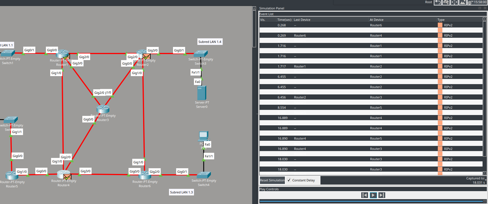

  **Debug del router 3:**

  Aquí podemos observar los paquetes **RIP** que está enviando y recibiendo el router 3 hacia/desde otros routers con la información del estado de las rutas.

  Comentar que cuando el router envía las actualizaciones, las envía a través del **multicast** de **RIP**, se emplea para que esa información llegue a todos los demás routers. Por otro lado, el router 3 recibe información de enrutamiento proviene de otros routers, esta información le permite construir y actualizar su tabla de enrutamiento de manera dinámica.

  ```
  Router#debug ip rip
  RIP protocol debugging is on
  Router#RIP: received v2 update from 173.10.4.93 on GigabitEthernet1/0
     0.0.0.0/0 via 0.0.0.0 in 1 hops
     173.10.0.0/23 via 0.0.0.0 in 2 hops
     173.10.2.0/24 via 0.0.0.0 in 1 hops
     173.10.4.0/26 via 0.0.0.0 in 2 hops
     173.10.4.68/30 via 0.0.0.0 in 2 hops
     173.10.4.72/30 via 0.0.0.0 in 1 hops
     173.10.4.80/30 via 0.0.0.0 in 1 hops
     173.10.4.84/30 via 0.0.0.0 in 2 hops
  RIP: received v2 update from 173.10.4.65 on GigabitEthernet2/0
     0.0.0.0/0 via 0.0.0.0 in 1 hops
     173.10.0.0/23 via 0.0.0.0 in 1 hops
     173.10.2.0/24 via 0.0.0.0 in 2 hops
     173.10.3.0/24 via 0.0.0.0 in 3 hops
     173.10.4.0/26 via 0.0.0.0 in 3 hops
     173.10.4.68/30 via 0.0.0.0 in 1 hops
     173.10.4.72/30 via 0.0.0.0 in 1 hops
     173.10.4.80/30 via 0.0.0.0 in 2 hops
     173.10.4.84/30 via 0.0.0.0 in 2 hops
     173.10.4.88/30 via 0.0.0.0 in 2 hops
  ```

  Podemos observar en las salida anterior que el router 3 recibe paquetes RIP por parte del router 2 (173.10.4.93) a través de la interfaz GigabitEthernet1/0 y por parte del router 4 (173.10.4.65) a través de la interfaz GigabitEthernet2/0.

  ```
  RIP: sending  v2 update to 224.0.0.9 via GigabitEthernet0/0 (173.10.4.77)
  RIP: build update entries
      0.0.0.0/0 via 0.0.0.0, metric 1, tag 0
      173.10.0.0/23 via 0.0.0.0, metric 2, tag 0
      173.10.2.0/24 via 0.0.0.0, metric 2, tag 0
      173.10.4.64/30 via 0.0.0.0, metric 1, tag 0
      173.10.4.72/30 via 0.0.0.0, metric 2, tag 0
      173.10.4.80/30 via 0.0.0.0, metric 2, tag 0
      173.10.4.92/30 via 0.0.0.0, metric 1, tag 0
  RIP: sending  v2 update to 224.0.0.9 via GigabitEthernet1/0 (173.10.4.94)
  RIP: build update entries
      0.0.0.0/0 via 0.0.0.0, metric 1, tag 0
      173.10.0.0/23 via 0.0.0.0, metric 2, tag 0
      173.10.3.0/24 via 0.0.0.0, metric 3, tag 0
      173.10.4.64/30 via 0.0.0.0, metric 1, tag 0
      173.10.4.68/30 via 0.0.0.0, metric 2, tag 0
      173.10.4.76/30 via 0.0.0.0, metric 1, tag 0
      173.10.4.84/30 via 0.0.0.0, metric 2, tag 0
      173.10.4.88/30 via 0.0.0.0, metric 2, tag 0
  RIP: sending  v2 update to 224.0.0.9 via GigabitEthernet2/0 (173.10.4.66)
  RIP: build update entries
      0.0.0.0/0 via 0.0.0.0, metric 1, tag 0
      173.10.2.0/24 via 0.0.0.0, metric 2, tag 0
      173.10.3.0/24 via 0.0.0.0, metric 3, tag 0
      173.10.4.0/26 via 0.0.0.0, metric 3, tag 0
      173.10.4.76/30 via 0.0.0.0, metric 1, tag 0
      173.10.4.80/30 via 0.0.0.0, metric 2, tag 0
      173.10.4.84/30 via 0.0.0.0, metric 2, tag 0
      173.10.4.88/30 via 0.0.0.0, metric 2, tag 0
      173.10.4.92/30 via 0.0.0.0, metric 1, tag 0
  RIP: received v2 update from 173.10.4.93 on GigabitEthernet1/0
      0.0.0.0/0 via 0.0.0.0 in 1 hops
      173.10.0.0/23 via 0.0.0.0 in 2 hops
      173.10.2.0/24 via 0.0.0.0 in 1 hops
      173.10.4.0/26 via 0.0.0.0 in 2 hops
      173.10.4.68/30 via 0.0.0.0 in 2 hops
      173.10.4.72/30 via 0.0.0.0 in 1 hops
      173.10.4.80/30 via 0.0.0.0 in 1 hops
      173.10.4.84/30 via 0.0.0.0 in 2 hops
  RIP: received v2 update from 173.10.4.65 on GigabitEthernet2/0
      0.0.0.0/0 via 0.0.0.0 in 1 hops
      173.10.0.0/23 via 0.0.0.0 in 1 hops
      173.10.2.0/24 via 0.0.0.0 in 2 hops
      173.10.3.0/24 via 0.0.0.0 in 3 hops
      173.10.4.0/26 via 0.0.0.0 in 3 hops
      173.10.4.68/30 via 0.0.0.0 in 1 hops
      173.10.4.72/30 via 0.0.0.0 in 1 hops
      173.10.4.80/30 via 0.0.0.0 in 2 hops
      173.10.4.84/30 via 0.0.0.0 in 2 hops
      173.10.4.88/30 via 0.0.0.0 in 2 hops
  RIP: received v2 update from 173.10.4.78 on GigabitEthernet0/0
      0.0.0.0/0 via 0.0.0.0 in 1 hops
      173.10.0.0/23 via 0.0.0.0 in 2 hops
      173.10.3.0/24 via 0.0.0.0 in 2 hops
      173.10.4.0/26 via 0.0.0.0 in 2 hops
      173.10.4.68/30 via 0.0.0.0 in 1 hops
      173.10.4.72/30 via 0.0.0.0 in 2 hops
      173.10.4.80/30 via 0.0.0.0 in 2 hops
      173.10.4.84/30 via 0.0.0.0 in 1 hops
      173.10.4.88/30 via 0.0.0.0 in 1 hops
  RIP: sending  v2 update to 224.0.0.9 via GigabitEthernet0/0 (173.10.4.77)
  RIP: build update entries
      0.0.0.0/0 via 0.0.0.0, metric 1, tag 0
      173.10.0.0/23 via 0.0.0.0, metric 2, tag 0
      173.10.2.0/24 via 0.0.0.0, metric 2, tag 0
      173.10.4.64/30 via 0.0.0.0, metric 1, tag 0
      173.10.4.72/30 via 0.0.0.0, metric 2, tag 0
      173.10.4.80/30 via 0.0.0.0, metric 2, tag 0
      173.10.4.92/30 via 0.0.0.0, metric 1, tag 0
  RIP: sending  v2 update to 224.0.0.9 via GigabitEthernet1/0 (173.10.4.94)
  RIP: build update entries
      0.0.0.0/0 via 0.0.0.0, metric 1, tag 0
      173.10.0.0/23 via 0.0.0.0, metric 2, tag 0
      173.10.3.0/24 via 0.0.0.0, metric 3, tag 0
      173.10.4.64/30 via 0.0.0.0, metric 1, tag 0
      173.10.4.68/30 via 0.0.0.0, metric 2, tag 0
      173.10.4.76/30 via 0.0.0.0, metric 1, tag 0
      173.10.4.84/30 via 0.0.0.0, metric 2, tag 0
      173.10.4.88/30 via 0.0.0.0, metric 2, tag 0
  RIP: sending  v2 update to 224.0.0.9 via GigabitEthernet2/0 (173.10.4.66)
  RIP: build update entries
      0.0.0.0/0 via 0.0.0.0, metric 1, tag 0
      173.10.2.0/24 via 0.0.0.0, metric 2, tag 0
      173.10.3.0/24 via 0.0.0.0, metric 3, tag 0
      173.10.4.0/26 via 0.0.0.0, metric 3, tag 0
      173.10.4.76/30 via 0.0.0.0, metric 1, tag 0
      173.10.4.80/30 via 0.0.0.0, metric 2, tag 0
      173.10.4.84/30 via 0.0.0.0, metric 2, tag 0
      173.10.4.88/30 via 0.0.0.0, metric 2, tag 0
      173.10.4.92/30 via 0.0.0.0, metric 1, tag 0
  ```

  Observando esta salida se puede ver el correcto funcionamiento de la técnica de **Split Horizon** para evitar bucles. Por las interfaces por donde antes ha recibido la información de enrutamiento **RIP** proveniente del router 2 y 4, GigabitEthernet0/0 y GigabitEthernet1/0, son en este caso empleadas para el envío de estos paquetes mediante **multicast** pero con el impedimento establecido de reenviar la información de enrutamiento a las interfaces por las que ha aprendido inicialmente el router 3. Claramente se ve, en la parte de envío, que en ningún momento se especifica el envío ni a (173.10.4.93) ni a (173.10.4.65).

- **Cuestión 3:** Empleando el comando tracert, muestre la ruta que sigue el tráfico desde el Host2 hasta la interfaz de R2 que conecta con el servidor (LAN 1.4).

  Primero vamos a realizar un ping para verificar la conectividad entre estos puntos en la red:

  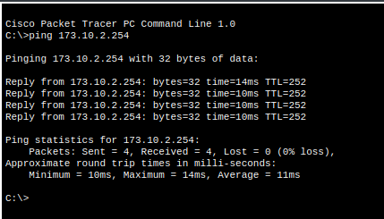

  Podemos ver que la conectividad es correcta ya que han sido exitosos el envío de paquetes ICMP entre los puntos.

  Ahora vamos a mostrar mediante el comando **tracert** una de las rutas que hay entre PC2 y la interfaz del router 2 que conecta con el servidor:

  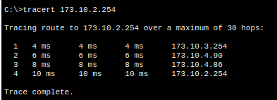

  Cada salto representa un router intermedio por el que pasa el tráfico desde PC2 hasta el router 2.

  Podemos observar en la siguiente imagen la ruta que se ha trazado:

  

- **Cuestión 4:** Con la simulación en marcha, desactive en R4 la interfaz de salida hacia R2. Utilizando información de las tablas de rutas y capturas del tráfico RIP en la red (Cisco Packet Tracer y/o salida de debug de los routers Cisco), explique en detalle cómo RIP converge a una nueva solución para alcanzar R2. Céntrese únicamente en los routers R4 y R2. Indique, en caso de que aplique, el funcionamiento sobre este escenario y el uso de las técnicas triggered updates y poison reverse.

  **Tabla de enrutamiento del router 4:**

  ```
  Router#show ip route
  Codes: C - connected, S - static, I - IGRP, R - RIP, M - mobile, B - BGP
       D - EIGRP, EX - EIGRP external, O - OSPF, IA - OSPF inter area
       N1 - OSPF NSSA external type 1, N2 - OSPF NSSA external type 2
       E1 - OSPF external type 1, E2 - OSPF external type 2, E - EGP
       i - IS-IS, L1 - IS-IS level-1, L2 - IS-IS level-2, ia - IS-IS inter area
       * - candidate default, U - per-user static route, o - ODR
       P - periodic downloaded static route

  Gateway of last resort is not set

      173.10.0.0/16 is variably subnetted, 12 subnets, 4 masks

  R 173.10.0.0/23 [120/1] via 173.10.4.69, 00:00:23, GigabitEthernet1/0
  R 173.10.2.0/24 [120/2] via 173.10.4.86, 00:00:28, GigabitEthernet3/0
  [120/2] via 173.10.4.77, 00:00:08, GigabitEthernet2/0
  [120/2] via 173.10.4.69, 00:00:23, GigabitEthernet1/0
  R 173.10.3.0/24 [120/1] via 173.10.4.89, 00:00:19, GigabitEthernet0/0
  R 173.10.4.0/26 [120/1] via 173.10.4.86, 00:00:28, GigabitEthernet3/0
  R 173.10.4.64/30 [120/1] via 173.10.4.69, 00:00:23, GigabitEthernet1/0
  [120/1] via 173.10.4.77, 00:00:08, GigabitEthernet2/0
  C 173.10.4.68/30 is directly connected, GigabitEthernet1/0
  R 173.10.4.72/30 [120/1] via 173.10.4.69, 00:00:23, GigabitEthernet1/0
  C 173.10.4.76/30 is directly connected, GigabitEthernet2/0
  R 173.10.4.80/30 [120/1] via 173.10.4.86, 00:00:28, GigabitEthernet3/0
  C 173.10.4.84/30 is directly connected, GigabitEthernet3/0
  C 173.10.4.88/30 is directly connected, GigabitEthernet0/0
  R 173.10.4.92/30 [120/1] via 173.10.4.77, 00:00:08, GigabitEthernet2/0

  ```

  Podemos ver que se puede escoger cualquiera de las interfaces para montar una ruta del router 4 al router 2, vamos a iniciar la simulación y vamos a desactivar dos de las tres interfaces. Tras esto, examinaremos de nuevo la tabla de rutas y el tráfico RIP para conocer como este protocolo consigue converger a una nueva solución.

  Inicio de la simulación con paquetes RIP, observemos la depuración de RIP para monitorear la convergencia cuando desactivemos las interfaces del router 4:

  **Paquetes de actualizaciones RIP recibidos por el router 4:**

  ```
  RIP: received v2 update from 173.10.4.77 on GigabitEthernet2/0
      0.0.0.0/0 via 0.0.0.0 in 1 hops
      173.10.0.0/23 via 0.0.0.0 in 2 hops
      173.10.2.0/24 via 0.0.0.0 in 2 hops
      173.10.4.64/30 via 0.0.0.0 in 1 hops
      173.10.4.72/30 via 0.0.0.0 in 2 hops
      173.10.4.80/30 via 0.0.0.0 in 2 hops
      173.10.4.92/30 via 0.0.0.0 in 1 hops
  RIP: received v2 update from 173.10.4.86 on GigabitEthernet3/0
      0.0.0.0/0 via 0.0.0.0 in 1 hops
      173.10.2.0/24 via 0.0.0.0 in 2 hops
      173.10.4.0/26 via 0.0.0.0 in 1 hops
      173.10.4.72/30 via 0.0.0.0 in 2 hops
      173.10.4.80/30 via 0.0.0.0 in 1 hops
      173.10.4.92/30 via 0.0.0.0 in 2 hops
  RIP: received v2 update from 173.10.4.69 on GigabitEthernet1/0
      0.0.0.0/0 via 0.0.0.0 in 1 hops
      173.10.0.0/23 via 0.0.0.0 in 1 hops
      173.10.2.0/24 via 0.0.0.0 in 2 hops
      173.10.4.64/30 via 0.0.0.0 in 1 hops
      173.10.4.72/30 via 0.0.0.0 in 1 hops
      173.10.4.80/30 via 0.0.0.0 in 2 hops
      173.10.4.92/30 via 0.0.0.0 in 2 hops
  RIP: received v2 update from 173.10.4.89 on GigabitEthernet0/0
      0.0.0.0/0 via 0.0.0.0 in 1 hops
      173.10.3.0/24 via 0.0.0.0 in 1 hops
  ```

  **Paquetes de actualizaciones RIP enviados por el router 4:**

  ```
  RIP: sending v2 update to 224.0.0.9 via GigabitEthernet0/0 (173.10.4.90)
  RIP: build update entries
  0.0.0.0/0 via 0.0.0.0, metric 1, tag 0
  173.10.0.0/23 via 0.0.0.0, metric 2, tag 0
  173.10.2.0/24 via 0.0.0.0, metric 3, tag 0
  173.10.4.0/26 via 0.0.0.0, metric 2, tag 0
  173.10.4.64/30 via 0.0.0.0, metric 2, tag 0
  173.10.4.68/30 via 0.0.0.0, metric 1, tag 0
  173.10.4.72/30 via 0.0.0.0, metric 2, tag 0
  173.10.4.76/30 via 0.0.0.0, metric 1, tag 0
  173.10.4.80/30 via 0.0.0.0, metric 2, tag 0
  173.10.4.84/30 via 0.0.0.0, metric 1, tag 0
  173.10.4.92/30 via 0.0.0.0, metric 2, tag 0
  RIP: sending v2 update to 224.0.0.9 via GigabitEthernet1/0 (173.10.4.70)
  RIP: build update entries
  0.0.0.0/0 via 0.0.0.0, metric 1, tag 0
  173.10.3.0/24 via 0.0.0.0, metric 2, tag 0
  173.10.4.0/26 via 0.0.0.0, metric 2, tag 0
  173.10.4.76/30 via 0.0.0.0, metric 1, tag 0
  173.10.4.80/30 via 0.0.0.0, metric 2, tag 0
  173.10.4.84/30 via 0.0.0.0, metric 1, tag 0
  173.10.4.88/30 via 0.0.0.0, metric 1, tag 0
  173.10.4.92/30 via 0.0.0.0, metric 2, tag 0
  RIP: sending v2 update to 224.0.0.9 via GigabitEthernet2/0 (173.10.4.78)
  RIP: build update entries
  0.0.0.0/0 via 0.0.0.0, metric 1, tag 0
  173.10.0.0/23 via 0.0.0.0, metric 2, tag 0
  173.10.3.0/24 via 0.0.0.0, metric 2, tag 0
  173.10.4.0/26 via 0.0.0.0, metric 2, tag 0
  173.10.4.68/30 via 0.0.0.0, metric 1, tag 0
  173.10.4.72/30 via 0.0.0.0, metric 2, tag 0
  173.10.4.80/30 via 0.0.0.0, metric 2, tag 0
  173.10.4.84/30 via 0.0.0.0, metric 1, tag 0
  173.10.4.88/30 via 0.0.0.0, metric 1, tag 0
  RIP: sending v2 update to 224.0.0.9 via GigabitEthernet3/0 (173.10.4.85)
  RIP: build update entries
  0.0.0.0/0 via 0.0.0.0, metric 1, tag 0
  173.10.0.0/23 via 0.0.0.0, metric 2, tag 0
  173.10.3.0/24 via 0.0.0.0, metric 2, tag 0
  173.10.4.64/30 via 0.0.0.0, metric 2, tag 0
  173.10.4.68/30 via 0.0.0.0, metric 1, tag 0
  173.10.4.72/30 via 0.0.0.0, metric 2, tag 0
  173.10.4.76/30 via 0.0.0.0, metric 1, tag 0
  173.10.4.88/30 via 0.0.0.0, metric 1, tag 0
  173.10.4.92/30 via 0.0.0.0, metric 2, tag 0
  ```

  Interpretando esta depuración previa a la desactivación con la simulación en marcha, podemos observar como la red se encuentra en un estado de convergencia, ahora pasaremos a desactivar algunas interfaces del router 4 para que el protocolo, con el uso de sus técnicas establecidas, restablezca la convergencia y devuelva la conectividad a través de otras rutas disponibles.

  **Desactivación de dos de las tres interfaces de red del router 4 que permiten establecer una ruta con el router 2:**

  ```
  Router>enable
  Router#configure terminal
  Enter configuration commands, one per line.  End with CNTL/Z.
  Router(config)#interface GigabitEthernet 1/0
  Router(config-if)#shutdown

  Router(config-if)#exit
  Router(config)#interface GigabitEthernet 3/0
  Router(config-if)#shutdown

  Router(config-if)#exit
  ```

  Automáticamente después de la desactivación, la tabla de enrutamiento es actualizada y se fija con métrico 16 aquellas redes que quedan inalcanzables.

  Esto se consigue gracias a las técnicas de **Triggered Updates y Poison Reverse**:
  - **Triggered Updates:** RIP no espera al siguiente intervalo de actualización (cada 30s) y envía una actualización inmediata a sus vecinos informando la caída del enlace, esto permite a la red acelerar la convergencia y, por lo tanto, permite a cada router actualizar su tabla de enrutamiento de forma inmediata.
  - **Poison Reverse:** R4 informará a sus vecinos que las redes alcanzadas a través de las interfaces desactivadas tienen un métrico de 16 (infinito), lo que indica que las rutas son inalcanzables.

  **Debug después de la desactivación:**

  ```
  RIP: sending  v2 update to 224.0.0.9 via GigabitEthernet0/0 (173.10.4.90)
  RIP: build update entries
      0.0.0.0/0 via 0.0.0.0, metric 1, tag 0
      173.10.0.0/23 via 0.0.0.0, metric 2, tag 0
      173.10.2.0/24 via 0.0.0.0, metric 16, tag 0
      173.10.4.0/26 via 0.0.0.0, metric 2, tag 0
      173.10.4.64/30 via 0.0.0.0, metric 2, tag 0
      173.10.4.68/30 via 0.0.0.0, metric 1, tag 0
      173.10.4.72/30 via 0.0.0.0, metric 2, tag 0
      173.10.4.76/30 via 0.0.0.0, metric 1, tag 0
      173.10.4.80/30 via 0.0.0.0, metric 16, tag 0
      173.10.4.84/30 via 0.0.0.0, metric 1, tag 0
      173.10.4.92/30 via 0.0.0.0, metric 2, tag 0
  RIP: sending  v2 update to 224.0.0.9 via GigabitEthernet1/0 (173.10.4.70)
  RIP: build update entries
      0.0.0.0/0 via 0.0.0.0, metric 1, tag 0
      173.10.3.0/24 via 0.0.0.0, metric 2, tag 0
      173.10.4.0/26 via 0.0.0.0, metric 2, tag 0
      173.10.4.76/30 via 0.0.0.0, metric 1, tag 0
      173.10.4.80/30 via 0.0.0.0, metric 16, tag 0
      173.10.4.84/30 via 0.0.0.0, metric 1, tag 0
      173.10.4.88/30 via 0.0.0.0, metric 1, tag 0
      173.10.4.92/30 via 0.0.0.0, metric 2, tag 0
  RIP: sending  v2 update to 224.0.0.9 via GigabitEthernet2/0 (173.10.4.78)
  RIP: build update entries
      0.0.0.0/0 via 0.0.0.0, metric 1, tag 0
      173.10.0.0/23 via 0.0.0.0, metric 2, tag 0
      173.10.2.0/24 via 0.0.0.0, metric 16, tag 0
      173.10.3.0/24 via 0.0.0.0, metric 2, tag 0
      173.10.4.0/26 via 0.0.0.0, metric 2, tag 0
      173.10.4.68/30 via 0.0.0.0, metric 1, tag 0
      173.10.4.72/30 via 0.0.0.0, metric 2, tag 0
      173.10.4.80/30 via 0.0.0.0, metric 16, tag 0
      173.10.4.84/30 via 0.0.0.0, metric 1, tag 0
      173.10.4.88/30 via 0.0.0.0, metric 1, tag 0
  RIP: sending  v2 update to 224.0.0.9 via GigabitEthernet3/0 (173.10.4.85)
  RIP: build update entries
      0.0.0.0/0 via 0.0.0.0, metric 1, tag 0
      173.10.0.0/23 via 0.0.0.0, metric 2, tag 0
      173.10.2.0/24 via 0.0.0.0, metric 16, tag 0
      173.10.3.0/24 via 0.0.0.0, metric 2, tag 0
      173.10.4.64/30 via 0.0.0.0, metric 2, tag 0
      173.10.4.68/30 via 0.0.0.0, metric 1, tag 0
      173.10.4.72/30 via 0.0.0.0, metric 2, tag 0
      173.10.4.76/30 via 0.0.0.0, metric 1, tag 0
      173.10.4.88/30 via 0.0.0.0, metric 1, tag 0
      173.10.4.92/30 via 0.0.0.0, metric 2, tag 0
  ```

  Si interpretamos el envío de paquetes RIP por parte del router 4 podemos observar como el router envía a sus vecinos la información de que algunas redes han sido marcadas como inalcanzables (métrico 16), sin embargo, podemos observar que ha quedado una ruta posible, con métrico 3, entre el router 4 y el router 2, por lo que la red a la que pertenece el servidor no queda inalcanzable.

  Ese envío de paquetes RIP ocurre justo después de la desactivación de las interfaces, por eso, la red no se encuentra en su estado de convergencia. Tras esto, se produce un envío de paquetes RIP con información de nuevas rutas disponibles, para estas redes
  supuestamente inalcanzables, por parte de los routers 3 y 5 que termina recibiendo el router 4.

  El router 4 utiliza esta información proporcionada para actualizar su tabla de enrutamiento y así es como se consigue que todas las subredes vuelvan a ser alcanzables y que, por lo tanto, se vuelva a reestablecer el estado de convergencia.

  **Tabla de enrutamiento del router 4 tras la desactivación de las interfaces:**

  ```
  Router#show ip route
  Codes: C - connected, S - static, I - IGRP, R - RIP, M - mobile, B - BGP
        D - EIGRP, EX - EIGRP external, O - OSPF, IA - OSPF inter area
        N1 - OSPF NSSA external type 1, N2 - OSPF NSSA external type 2
        E1 - OSPF external type 1, E2 - OSPF external type 2, E - EGP
        i - IS-IS, L1 - IS-IS level-1, L2 - IS-IS level-2, ia - IS-IS inter area
        * - candidate default, U - per-user static route, o - ODR
        P - periodic downloaded static route

  Gateway of last resort is not set

      173.10.0.0/16 is variably subnetted, 12 subnets, 4 masks
  R       173.10.0.0/23 [120/1] via 173.10.4.69, 00:00:23, GigabitEthernet1/0
  R       173.10.2.0/24 is possibly down, routing via 173.10.4.69, GigabitEthernet1/0
  R       173.10.3.0/24 [120/1] via 173.10.4.89, 00:00:17, GigabitEthernet0/0
  R       173.10.4.0/26 [120/1] via 173.10.4.86, 00:00:00, GigabitEthernet3/0
  R       173.10.4.64/30 [120/1] via 173.10.4.69, 00:00:23, GigabitEthernet1/0
                        [120/1] via 173.10.4.77, 00:00:10, GigabitEthernet2/0
  C       173.10.4.68/30 is directly connected, GigabitEthernet1/0
  R       173.10.4.72/30 [120/1] via 173.10.4.69, 00:00:23, GigabitEthernet1/0
  C       173.10.4.76/30 is directly connected, GigabitEthernet2/0
  R       173.10.4.80/30 is possibly down, routing via 173.10.4.86, GigabitEthernet3/0
  C       173.10.4.84/30 is directly connected, GigabitEthernet3/0
  C       173.10.4.88/30 is directly connected, GigabitEthernet0/0
  R       173.10.4.92/30 [120/1] via 173.10.4.77, 00:00:10, GigabitEthernet2/0
  ```

  Finalmente podemos observar que se consigue reestablecer la conectividad con todas las subredes de la topología devolviendo a la red a su estado previo de convergencia.

# Estudio TCP/UDP

Lo primero de todo es habilitar y configurar los servicios en el servidor (Server0), para ello nos vamos al servidor y luego le damos a la pestaña de _services_ y seleccionamos el protocolo HTTP y lo activamos (ON):

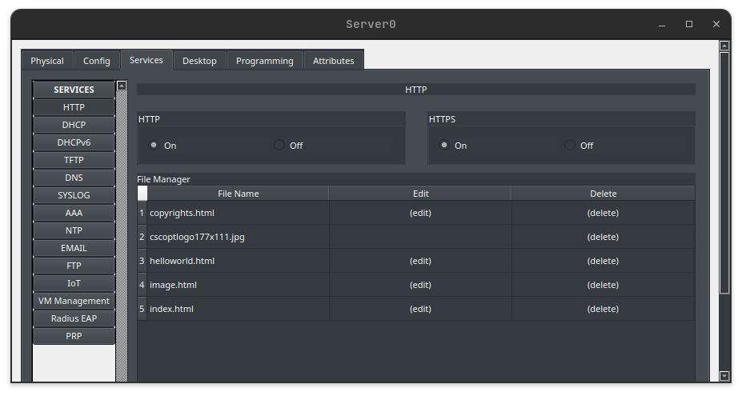{width=70% fig-align="center"}

Luego hacemos lo mismo, pero en este caso con el protocolo DNS:

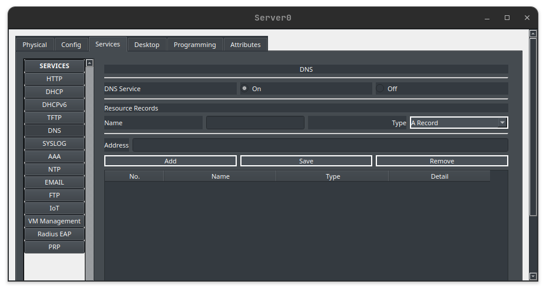{width=70% fig-align="center"}

## Cuestiones TCP

- **Cuestión 1:** Filtra el tráfico para que solo se muestren los paquetes HTTP y TCP.

  Para filtrar el tráfico se muestren únicamente los paquetes HTTP y TCP debemos de darle a _simulation-edit filters_, dentro de _edit filters_ desactivamos todos los protocolos dejando solo HTTP y TCP, estos se encuentran en la ventana _Misc_.

  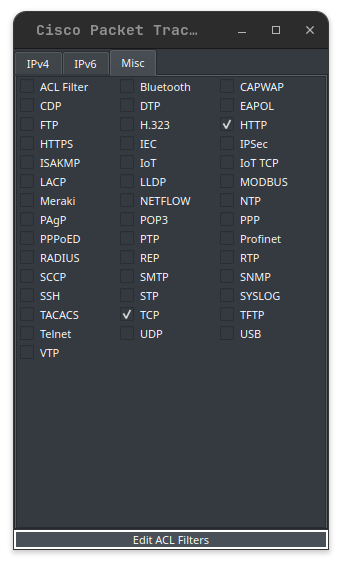{width=70% fig-align="center"}

  A continuación, cerramos esta ventana e iniciamos la simulación de PC2 a Server0 mediante la opción de _Web Browser_ que hay en la pestaña de _desktop_ de PC2 para ver que solo se filtran paquetes HTTP y TCP.

  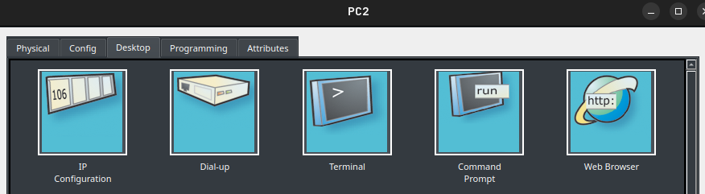{width=70% fig-align="center"}

  Una vez estemos en _Web Browser_ tenemos que poner la URL con la IP de _Server0_ que en este caso es la IP 173.10.2.1, quedando así una hecha la simulación:

  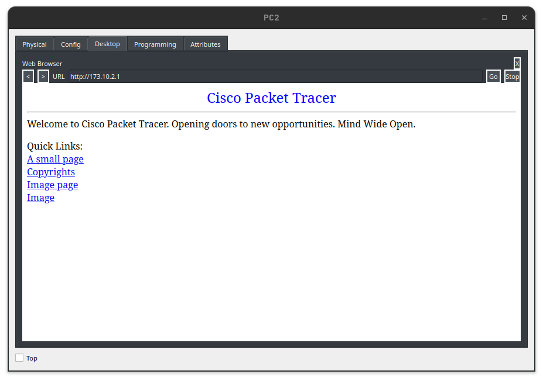{width=70% fig-align="center"}

  En cuanto a la simulación, primero se han enviado paquetes TCP ya que se debe establecer una conexión segura con el servidor y que este acepte la conexión para así luego transferir o enviar datos HTTP:

  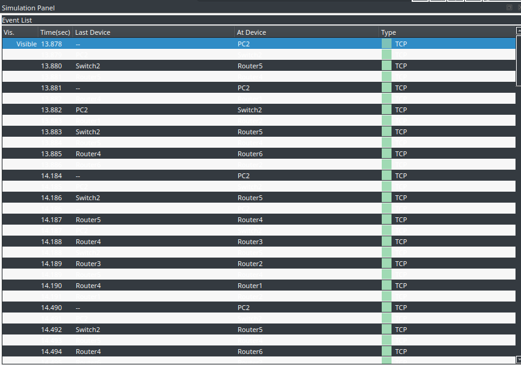{width=70% fig-align="center"}

  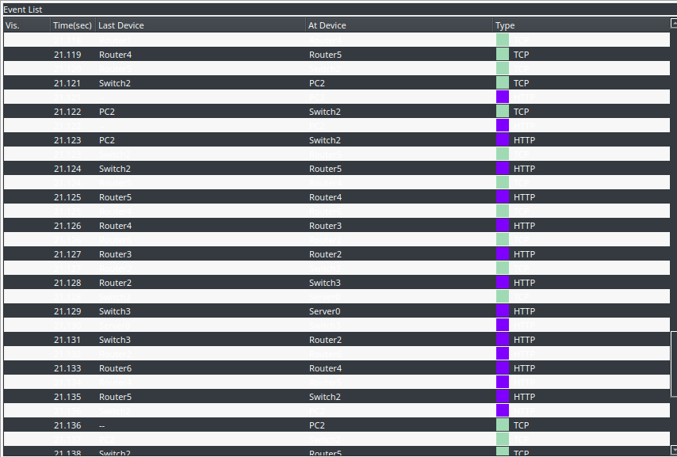{width=70% fig-align="center"}

- **Cuestión 2:** Busca el paquete que se origine en el PC que está usando el navegador web nada más realizar la petición web y analízalo respondiendo a las siguientes cuestiones:

  El primer paquete que se origina en PC es este:

  
  1. Haz click en la pestaña “PDU Details” y busca la última cabecera. ¿A qué protocolo corresponde? ¿Por qué no incluye más cabeceras (como, por ejemplo, la cabecera HTTP)?

     La pestaña PDU Details del primer paquete tiene una cabecera TCP, porque es el protocolo de transporte.

     GEste paquete no incluye la cabecera HTTP ya que es un paquete SYN de TCP que aún no lleva datos HTTP ya que primero se debe de establecer una conexión entre ambos (PC2- Server0) para asegurar el transporte de datos HTTP.

  2. Registra los valores SRC PORT, DEST PORT, SEQUENCE NUMBER y ACKOWLEDGEMENT NUMBER.
     - SRC PORT $\rightarrow$ 1029
     - DEST PORT $\rightarrow$ 80
     - SEQUENCE NUMBER $\rightarrow$ 1
     - ACKOWLEDGEMENT NUMBER $\rightarrow$ 1

     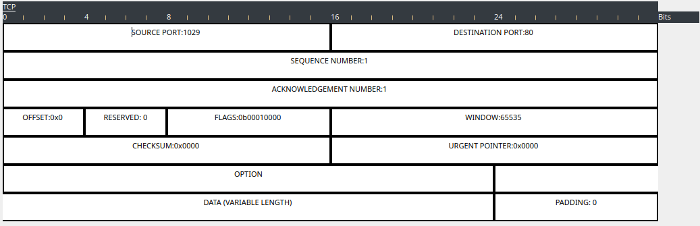{width=80% fig-align="center"}

- **Cuestión 3:** Ahora busca el paquete de respuesta que se origina en el servidor.

  El primer paquete de respuesta que se origina en el servidor sería otro paquete TCP ya que está aceptando la petición de conexión que le ha mandado PC2:

  
  1. ¿Qué cambios destacables observas con respecto al primero que has analizado?

     Los cambios más relevantes es que en este caso son el puerto de origen (SRC PORT) que es el puerto 80 y el puerto de destino (DEST PORT) que es el puerto 1029 y por último ACKOWLEDGEMENT NUMBER que es un número que se usa para confirmar la recepción de datos y poder continuar a partir de este número de byte en este caso es 1 ya que se ha recibido el primer paquete TCP.

     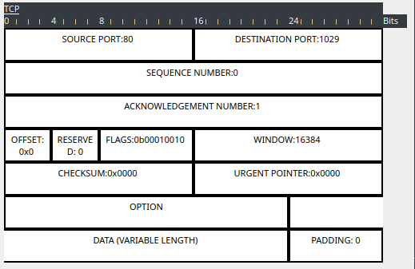{width=80% fig-align="center"}

- **Cuestión 4:** Cuando llega esta última respuesta al cliente, éste genera otro paquete similar.

  El paquete es también TCP y es el siguiente:

  
  1. ¿Qué cambios destacables observas con respecto al segundo que has analizado?

     Los cambios más relevantes en este caso es que los puertos origen y destino se han vuelto a intercambiar. Además de que el número de secuencia (SEQUENCE NUMBER) ha aumentado con respecto al anterior en 1, ya que se ha enviado más información.

     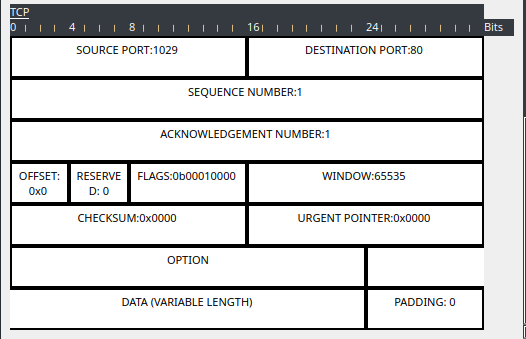{width=80% fig-align="center"}

- **Cuestión 5:** ¿A qué corresponde esta secuencia de paquetes?

  Esta secuencia de paquetes corresponde al establecimiento de la conexión entre PC2 y Server0 donde PC2 envía una petición de conexión a Server0 (SYN) y Server0 confirma que ha aceptado dicha petición (SYN-ACK) y por último PC2 le responde (ACK).

- **Cuestión 6:** Después de este análisis, verás como continúa el envío de los datos HTTP (se verá la página web en el navegador) y posteriormente el cierre de la conexión TCP. Analiza también estos intercambios y explica lo que está ocurriendo, analizando la relación entre los números de secuencia y los números de ACK intercambiados en estos mensajes.
  - **Intercambio de datos HTTP:** PC2 envía una petición mediante el protocolo HTTP y Server0 responde con los datos de su página web disponible. Por último, Pc2 confirma la recepción de cada segmento con un ACK (confirma que ha recibido la página web).

    El primer paquete de origen (PC2 $\rightarrow$ Server0) sería este:

    {width=80% fig-align="center"}

    El cual tiene como número de secuencia 1 y como número ACK 1, hasta que empieza la respuesta, es decir desde Server0 hasta PC2, el cuál no espera más datos del servidor, por eso siempre envía ACK=1.

    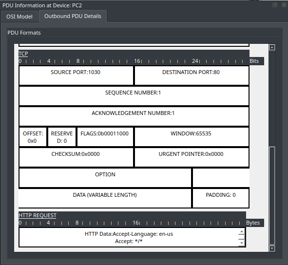{width=80% fig-align="center"}

    El primer paquete de respuesta (Server0$\rightarrow$PC2) sería este:

    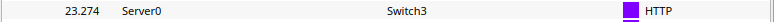{width=80% fig-align="center"}

    El cual tiene como número de secuencia 1 y como número ACK 100, en este caso como el servidor ha enviado datos en este caso 99 bytes entonces PC2 confirma que ha recibido hasta el byte 99 y espera el byte 100, por esa razón, ACK=100.

    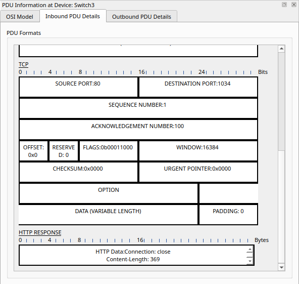{width=80% fig-align="center"}

  - **Cierre de la conexión TCP:** PC2 envía para finalizar la conexión TCP (indica que ha terminado de enviar datos y no enviará más) y Server0 confirma que ha recibido la petición de finalizar y cuando éste termina de enviar sus datos finaliza la conexión TCP también, y por último, PC2 responde haciendo una confirmación del cierre definitivo de la conexión.

    A partir del cierre los pquetes que se envía son todos de **protocolo TCP**.
    1. Los paquetes que se envían desde PC2 hasta Server0 tienen un número de secuencia 100 ya que sigue con el byte 100 como se ha mostrado anteriormente, y en este caso el número de ACK es el 472, es decir que Server0 ha recibido hasta el byte 471 y sigue en el 472.

       {width=80% fig-align="center"}

       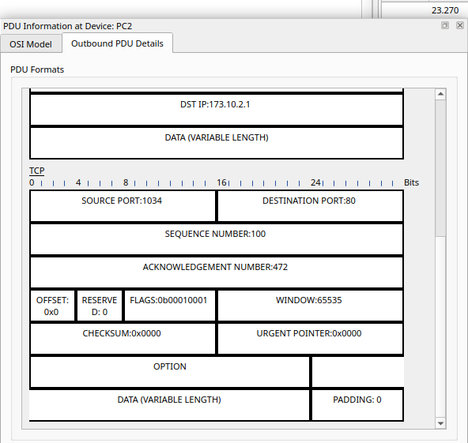{width=80% fig-align="center"}

    2. Los paquetes que se envían desde Server0 hasta PC2 tienen un número de secuencia 472 ya que sigue con el byte 472 que coincide con el ACK de PC2 a Server0, y en este caso el número de ACK es el 101, es decir que PC2 ha recibido hasta el byte 100 y sigue en el 101, por lo que el siguiente paquete de PC2 a Server0 tendrá como número de secuencia el 101 y como número ACK uno distinto basado en los datos enviados y recibidos.

       {width=80% fig-align="center"}

       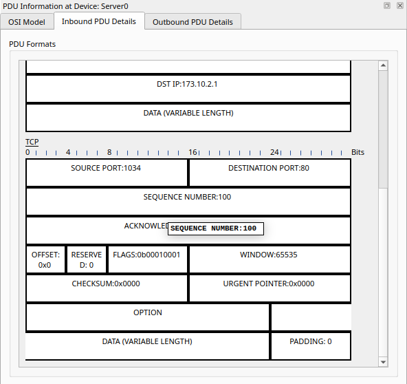{width=80% fig-align="center"}

- **Cuestión 7:** ¿Consideras que este tipo de comunicaciones son confiable? ¿Por qué?

  Si se considera que este tipo de comunicaciones son confiables ya que TCP es un protocolo bastante confiable por distintos motivos:
  1. Garantiza la entrega de datos mediante números de secuencia y ACK para asegurarse que los datos siguen un orden y que no haya pérdidas.
  2. TCP es un protocolo que corrige bastante bien los errores retrasmitiendo el paquete dañado.
  3. Tiene un buen control de flujo de datos evitando que el receptor se sobrecargue con datos que no se pueden procesar en ese preciso momento.
  4. Cierra las conexiones de manera adecuada y ordenada mediante un cierre de 4 pasos (FIN-cliente, ACK-servidor, FIN-servidor, ACK-cliente) asegurando que ambos lados han terminado bien la trasmisión.

## Cuestiones UDP

- **Cuestión 1:** Filtra el tamaño para que solo se muestren los paquetes UDP.

  Para que solo se muestren los paquetes UDP lo que se debe hacer es desactivar todos los protocolos excepto el protocolo UDP en la pestaña de _Misc dentro de edit filters_:

  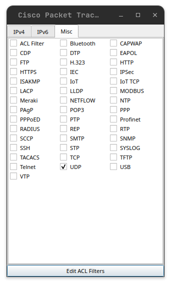{width=80% fig-align="center"}

  Ahora para hacer el filtrado de paquetes UDP (paquetes DNS) lo que se tiene que hacer es ir la ruta “PC2/Desktop/Command Prompt” y escribir en la línea de comando nslookup “IPserver”\* que en este caso es nslookup 173.10.2.1, esto nos pondrá el paquete en el PC2 para que nosotros mismo comencemos la simulación dándole a play:

  ```
  C:\>nslookup 173.10.2.1

  Server: [173.10.2.1]
  Address:  173.10.2.1
  ```

  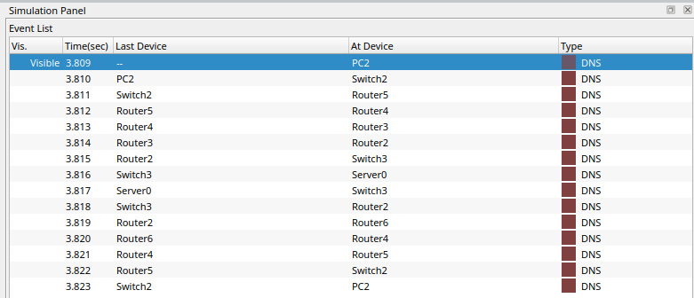{width=80% fig-align="center"}

- **Cuestión 2:** Busca el primer paquete que se origina en el cliente al hacer la petición DNS.

    El primer paquete que se origina en el cliente al hacer la petición DNS en este caso es:

    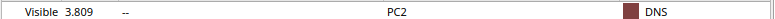{width=80% fig-align="center"}

    1. Haz click en la pestaña "PDU details". ¿Qué encontramos en las capas 4 y superiores del modelo OSI?

        - En la capa 4 (Trasporte) se encuentra el protocolo UDP ya que por defecto DNS trabaja o usa UDP.
        - En las capas 5 (Sesión) y 6 (Presentación) no aparece nada ya que Cisco Packet Tracer en la mayoría de los casos simplifica la pila OSI mostrando únicamente las capas 1, 2, 3, 4 y 7.
        - En la capa 7 (Aplicación) aparece DNS, que contiene la consulta al servidor, en este caso, a la IP de Server0 (173.10.2.1).

        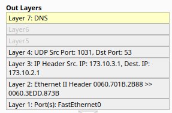{width=80% fig-align="center"}

    2. Registra los valores de SRC PORT y DEST PORT de la cabecera UDP. ¿Qué diferencias observas en la cabecera con respecto a la de TCP? ¿Por qué no hay números de secuencia ni de ACK?

        Los valores de SRC PORT y DEST PORT son:

        - SOURCE PORT: 1031
        - DESTINATION PORT: 53

        La principal diferencia en cuanto al protocolo TCP es que no tiene los números de secuencia ni los números ACK, esto es debido a que el protocolo UDP trabaja sin conexión por lo que es más rápido que TCP, pero es bastante menos confiable ya que no toma en cuenta el control de errores ni el reenvío de paquetes perdidos.

        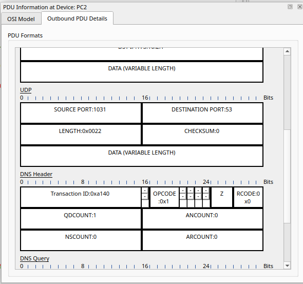{width=80% fig-align="center"}

- **Cuestión 3:** Busca ahora el paquete de respuesta que se origina desde el servidor para responder a la petición DNS.

    El paquete de respuesta en este caso sería el siguiente:

    {width=80% fig-align="center"}

    1. Haz click en la pestaña “PDU details” ¿Qué ha cambiado con respecto al paquete que contenía la petición del cliente?

        Los principales cambios son que el sentido del tráfico se invierte por lo que los puertos se intercambian, es decir, ahora SRC PORT es igual a 53 y DEST PORT es igual a 1031 y en la capa 7 (Aplicación) se reemplaza la consulta que le hace PC2 por una respuesta que da Server0 con la dirección IP del dominio solicitado (173.10.2.1).

        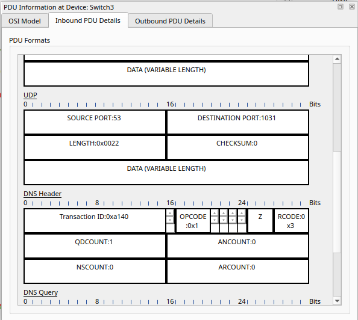{width=80% fig-align="center"}

- **Cuestión 4:** ¿En qué se diferencia este intercambio con el analizado anteriormente basado en TCP? ¿Consideras que son confiables este tipo de comunicaciones?

    La principal diferencia es que UDP es más rápido porque no necesita establecer ni mantener una conexión con el servidor. UDP se utiliza cuando la velocidad es más importante que la confiabilidad.
    
    Este tipo de comunicación es menos confiable que la comunicación TCP por distintos motivos:

    1. No requiere una conexión establecida previamente por lo que puede haber datos perdidos.
    2. No garantiza ni la entrega de todos los paquetes y tampoco garantiza el orden de estos, su orden es aleatorio.
    3. No hay un control de errores ni hay retrasmisión de paquetes como en TCP.