\newpage

# Introducción

El bloque de servicios de la asignatura de Redes de Datos tiene como objetivo
estudiar el funcionamiento de servicios de red reales, especialmente aquellos
basados en el modelo cliente-servidor. En esta práctica se trabaja con HTTP
sobre TCP desde dos enfoques distintos: primero implementando un servidor web
básico en Python y después desplegando un servidor Apache configurado con
autenticación.

La Práctica 5 se centra en el desarrollo de un servidor HTTP propio usando
sockets TCP. Esta parte permite observar de forma directa cómo se reciben las
peticiones, cómo se construyen las respuestas, cómo se gestionan cabeceras,
cookies, errores y conexiones persistentes. La Práctica 6, por otro lado,
trabaja con Apache como servidor HTTP ya desarrollado, desplegado mediante
Docker y configurado con ficheros propios del servicio.

Esta memoria final reúne y ordena el trabajo realizado en ambas prácticas.
Además de describir la implementación y la configuración de los servidores,
también se reserva un apartado específico para el análisis de tráfico con
Wireshark, con el objetivo de relacionar el código y la configuración con el
comportamiento real observado en la red.

# Descripción del servidor HTTP en Python

Para esta primera parte se ha programado y desplegado un servidor HTTP en
Python siguiendo los requisitos del enunciado. El servidor se encuentra en el
archivo `webRD_python.py` y se encarga de servir contenido estático, procesar
formularios mediante `POST`, gestionar cookies, mantener conexiones
persistentes y atender varios clientes de forma concurrente.

## Arquitectura general

El servidor está construido directamente sobre sockets TCP. Para ello se
utilizan las librerías `socket`, `select`, `os`, `sys`, `argparse`, `logging`,
`datetime` y `urllib.parse`. La librería `socket` permite crear el servicio TCP,
`select` se emplea para esperar datos con timeout, `argparse` permite recibir
por terminal la IP, el puerto y el directorio de ficheros, y `logging` se usa
para registrar la actividad del servidor.

El programa define una configuración de grupo formada por los valores `XX` e
`YY`, correspondientes a las dos últimas cifras del DNI de cada integrante. A
partir de estos valores se construye el nombre de la cookie:
`cookie_counter_10_49`. También se calcula el tiempo de espera de la conexión
persistente como la suma de las cuatro cifras de `XX` e `YY` más 10 segundos,
que en este caso da un total de 24 segundos.

Además, se definen constantes como `BUFSIZE`, que fija el tamaño máximo de los
bloques de lectura y escritura; `MAX_ACCESOS`, que limita a 5 los accesos a la
página principal antes de bloquear al cliente; y `COOKIE_MAX_AGE`, que fija la
caducidad de la cookie en 120 segundos. El diccionario `filetypes` relaciona
extensiones de fichero con tipos MIME para construir correctamente la cabecera
`Content-Type`.

La implementación se organiza en funciones auxiliares para enviar, recibir y
cerrar conexiones, una función para generar fechas en formato HTTP, funciones
específicas para errores, cookies y formularios, una función principal de
procesamiento de peticiones y una función `main()` encargada de arrancar el
servidor.

## Gestión de peticiones HTTP

La función principal de tratamiento de peticiones es `process_web_request()`.
Esta función recibe el socket conectado con el cliente y el directorio desde el
que se sirven los recursos. Dentro de ella se procesa la petición HTTP recibida
en varias fases: lectura de datos del socket, separación entre cabeceras y
cuerpo, análisis de la línea de solicitud y selección del tratamiento
correspondiente según el método utilizado.

La línea inicial de la petición se divide en método, ruta y versión. El servidor
acepta únicamente HTTP/1.1 y los métodos `GET` y `POST`. Si el método es `GET`,
se interpreta la ruta solicitada, se elimina la posible cadena de consulta y se
traduce la ruta `/` al fichero `index.html`. Después se comprueba si el recurso
existe dentro del directorio configurado y se envía al cliente con su longitud y
tipo MIME correspondiente.

También se añade una comprobación básica de seguridad para impedir accesos por
path traversal. Si el recurso solicitado contiene `..`, comienza por una barra
invertida o incluye `:`, se rechaza la petición con un error `403 Forbidden`.
Esta decisión evita que el cliente pueda intentar acceder a ficheros situados
fuera del directorio de la web.

La ejecución normal del servidor se puede realizar desde el directorio
`WebRD Python Server` con la siguiente orden:

```bash
python3 webRD_python.py -p 8080 -ip 0.0.0.0 -f files
```

Una vez iniciado, el servidor queda escuchando en el puerto 8080 y sirve los
recursos incluidos en el directorio `files`.

## Gestión de errores

La gestión de errores se centraliza en la función `enviar_error()`. Esta función
construye una respuesta HTTP con el código de estado recibido, genera una página
HTML sencilla para informar al usuario y añade las cabeceras necesarias:
`Date`, `Server`, `Connection`, `Content-Length` y `Content-Type`.

El servidor contempla varios errores relevantes:

- `400 Bad Request`, cuando la petición está vacía, no puede interpretarse o la
  línea inicial no tiene el formato esperado.
- `403 Forbidden`, cuando se intenta acceder a un recurso no permitido o cuando
  se alcanza el límite de accesos definido por la cookie.
- `404 Not Found`, cuando el fichero solicitado no existe en el directorio
  servido.
- `405 Method Not Allowed`, cuando se utiliza un método distinto de `GET` o
  `POST`.
- `505 HTTP Version Not Supported`, cuando la petición no usa HTTP/1.1.

El tratamiento de errores mantiene la misma lógica de conexión que las
respuestas correctas. Si la conexión es persistente, se responde con
`Connection: keep-alive`; si no, se responde con `Connection: close`.

## Procesamiento de POST

El método `POST` se utiliza para procesar el formulario de validación de correo.
El cuerpo de la petición se recibe con formato
`application/x-www-form-urlencoded`, por lo que los campos llegan como pares
`clave=valor` separados por `&`.

El servidor busca el campo `email`, decodifica su valor mediante
`unquote_plus()` y comprueba si termina en el dominio `@edu.upct.es`. Si el
correo pertenece a ese dominio, se genera una página indicando que el correo es
correcto. Si no pertenece al dominio o el campo está vacío, se devuelve una
página indicando que el correo no es válido.

El código de estado de esta respuesta es `200 OK`, ya que la petición se ha
procesado correctamente aunque el dato introducido no cumpla la condición
establecida. La diferencia entre correo válido e inválido se expresa en el
cuerpo HTML de la respuesta.

## Gestión de cookies

La cookie se utiliza para controlar el número de accesos a `index.html`. El
nombre de la cookie se genera con los dos últimos dígitos del DNI de cada
integrante, por lo que en este trabajo se usa `cookie_counter_10_49`.

La función `process_cookies()` analiza la cabecera `Cookie` de la petición. Si
no encuentra la cookie esperada, interpreta que se trata del primer acceso y
devuelve el valor `1`. Si la cookie ya existe, incrementa el contador hasta el
límite definido por `MAX_ACCESOS`.

Cuando el contador llega a 5 accesos, el servidor deja de entregar la página
principal y responde con `403 Forbidden`. Además, vuelve a enviar la cookie con
el valor máximo y con `Max-Age=120`, de forma que el bloqueo se mantiene durante
dos minutos. Una vez transcurrido ese tiempo, la cookie expira y el cliente
puede volver a acceder.

## Persistencia de conexiones

El servidor implementa conexiones persistentes de HTTP/1.1. En esta versión del
protocolo, la conexión se mantiene abierta por defecto salvo que el cliente
indique explícitamente `Connection: close`.

Para evitar que una conexión quede abierta indefinidamente, se usa
`select.select()` con el timeout calculado a partir de los DNI del grupo. Si no
llega ninguna nueva petición durante 24 segundos, el servidor registra el
timeout y cierra la conexión. Si el cliente solicita mantener la conexión, las
respuestas incluyen las cabeceras `Connection: keep-alive` y
`Keep-Alive: timeout=24`.

Esta decisión permite que un mismo cliente pueda realizar varias peticiones
HTTP dentro de la misma conexión TCP, reduciendo el número de aperturas y
cierres de conexión.

## Concurrencia

La concurrencia se implementa en la función `main()` mediante `os.fork()`.
Cuando el servidor acepta una nueva conexión con `accept()`, crea un proceso
hijo para atender a ese cliente. El proceso hijo cierra el socket de escucha del
padre, procesa la conexión mediante `process_web_request()` y finaliza. El
proceso padre, por su parte, cierra su copia del socket conectado y vuelve a
esperar nuevas conexiones.

Para evitar procesos zombi, el servidor llama a `os.waitpid(-1, os.WNOHANG)`,
lo que permite recoger procesos hijo ya finalizados sin bloquear la ejecución
del proceso principal. Si `fork()` no está disponible, el programa cae a un modo
iterativo en el que atiende la conexión sin crear un proceso nuevo.

## Evidencias de funcionamiento

Al iniciar el servidor con una sintaxis incorrecta, `argparse` muestra el uso
esperado del programa e indica los argumentos obligatorios. Con la sintaxis
correcta, el servidor muestra por terminal la dirección, el puerto, el
directorio de ficheros, el nombre de la cookie y el timeout de conexión.

```bash
> python3 webRD_python.py
usage: webRD_python.py [-h] -p PORT -ip HOST [-f FILES] [--verbose]
webRD_python.py: error: the following arguments are required: -p/--port, -ip/--host

> python3 webRD_python.py -p 8080 -ip 0.0.0.0 -f files
[2026-05-01 12:01:04.047] [INFO] [pid=238984] Enabling server in address 0.0.0.0 and port 8080.
[2026-05-01 12:01:04.047] [INFO] [pid=238984] Serving files from files
[2026-05-01 12:01:04.047] [INFO] [pid=238984] COOKIE_NAME = cookie_counter_10_49
[2026-05-01 12:01:04.047] [INFO] [pid=238984] TIMEOUT_CONNECTION = 24s
```

A continuación se muestra la página principal servida desde `index.html`:

{fig-align="center"}

El formulario permite comprobar si el correo introducido pertenece al dominio
`@edu.upct.es`. Si el correo es correcto, el servidor devuelve una respuesta de
validación positiva; si no lo es, devuelve una respuesta indicando que el correo
es incorrecto.

::::::: {layout-ncol="2"}
::: {#first-layout}
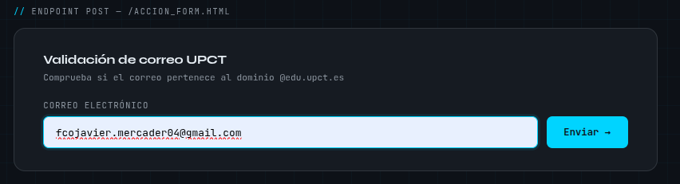
:::

::: {#second-column}
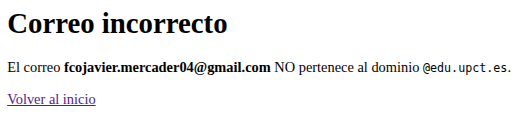
:::

::: {#third-layout}
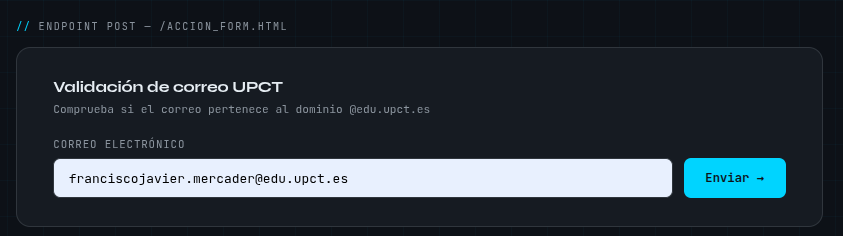
:::

::: {#fourth-column}
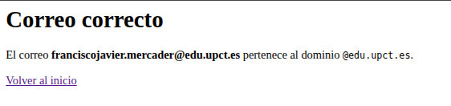
:::
:::::::

Al superar el límite de accesos, el servidor devuelve el error `403 Forbidden` e
informa de que se debe esperar dos minutos hasta que expire la cookie.

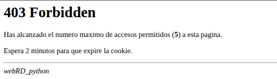{fig-align="center"}

\newpage

# Configuración del servidor Apache

En la segunda parte de la práctica se despliega un servidor Apache HTTP con
Docker. A diferencia del servidor Python, Apache ya incorpora la lógica completa
del protocolo HTTP, por lo que el trabajo se centra en el despliegue, la
configuración del sitio web y la activación de la autenticación HTTP Basic.

## Despliegue con Docker

El despliegue inicial de Apache se realiza con la imagen oficial `httpd`. Para
publicar el servicio en la máquina local se mapea el puerto 80 del contenedor al
puerto 80 del equipo anfitrión. Además, se monta el directorio local `site` como
`DocumentRoot` del servidor:

```bash
docker run -p 80:80 -v "${PWD}/site":/usr/local/apache2/htdocs httpd
```

Una vez añadida la autenticación, el despliegue se realiza montando también el
directorio de credenciales y el fichero de configuración principal:

```bash
docker run -p 80:80 \
  -v "${PWD}/site":/usr/local/apache2/htdocs \
  -v "${PWD}/auth":/usr/local/apache2/auth \
  -v "${PWD}/httpd.conf":/usr/local/apache2/conf/httpd.conf \
  httpd
```

El uso de volúmenes permite modificar los ficheros en el equipo anfitrión sin
tener que reconstruir la imagen ni copiar manualmente los recursos dentro del
contenedor.

## Configuración del sitio web

El sitio web servido por Apache se encuentra en el directorio `site`. Está
formado por una página principal `index.html`, una segunda página enlazada
`pagina2.html` y el fichero de estilos `styles.css`.

La página principal muestra que Apache está funcionando en el puerto 80 e
incluye un enlace a `pagina2.html`. La segunda página permite comprobar que el
servidor entrega correctamente varios recursos estáticos desde el
`DocumentRoot`. El fichero CSS se encarga únicamente de la presentación visual
de ambas páginas.

Para que Apache pueda aplicar la configuración de autenticación incluida en
`.htaccess`, se modificó el bloque del `DocumentRoot` en `httpd.conf` y se
estableció `AllowOverride All`:

```apache
DocumentRoot "/usr/local/apache2/htdocs"
<Directory "/usr/local/apache2/htdocs">
    Options Indexes FollowSymLinks
    AllowOverride All
    Require all granted
</Directory>
```

Con esta configuración, Apache permite que el fichero `.htaccess` situado dentro
del sitio web active reglas adicionales, como la autenticación básica.

## Autenticación HTTP Basic

La autenticación HTTP Basic se configura mediante dos ficheros. El primero es
`.htpasswd`, situado en el directorio `auth`, donde se almacenan los usuarios y
sus contraseñas cifradas. Para crearlo se utilizó la utilidad `htpasswd` de la
propia imagen de Apache:

```bash
docker run --rm httpd htpasswd -nb fcojaviermercader FJMM2526 > auth/.htpasswd
docker run --rm httpd htpasswd -nb mauromartinezcazaux MMC2526 >> auth/.htpasswd
```

El segundo fichero es `.htaccess`, ubicado en el directorio `site`. Este fichero
indica a Apache que todo el contenido del sitio requiere autenticación:

```apache
AuthType Basic
AuthName "Zona protegida"
AuthUserFile /usr/local/apache2/auth/.htpasswd
Require valid-user
```

Con esta configuración, cualquier petición al sitio web provoca que Apache
solicite credenciales. La directiva `Require valid-user` permite el acceso a
cualquier usuario válido definido en `.htpasswd`.

## Funcionamiento del sistema

El funcionamiento de la autenticación se comprobó con `curl` y desde el
navegador. Sin credenciales, Apache responde con `401 Unauthorized` e incluye la
cabecera `WWW-Authenticate`, que indica al cliente que debe solicitar usuario y
contraseña:

```bash
> curl -i http://localhost
HTTP/1.1 401 Unauthorized
Server: Apache/2.4.66 (Unix)
WWW-Authenticate: Basic realm="Zona protegida"
Content-Type: text/html; charset=iso-8859-1
```

Al repetir la petición con un usuario y contraseña válidos, Apache responde con
`200 OK` y entrega el contenido de la página principal:

```bash
> curl -i -u mauromartinezcazaux:MMC2526 http://localhost
HTTP/1.1 200 OK
Server: Apache/2.4.66 (Unix)
Content-Length: 2419
Content-Type: text/html
```

Desde el navegador, el servidor muestra primero el cuadro de autenticación:

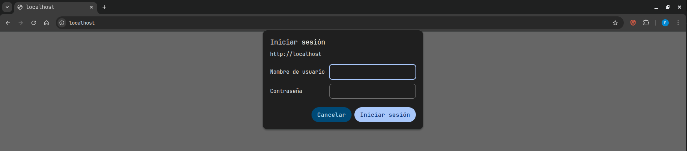{fig-align="center"}

Una vez introducidas correctamente las credenciales, se accede al sitio web:

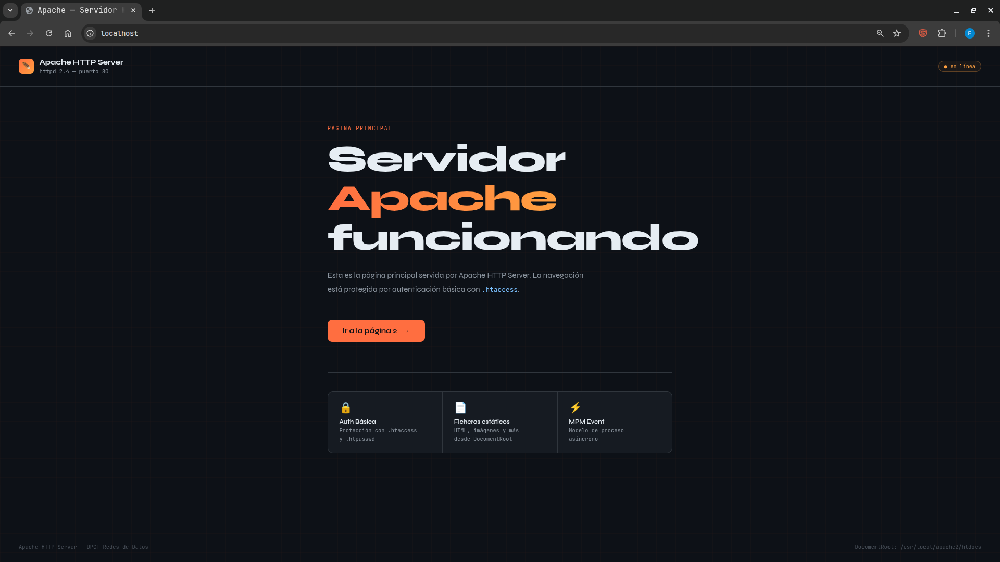{fig-align="center"}

\newpage

# Análisis de tráfico con Wireshark

Este apartado recoge la interpretación del tráfico HTTP observado sobre TCP. Su
objetivo es relacionar lo visto en las capturas con el comportamiento de los dos
servidores: el servidor implementado en Python y el servidor Apache.

## Servidor HTTP en Python

En las trazas del método `GET` se observan varias peticiones, ya que el
navegador solicita tanto la página principal como los recursos estáticos
asociados. La petición inicial carga `index.html` desde `localhost:8080` y otra
petición posterior solicita la imagen incluida en la página.

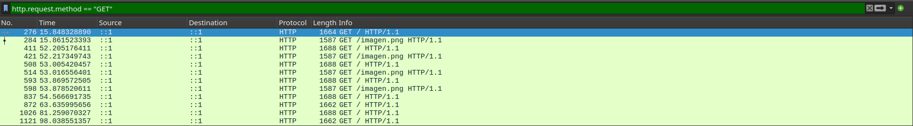

En el detalle de la primera trama se observa que se capturan 1664 bytes y que
se utiliza IPv4. La dirección de origen y destino es `127.0.0.1`, ya que las
pruebas se realizaron en local. El puerto de origen es un puerto dinámico
asignado automáticamente por el sistema, mientras que el puerto de destino es
el 8080, configurado manualmente para el servidor Python.

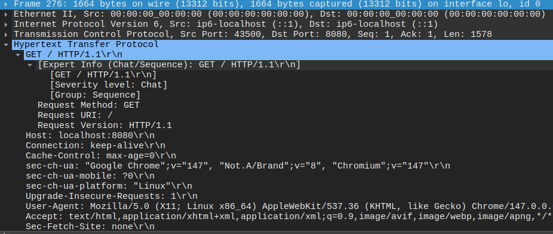

En las tramas del método `POST`, el tráfico aparece cuando el usuario introduce
un correo en el formulario. En la captura se observan varias peticiones porque
el servidor se inició más de una vez durante la prueba, pero el comportamiento
relevante es el esperado: tras varias consultas se alcanza el límite de accesos
y se obtiene la respuesta `403 Forbidden`.

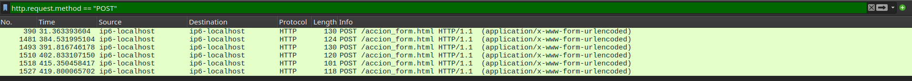

El error `403 Forbidden` aparece cuando la cookie alcanza el número máximo de
accesos permitidos. En las trazas se puede identificar esta respuesta HTTP y
relacionarla con la lógica de control de accesos implementada en el servidor.

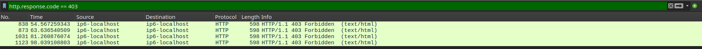

## Servidor Apache

Primero analizamos el tráfico para el servidor Apache de la sesión 1 donde no
habíamos implementado el sistema de autenticación:

```bash
> docker run -p 80:80 -v "${PWD}/site":/usr/local/apache2/htdocs httpd
```

Entramos a Wireshark y utilizando _Adapter for lookback traffic capture_
obtenemos los registros mientras el servicio ha estado activo. Utilizando el filtro
`tcp.port == 80` observamos cómo Wireshark ha captado los paquetes.

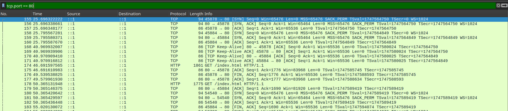

En la imagen podemos ver que Wireshark captura:

1. _Three-Way Handshake_ (Establecimiento de la conexión): Con los primeros tres
   paquetes se establece la conexión, 1) el primero va desde el navegador al servidor para
   sincronizarse, 2) el servidor responde el mensaje y 3) el host confirma que todo
   ha llegado correctamente con un ACK.
2. `GET / HTTP/1.1`: El navegador envía un mensaje HTTP buscando la raíz de la web `(/)`.
3. `HTTP /1.1 200 OK (text/html)`: Además de los ACK propios de TCP, el servidor
   devuelve una respuesta HTTP `200 OK`, que indica que la petición se ha
   procesado bien y que se envía el contenido _html_ de la web.

Ahora analizamos el tráfico para el servidor Apache de la sesión 2 una vez
implementada la autenticación:

```bash
docker run -p 80:80 \
  -v "${PWD}/site":/usr/local/apache2/htdocs \
  -v "${PWD}/auth":/usr/local/apache2/auth \
  -v "${PWD}/httpd.conf":/usr/local/apache2/conf/httpd.conf \
  httpd
```

Con Wireshark escuchando, abrimos otra vez [http://localhost](http://localhost) el cuál
ya nos pide que nos registremos para poder acceder y observamos lo que ocurre en
Wireshark.

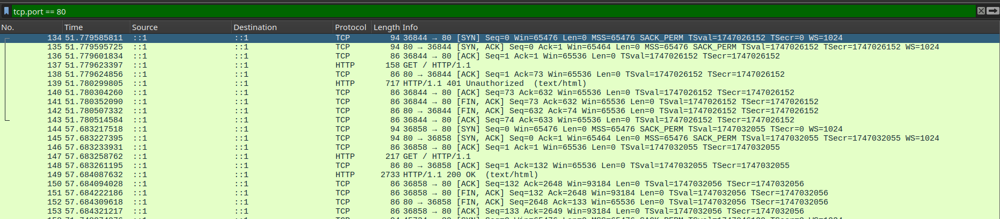

Lo que podemos observar ahora es:

1. _Three-Way Handshake_ (Establecimiento de la conexión)
2. `GET / HTTP/1.1`
3. `HTTP /1.1 401 Unauthorized (text/html)`: El servidor envía esta respuesta debido a que
   aún no nos hemos autenticado.
4. Inicia la conexión desde un puerto diferente.
5. Cierra la primera conexión debido a que ésta ha fallado.
6. Vuelve a enviar la petición `GET / HTTP/1.1`.
7. El servidor envía `HTTP /1.1 200 OK (text/html)`, lo que indica que las
   credenciales introducidas son correctas y que ya se puede acceder a la web.

## Interpretación global

Las trazas confirman tres ideas de fondo:

1. **HTTP es texto sobre TCP.** Todas las peticiones y respuestas viajan
   en claro y son legibles directamente desde Wireshark, sin necesidad de
   ningún disector adicional.
2. **Keep-Alive ahorra handshakes.** Es notable la diferencia entre las
   trazas iniciales (un _handshake_ por recurso) y las que reutilizan la
   conexión (un único handshake para varios recursos).
3. **HTTP Basic deja ver demasiado si no se usa HTTPS.** En la captura se puede
   comprobar que las credenciales viajan codificadas, pero no cifradas.

\newpage

# Comparativa entre ambos servidores

Aunque ambos servidores usan HTTP, se nota bastante la diferencia entre
programar uno desde cero y configurar uno ya preparado como Apache. La siguiente
tabla resume las diferencias más relevantes:

| Aspecto                   | Servidor Python (propio)              | Apache HTTP Server                                               |
| ------------------------- | ------------------------------------- | ---------------------------------------------------------------- |
| Líneas de código          | ~580 (un único fichero)               | varios cientos de miles (no las tocamos)                         |
| Nivel de abstracción      | Bajo: maneja el _socket_ directamente | Alto: configurado por directivas                                 |
| Protocolos                | Solo HTTP/1.1, GET y POST             | HTTP/1.0, 1.1 y 2; todos los métodos                             |
| Cabeceras automáticas     | Las que programamos a mano            | `Date`, `Server`, `ETag`, `Last-Modified`, `Accept-Ranges`, etc. |
| Caché del cliente         | No soportada                          | Sí, con `ETag` y `If-Modified-Since`                             |
| Concurrencia              | `fork()` por conexión                 | MPM (prefork, worker o event), pool de procesos/hilos            |
| Configurabilidad          | Constantes en el código               | `httpd.conf`, `.htaccess`, módulos                               |
| Autenticación             | No implementada                       | Basic, Digest, LDAP, certificados, etc. (módulos)                |
| Logs                      | `logging` de Python al `stdout`       | `access_log` y `error_log` en formatos personalizables           |
| TLS / HTTPS               | No                                    | Sí (módulo `mod_ssl`)                                            |
| Curva de aprendizaje      | Más directa al estar todo en un fichero | Requiere aprender directivas y ficheros de configuración       |
| Idoneidad para producción | Muy limitada (didáctica)              | Excelente (uso real masivo)                                      |

La gran ventaja del servidor Python ha sido que ayuda mucho a aprender.
Programando cada cabecera a mano hemos entendido mejor por qué
`Content-Length` es necesario, qué papel juega `Connection`, cómo se envía
`Set-Cookie` y cuándo TCP puede dividir o reagrupar los datos. Es difícil ver
estos detalles si desde el principio se usa un servidor que ya lo hace todo
automáticamente.

La ventaja de Apache, por su parte, es que resulta mucho más práctico para un
uso real. Es un servidor robusto, soporta HTTP/2 y HTTPS, y permite activar
funciones mediante módulos y directivas. Cosas como la caché, las redirecciones
o la autenticación avanzada serían mucho más costosas de implementar en nuestro
servidor Python.

# Problemas encontrados

**`AllowOverride None` por defecto:** La autenticación de Apache no
funcionó hasta que reparamos en que el `httpd.conf` por defecto tiene
`AllowOverride None`, lo que hace que `.htaccess` se ignore por completo.
Nos dimos cuenta porque las páginas se seguían sirviendo sin pedir
credenciales y, al revisar el log de Apache, no aparecía ningún error claro.
Tuvimos que extraer el `httpd.conf` original con
`docker run --rm httpd cat /usr/local/apache2/conf/httpd.conf > httpd.conf`,
modificar la directiva y volver a montar el volumen.

**Generación incorrecta del `.htpasswd`:** Al añadir el segundo usuario por
error usamos `>` en lugar de `>>`, lo que sobrescribió el primer usuario.
El error solo se manifestaba al intentar iniciar sesión con el primer usuario, que
volvía a fallar como si no existiera.

# Tiempo de trabajo

- Francisco Javier Mercader Martínez: 8-8.5 horas
- Mauro Martínez Cazaux: 7.5-8 horas

# Conclusiones

Esta práctica nos ha servido para entender mucho mejor cómo funciona un servicio web por dentro. En teoría ya habíamos visto conceptos como TCP, HTTP, las cabeceras, las cookies o el cierre de conexiones, pero al tener que programar un servidor en Python y después analizar las trazas con Wireshark se entiende de una forma mucho más clara.

El servidor en Python nos ha parecido la parte más útil para aprender, porque obliga a controlar detalles que normalmente no vemos: leer la petición, separar cabeceras y cuerpo, responder con el código HTTP correcto, gestionar cookies, mantener conexiones abiertas o cerrarlas cuando corresponde. También nos ha ayudado a ver que HTTP no funciona “solo”, sino que todo depende de cómo se envían y reciben los datos sobre TCP.

Por otro lado, trabajar con Apache nos ha permitido ver la diferencia entre desarrollar un servidor desde cero y usar una herramienta ya preparada. Con Apache, muchas funciones como servir ficheros, gestionar errores o activar autenticación básica se configuran de forma mucho más sencilla. Esto nos ha hecho valorar la utilidad de los servidores reales, pero también entender mejor todo lo que hacen internamente.

El análisis con Wireshark ha sido importante porque nos ha permitido comprobar que lo que programamos y configuramos realmente se refleja en la red: peticiones GET y POST, respuestas 200, 401 o 403, cabeceras HTTP, puertos utilizados y conexiones TCP.

En conclusión, la práctica nos ha ayudado a relacionar la teoría de la asignatura con un caso práctico real. Hemos aprendido mejor cómo funciona HTTP sobre TCP, qué papel tienen las cookies y la autenticación, y cuáles son las diferencias entre implementar un servidor propio y configurar un servidor profesional como Apache.
