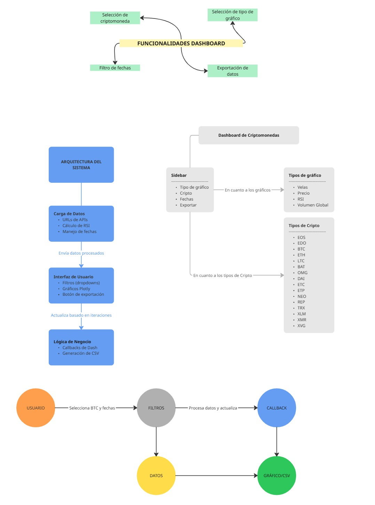

## Actividad 1: Contexto y Selección de Datos

### **Objetivo**

- ¿Qué se busca lograr con esta actividad?

Desarrollar una plataforma interactiva que permita visualizar, analizar y exportar datos históricos de precios de criptomonedas, facilitando así la toma de decisiones en el análisis técnico, especialmente mediante indicadores como el RSI y herramientas como gráficos de velas, líneas de precios y volumen transaccionado.

### **Contexto**

- ¿Cuál es el dominio o enfoque del dashboard? (p.ej., análisis de ventas, métricas climáticas, criptomonedas, etc.)

    El dominio principal del dashboard es el análisis de datos financieros, específicamente centrado en el comportamiento histórico de diversas criptomonedas.

    La herramienta permite visualizar indicadores técnicos como el  precio de cierre, el volumen de transacciones y el RSI (Relative Strength Index), así como observar su evolución a lo largo del tiempo mediante distintos tipos de gráficos interactivos (velas japonesas, líneas, histogramas y treemaps).

- ¿Por qué se eligió este dominio?

    El mercado de las criptomonedas representa uno de los entornos más dinámicos, accesibles y técnicamente interesantes para aplicar visualización y análisis de datos en tiempo real o histórico.

    Además ofrece patrones visuales claros y útiles para análisis técnico, tiene datos abiertos y actualizados disponibles gratuitamente, y es útil tanto para estudiantes como para profesionales de datos y finanzas.


### **Selección del Conjunto de Datos**

- ¿Qué conjunto de datos se utilizará para el dashboard?

Se utilizarán series temporales históricas de precios y volúmenes de diversas  criptomonedas , como Bitcoin (BTC), Ethereum (ETH), Litecoin (LTC), entre otras.

Cada criptomoneda cuenta con su propio conjunto de datos diario que incluye precios de apertura, cierre, máximos, mínimos y volumen en USD.

- ¿De dónde provienen los datos? (p.ej., fuentes públicas, bases de datos internas, etc.)

Los datos provienen de la plataforma pública [CryptoDataDownload](https://www.cryptodatadownload.com/), una fuente gratuita y confiable de datos de criptomonedas históricas.

En este caso, se usan los archivos CSV de la casa de cambio Bitfinex para cada criptomoneda.

- ¿Qué características o columnas relevantes tiene el dataset seleccionado?

date: fecha de la transacción (índice temporal del dataset).

open: precio de apertura de la criptomoneda en ese día.

high: precio máximo alcanzado durante ese día.

low: precio mínimo alcanzado durante ese día.

close: precio de cierre de la criptomoneda ese día, muy utilizado en análisis técnico.

Volume USD: volumen total transaccionado en dólares estadounidenses.

RSI (añadido en el procesamiento): índice de fuerza relativa, un indicador técnico de momentum que oscila entre 0 y 100 y se utiliza para detectar condiciones de sobrecompra o sobreventa.


## Actividad 2: Identificación de Tareas y Funcionalidades

### **Objetivo**

- ¿Qué tareas clave realizarán los usuarios con el dashboard?

    El objetivo principal es proporcionar a los usuarios una herramienta que de manera interactiva les permita visualizar y analizar datos historicos de criptomonedas, identificar patrones y tendencias en el mercado, tambien la posibilidad de realizar un análisis más técnico con indicadores como el RSI, comparar el comportamiento de diferentes criptomonedas o exportar datos para su posterior análisis entre otras.


### **Identificación de Tareas**

- ¿Cuáles son las tareas principales que los usuarios necesitarán realizar? (p.ej., explorar tendencias, comparar valores, filtrar datos, obtener detalles).
- ¿Qué problemas o necesidades específicas de los usuarios se buscan resolver con estas tareas?

    Las tareas principales a las que está orientado este dashboard son las ya nombradas anteriormente: exploración de datos históricos, análisis técnico, comparación de distintas criptomonedas, filtrado de datos o exportación de datos.

    Y en cuanto a los problemas o necesidades que se buscan resolver principalmente es la dificultad para acceder y visualizar datos históricos de múltiples criptomonedas en un solo lugar, limitaciones para exportar datos de las mismas, o la necesidad de herramientas de análisis más técnico integradas.


### **Definición de Funcionalidades**

- ¿Qué funcionalidades soportarán las tareas identificadas? (p.ej., selección de variables, filtros, gráficos interactivos, tooltips, exportación de datos).
- ¿Cómo estas funcionalidades mejorarán la experiencia del usuario?

    Las funcionalidades que soportan las tareas identificadas son la de selección de criptomoneda, selector de tipo de gráfico, filtro de fechas o exportación de datos. Esto mejora la experiencia del usuario aportándole accesibilidad (toda la información en una sola interfaz), portabilidad (capacidad de exportación para su uso en otras herramientas), 


### **Representación de Funcionalidades**

- ¿Cómo se representaron las funcionalidades en Miro?

    Se representaron con un esquema básico con las cuatro funcionalidades principales comentadas anteriormente.


## Actividad 3: Card Sorting y Priorización

### **Objetivo**

- ¿Qué se busca lograr con el card sorting y la priorización de funcionalidades?

Lo que se busca es entender cómo se agrupan las opciones (filtros, gráficas, acciones) según el usuario, además también se busca definir un flujo de uso para colocar para llevar un control y un orden.

### **Realización del Card Sorting**

- ¿Qué tipo de card sorting se realizó? (p.ej., abierto o cerrado).
El tipo de card sorting es abierto, así cada uno puede crear sus propias categorías y labels.

- ¿Cómo se agruparon y categorizaron las funcionalidades?
Se agruparon en 3 partes:

    1. Selección de datos:
        - Criptomonedas
        - Rango de fechas
    2. Visualización:
        - Tipo de gráfico
        - Sub-opción de volumen (Dropdown dinámico)
    3. Acciones:
        - Exportar CSV

- ¿Qué patrones o categorías comunes se identificaron?
Los patrones o categorías comunes son las siguientes:
    - Selección de datos (primer bloque en el sidebar)
    - Visualización (segundo bloque)
    - Acciones (bloque final)


### **Priorización de Funcionalidades**

- ¿Qué criterios se utilizaron para priorizar las funcionalidades? (p.ej., importancia, frecuencia de uso).
Los criterios de priorización son los siguientes:
    - Frecuencia de uso: criptomonedas y fechas siempre lo primero
    - Importancia analítica: gráficos de velas y precio son los más consultados; RSI y 
    Volumen Global complementan
    - Necesidad de acción: exportar los datos o refrescarlos debe estar siempre a un clic

- ¿Qué elementos se definieron como más accesibles o prominentes en el dashboard?
Los elementos más accesibles son los siguientes: 
    1. Dropdown multi-opción de Criptomonedas
    2. Selector DatePickerRange de Fechas
    3. RadioItems de Tipo de Gráfico
    4. Dropdown condicional de Modo de Volumen Global
    5. Botón de Exportar CSV


### **Resultados**

- ¿Qué agrupaciones y categorías clave surgieron del card sorting?
Agrupaciones clave:
    1. Selección de datos
    2. Visualización
    3. Acciones

- ¿Qué funcionalidades fueron priorizadas y por qué?
Funcionalidades priorizadas:
    - Multi-selección de criptomonedas para un análisis comparativo
    - Tipo de gráfico con énfasis en Velas/Precio por defecto
    - Sub-selector de modo de Volumen Global
    - Botones de acción siempre visibles

- ¿Cómo ayudaron estos resultados a estructurar mejor el diseño del dashboard?
Impacto en el diseño:
    - La sidebar quedó jerarquizada en tres bloques claros.
    - La lógica “primero datos → luego gráfico → luego acción” guía el flujo de uso.
    - Se separó la vista individual de la vista global de volumen para no mezclar contextos.



## Actividad 4: Diseño del Dashboard

### **Objetivo**

- ¿Qué se busca lograr con el diseño del dashboard?
Lo que se busca lograr con el dashboard es crear un panel interactivo donde el usuario, de forma rápida pueda seleccionar que criptomonedas y rango de fechas visualizar, que se pueda escoger el tipo de gráfico que se desea ver y que el usuario pueda exportar sin perder el contexto.


### **Diseño del Layout**

- ¿Cómo se organizó el layout del dashboard? (p.ej., wireframes, disposición de elementos).
1.Sidebar con tres secciones:
    - Selección de datos: multi-select Cripto + DatePickerRange
    - Visualización: RadioItems de gráfico + dropdown dinámico para Volumen Global
    - Acciones: botones “Actualizar” y “Exportar CSV”
2.Área de gráficos (col-9):
    - Un único dcc.Graph que cambia según la selección.
    - Ocupa el 75 % del ancho, para máxima visibilidad.
3.Título centrado arriba.

- ¿Qué principios de diseño se consideraron? (p.ej., claridad, eficiencia, estética).
Principios:
    - Claridad: cada bloque bien delimitado y etiquetado.
    - Eficiencia: no hay scroll innecesario, todo cabe en pantalla.
    - Consistencia: estilos de Bootstrap y Dash coherentes en toda la UI.

- ¿Cómo se diseñó la navegación y las interacciones del dashboard?
Navegación e interacciones:
    - Multi-select para ver tendencias comparadas de varias criptos en Volumen Global.
    - Callbacks que sólo disparan el renderizado al pulsar “Actualizar” o cambiar filtros esenciales.
    - Sub-selector de modo de Volumen Global sólo cuando se desee.


### **Ejemplo de Implementación: Desarrollo Dashboard Interactivo de Criptomonedas**

- ¿Cómo se podría implementar el layout diseñado utilizando componentes de la librería seleccionada? (p.ej., Bootstrap de Dash o Componentes HTML de Dash).
Para montar el panel con Dash y Bootstrap se hace lo siguiente: 

1. Se mete todo dentro de un `dbc.Container(fluid=True)` para que se ajuste al ancho.
2. Se crean dos columnas con `dbc.Row` y `dbc.Col`: la de la izquierda para los filtros, el selector de fechas y los botones, y la de la derecha para el gráfico. Cada parte se ha envuelto en un `dbc.Card` con su cabecera y cuerpo para que se vea ordenado. 
3. En la sidebar se han puesto los `dcc.Dropdown`, el `DatePickerRange`, los `dcc.RadioItems` y los botones de `dbc.Button` (Actualizar y Exportar), y en la zona principal un `dcc.Graph` que se refresca con un callback cuando cambian los filtros o pulso “Actualizar”. 
4. Con clases de Bootstrap como `my-4`, `g-4` y `h-100` se consigue que todo tenga buen espaciado y altura uniforme, y así la interfaz queda clara y fácil de ampliar si quiero añadir más componentes.

- ¿Qué componentes específicos se utilizarían para representar los elementos del layout?

    Para montar el dashboard se usarían principalmente componentes de Dash y Dash Bootstrap Components: un `dbc.Container(fluid=True)` para que la interfaz responda, `dbc.Row` y `dbc.Col` para dividir la pantalla en la barra lateral y el área de gráficos, y dentro de la sidebar envolvería todo en un `dbc.Card` con *CardHeader* y *CardBody* para agrupar los controles. 
    
    Para la entrada de datos emplearía un `dcc.Dropdown` (con `multi=True`) para elegir una o varias criptomonedas, un `dcc.DatePickerRange` para el rango de fechas, y un `dcc.RadioItems` para seleccionar el tipo de gráfico (velas, precio, RSI o volumen global); además, un dcc.Dropdown dinámico que solo aparece al escoger “volumen global” para elegir entre histograma o treemap. 
    
    Por último, se incluirían dos dbc.Button para “Actualizar” y “Exportar CSV” junto a un `dcc.Download`, y en la zona principal pondría otro `dbc.Card` que contenga un `dcc.Graph` donde se renderice la gráfica según los filtros seleccionados. Así todo queda bien estructurado y fácil de ampliar.

## Introducción

 El objetivo principal de la aplicación es proporcionar una interfaz amigable para analizar datos históricos de diferentes criptomonedas, permitiendo al usuario seleccionar el tipo de gráfico y las criptomonedas que desea visualizar. El dashboard está diseñado para ser lo suficientemente flexible como para admitir múltiples tipos de visualización, un rango dinámico de fechas y varias herramientas interactivas para una interpretación más profunda de los datos como tooltips, zoom, selección dinámica de temporalidad, etc...


## Carga de Datos

Para la carga de datos, empleamos un conjunto de archivos CSV descargados desde fuentes públicas que contienen información histórica de precios y volúmenes de diversas criptomonedas. Los datos son procesados para calcular indicadores como el RSI (Relative Strength Index) y son almacenados en un diccionario para facilitar su manipulación.


## Diseño del Dashboard

El layout se organiza en dos componentes principales:

1. **Filtros y controles:** Contienen los elementos de entrada como dropdowns, selectores de fechas y el botón de descarga de los datos de visualización.
2. **Área de gráficos:** Un espacio dedicado a la visualización dinámica de los gráficos seleccionados.

El uso combinado de Bootstrap y HTML nos permitió estructurar el dashboard de manera responsiva, asegurando una buena experiencia de usuario en diferentes dispositivos.

### Organización del Layout

El layout está definido dentro de un contenedor principal (`dbc.Container`) que organiza los elementos en filas (`dbc.Row`) y columnas (`dbc.Col`). Este diseño modular facilita la disposición de los filtros y gráficos en pantalla:

- **Sección de Filtros:** Incluye dropdowns para seleccionar el **tipo de gráfico** , la **criptomoneda** a analizar y el **rango de fechas**. También tenemos un botón, como hemos comentado con anterioridad, para la exportación de datos.
- **Área de Gráficos:** Utilizamos el componente `dcc.Graph` para renderizar dinámicamente los gráficos seleccionados.


## Interactividad con Callbacks

Para implementar la interactividad, utilizamos el sistema de *callbacks* de Dash. Este sistema permite que los componentes de la interfaz reaccionen a las acciones del usuario, actualizando automáticamente los gráficos y los datos a emplear en ellos.

### Callback para Mostrar/Ocultar Opciones de Volumen

Un dropdown adicional, que permite seleccionar entre un **histograma** y un **treemap** para la visualización del volumen global, se muestra únicamente cuando el usuario selecciona "Volumen Global" como tipo de gráfico. Esto se logra mediante un callback que modifica la propiedad `style` del dropdown:

```python
@app.callback(
    Output('tipo-volumen', 'style'),
    Input('dropdown-grafico', 'value')
)
def mostrar_opciones_volumen(tipo):
    if tipo == 'volumen':
        return {'display': 'block'}
    return {'display': 'none'}
```

### Callback para Actualización de Gráficos

El callback principal se encarga de actualizar el gráfico en función de las selecciones realizadas en los controles. Dependiendo de las opciones del usuario, se generan diferentes tipos de gráficos:

1. **Velas Japonesas:** Utilizamos `go.Candlestick` de Plotly para mostrar variaciones del precio (`open`, `high`, `low`, `close`).
2. **Gráficos de Línea:** Mostramos el precio de cierre o el RSI utilizando `go.Scatter`.
3. **Volumen Global:** Ofrecemos dos opciones de visualización:
   - **Treemap:** Implementado con el componente `go.Treemap` para representar el volumen promedio de cada criptomoneda.
   - **Histograma:** Utilizamos `go.Bar` para visualizar el volumen promedio en forma de barras, previamente se ha realizado el alineamiento de los datos para una correcta visualización de estos.

El callback está diseñado para manejar todos estos casos de manera eficiente:

```python
@app.callback(
    Output('grafico-principal', 'figure'),
    Input('dropdown-criptomoneda', 'value'),
    Input('selector-fechas', 'start_date'),
    Input('selector-fechas', 'end_date'),
    Input('dropdown-grafico', 'value'),
    Input('tipo-volumen', 'value')  
)
```

### Callback para Exportar Datos a un Archivo CSV

Este callback permite a los usuarios exportar los datos filtrados del dashboard a un archivo CSV descargable. A continuación, se describe su funcionamiento:

#### **Lógica del Callback**

1. **Validar el clic:**

   - El callback se ejecuta si el valor de `n` (número de clics del botón) es positivo, lo que indica que el usuario ha solicitado una exportación.
2. **Filtrado de datos:**

   - Convierte las fechas de inicio y fin a formato de fecha utilizando `pd.to_datetime`.
   - Filtra los datos de la criptomoneda seleccionada (`datos_crypto[sigla]`) dentro del rango de fechas proporcionado.
3. **Generación del archivo CSV:**

   - Utiliza `dcc.send_data_frame` para transformar los datos filtrados en un archivo CSV.
   - El archivo se nombra utilizando el símbolo de la criptomoneda seleccionada (`sigla`) seguido de `_datos.csv`.
4. **Retorno del archivo:**

   - Si se cumple la condición de exportación, el archivo CSV se genera y se devuelve al componente `dcc.Download`.
   - Si no se cumple, el callback retorna `None`, evitando cualquier acción.

```python
@app.callback(
    Output("descarga-datos", "data"),
    Input("btn-exportar", "n_clicks"),
    Input("dropdown-criptomoneda", "value"),
    Input("selector-fechas", "start_date"),
    Input("selector-fechas", "end_date")
)
def exportar_csv(n, sigla, inicio, fin):
    if n:
        inicio = pd.to_datetime(inicio)
        fin = pd.to_datetime(fin)
        df = datos_crypto[sigla].loc[inicio:fin]
        return dcc.send_data_frame(df.to_csv, f"{sigla}_datos.csv")
    return None
```
